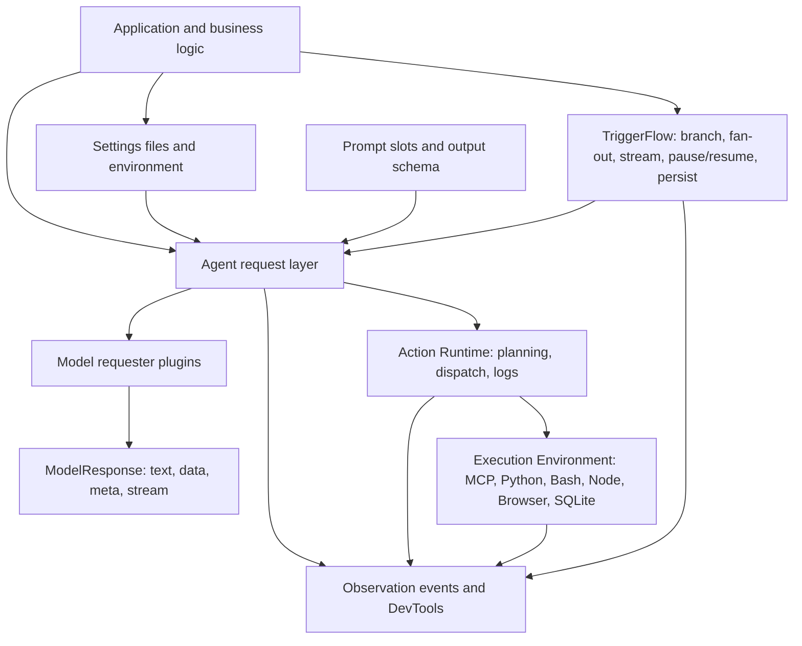
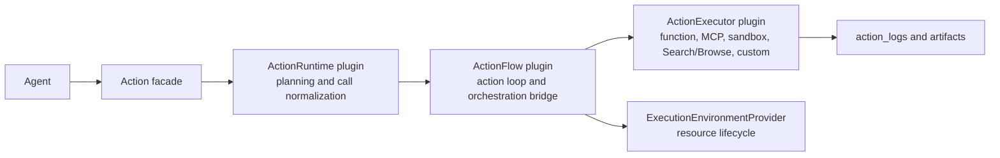

# Agently 4.1.3.4 - AI Application Runtime Framework

> Build AI service backends with structured outputs, observable Actions, runtime Skills, MCP capabilities, process streams, and recoverable workflows.

[English](https://github.com/AgentEra/Agently/blob/main/README.md) | [中文介绍](https://github.com/AgentEra/Agently/blob/main/README_CN.md)

[](https://github.com/AgentEra/Agently/blob/main/LICENSE)
[](https://pypi.org/project/agently/)
[](https://pypistats.org/packages/agently)
[](https://github.com/AgentEra/Agently/stargazers)
[](https://x.com/AgentlyTech)
<a href="https://doc.weixin.qq.com/forms/AIoA8gcHAFMAScAhgZQABIlW6tV3l7QQf">

</a>

<p align="center">
  <b><a href="https://agently.tech/docs">Docs</a> · <a href="#quickstart">Quickstart</a> · <a href="#why-agently">Why Agently</a> · <a href="#core-capabilities">Capabilities</a> · <a href="#architecture">Architecture</a> · <a href="#ecosystem">Ecosystem</a></b>
</p>

---

## Who This README Is For

Agently is for teams moving from "the model can do it once" to "the application must do it reliably":

- product engineers building assistants, internal copilots, knowledge tools, operation workflows, or AI-backed APIs
- platform teams that need clear extension points for model providers, tools, MCP servers, sandboxes, workflows, and observability
- technical leads comparing AI frameworks for maintainability, explicit control, debuggability, and production handoff
- coding-agent users who want a framework whose recommended patterns can be encoded as reusable project guidance

The main design question is simple: how do you keep model behavior useful while still giving application code stable contracts, observable execution, and restart-safe workflow boundaries?

Agently 4.1.3.4 hardens structured output parsing for mixed long-text and typed
contracts, adds OpenAICompatible pre-output transport retry, propagates explicit
stream materialization errors, and ships a bounded single-Agent AgentTaskLoop
first public slice. Read the
[4.1.3.4 Release Notes](docs/en/development/release-notes-4.1.3.4.md),
[4.1.3.3 Release Notes](docs/en/development/release-notes-4.1.3.3.md),
[4.1.3.2 Release Notes](docs/en/development/release-notes-4.1.3.2.md),
[4.1.3.1 Release Notes](docs/en/development/release-notes-4.1.3.1.md), and
[4.1.3 Release Notes](docs/en/development/release-notes-4.1.3.md) for the full
release story.

## Why Agently

Many AI frameworks are strong at exploration or at assembling broad integration stacks. Agently is optimized for the engineering layer that makes model applications survive model changes, output drift, streaming UX, action execution, workflow signals, and service boundaries.

Agently is a good fit when you care about:

- **AI services should be runtime executions, not prompt glue** - one Agent turn can declare candidate Actions, Skills, MCP services, Dynamic Task planning, process streams, and output contracts, then execute through the same runtime surface. Read [4.1.3 Release Notes](docs/en/development/release-notes-4.1.3.md), [Agent Auto Orchestration examples](examples/agent_auto_orchestration/), and [Skills Executor examples](examples/skills_executor/).
- **Model switching should not rewrite business logic** - Agently normalizes provider setup, prompt slots, response parsing, action execution, and response reading into one request/runtime contract. Read [Model Setup](docs/en/start/model-setup.md), [Models Overview](docs/en/models/overview.md), and [Requests Overview](docs/en/requests/overview.md).
- **Structured output should be a framework guarantee, not only a provider feature** - `.output(...)` schemas, required field extraction, parser feedback, retries, `ensure_keys`, `ensure_all_keys`, and validation handlers work together inside Agently. Read [Schema as Prompt](docs/en/requests/schema-as-prompt.md), [Output Control](docs/en/requests/output-control.md), and examples in [`examples/basic/`](examples/basic/).
- **Streaming should expose structure before the final token** - `instant` mode lets consumers react to structured fields while the model is still streaming, which is useful for UI updates, SSE routes, and workflow signals. Read [Model Response](docs/en/requests/model-response.md), [FastAPI Service Exposure](docs/en/services/fastapi.md), and [`examples/fastapi/`](examples/fastapi/).
- **Actions should be observable and model-portable** - local functions, built-in actions, MCP servers, shell/Python/Node/SQLite/workspace helpers, and custom executors produce structured records and can share one Action Runtime. Read [Action Runtime](docs/en/actions/action-runtime.md), [MCP](docs/en/actions/mcp.md), and [`examples/action_runtime/`](examples/action_runtime/).
- **Skills should be runtime capabilities, not inline prompt snippets** - `agent.use_skills(...)` can declare local or remote Skill sources; the Skills Executor discovers, installs, selects, mounts MCP/script capabilities, streams diagnostics, and executes only when the planner needs them. Read [Skills Executor](docs/en/development/skills-executor.md) and [`examples/skills_executor/`](examples/skills_executor/).
- **Execution dependencies should have lifecycle owners** - Execution Environment providers manage reusable resources such as MCP processes, browser sessions, shell/Python/Node runtimes, SQLite handles, and sandboxes. Read [Execution Environment](docs/en/actions/execution-environment.md) and [`examples/execution_environment/`](examples/execution_environment/).
- **Generated plans should become validated task graphs** - Dynamic Task turns model-generated or app-generated DAG data into validated, observable task execution through `Agently.create_dynamic_task(...)`. Read [Dynamic Task](docs/en/dynamic-task/README.md) and [`examples/dynamic_task/`](examples/dynamic_task/).
- **Workflows should be signal-driven, not just graph-shaped** - TriggerFlow supports events, fan-out, runtime streams, pause/resume, save/load, sub-flows, and close snapshots; `instant` structured output can become workflow input without waiting for the whole response. Read [TriggerFlow Overview](docs/en/triggerflow/overview.md), [Events and Streams](docs/en/triggerflow/events-and-streams.md), and [`examples/trigger_flow/`](examples/trigger_flow/).
- **Common model-app patterns should be composable** - router, To-Do/dependency execution, planning, reflection, evaluator/reviser, and multi-agent collaboration can be built from the same request/action/signal primitives. Read [Playbooks](docs/en/playbooks/overview.md), [TriggerFlow Model Integration](docs/en/triggerflow/model-integration.md), and [`examples/step_by_step/`](examples/step_by_step/).
- **Services should keep clean project boundaries** - async APIs, FastAPI helpers, settings files, prompt files, DevTools observation, and companion coding-agent skills fit non-trivial projects. Read [Project Framework](docs/en/start/project-framework.md), [FastAPI Service Exposure](docs/en/services/fastapi.md), and [Observability](docs/en/observability/overview.md).

Current framework version: `4.1.3.4`.

Python: `>=3.10`.

## Framework Positioning

The point is not that other frameworks are wrong. They choose different centers of gravity.

| Framework | Primary strength | Where Agently is intentionally different |
|---|---|---|
| LangChain | Broad integrations, prebuilt agents, and application building blocks | Agently is narrower and more system-shaped: provider adaptation, prompt slots, structured output, response parsing, action execution, settings, and observability are normalized in one request/runtime contract. See [Requests](docs/en/requests/overview.md), [Action Runtime](docs/en/actions/action-runtime.md), and [`examples/action_runtime/`](examples/action_runtime/). |
| LangGraph | Low-level orchestration runtime for long-running, stateful agents | TriggerFlow is the orchestration layer inside Agently's model-application stack: workflow signals compose directly with structured response events, actions, runtime streams, pause/resume, execution state, and close snapshots. See [TriggerFlow Events and Streams](docs/en/triggerflow/events-and-streams.md), [Persistence and Blueprint](docs/en/triggerflow/persistence-and-blueprint.md), and [`examples/trigger_flow/`](examples/trigger_flow/). |
| CrewAI | Multi-agent crews plus flow-controlled agent teamwork | Agently treats multi-agent collaboration as one buildable pattern on top of lower-level request, action, signal, and workflow primitives, not as the only application shape. See [Playbooks](docs/en/playbooks/overview.md) and [`examples/step_by_step/`](examples/step_by_step/). |
| AutoGen | Conversable agents and multi-agent conversation patterns | Agently emphasizes model-output contracts, explicit action logs, signal-driven workflows, lifecycle snapshots, and service-facing execution handles over open-ended agent chat as the default boundary. |
| Direct SDK calls | Maximum control with minimal abstraction | Agently adds reusable contracts for output parsing, actions, sessions, configuration, observability, and workflows without forcing a separate orchestration service. |

Use Agently when the application needs an AI execution substrate. Stay closer to direct SDK calls when the product is only one or two simple prompts. Use a specialized multi-agent framework when natural-language agent collaboration is the main product primitive.

The practical differences show up in four layers:

- **Against LangChain's integration-first style:** LangChain is strong when you want a broad, flexible set of model, tool, retrieval, and agent building blocks. Agently's bet is that production model apps need a more uniform request contract: different model providers should still feed the same prompt slots, structured parser, retry/validation path, `ModelResponse` readers, and Action Runtime. That reduces the chance that swapping the base model or provider changes the shape expected by downstream business logic. Start with [Requests Overview](docs/en/requests/overview.md) and [Action Runtime](docs/en/actions/action-runtime.md).
- **Against provider-native structured output as the only guarantee:** Agently can use model providers, but its output quality path does not depend only on provider-side JSON schema or tool-calling parameters. The framework owns schema-as-prompt authoring, required-field extraction, parser feedback, retries, `ensure_keys`, `ensure_all_keys`, and validation handlers. That matters when the target model does not expose the same structured-output or tool-calling semantics as another provider. See [Schema as Prompt](docs/en/requests/schema-as-prompt.md) and [Output Control](docs/en/requests/output-control.md).
- **Against graph-only orchestration:** LangGraph is strong for graph-shaped stateful agents and durable execution. TriggerFlow's core is event/signal-driven, and Agently's `instant` response mode can surface structured fields while the model is still streaming. That lets workflow signals be driven by partial structured output, action results, human input, or sub-flow state instead of waiting for a whole model response to finish. See [Model Response](docs/en/requests/model-response.md), [TriggerFlow Events and Streams](docs/en/triggerflow/events-and-streams.md), and [`examples/fastapi/`](examples/fastapi/) for streaming/service patterns.
- **Against treating multi-agent as the framework root:** Multi-agent collaboration is useful, but in Agently it is a scenario you can build on top of requests, Actions, TriggerFlow signals, sub-flows, Session, and runtime resources. Router, To-Do/dependency execution, planning, reflection, evaluator/reviser, and agent-team patterns are all compositions over the same lower-level engineering substrate. See [Playbooks](docs/en/playbooks/overview.md), [TriggerFlow Model Integration](docs/en/triggerflow/model-integration.md), and [`examples/step_by_step/`](examples/step_by_step/).

## Quickstart

Install:

```bash
pip install -U agently
```

Use DeepSeek or another OpenAI-compatible hosted endpoint:

```python
from agently import Agently

Agently.set_settings(
    "OpenAICompatible",
    {
        "base_url": "https://api.deepseek.com/v1",
        "model": "deepseek-chat",
        "auth": "DEEPSEEK_API_KEY",
        "model_type": "chat",
        "request_options": {"temperature": 0.2},
    },
)

agent = Agently.create_agent()

result = (
    agent
    .input("Introduce Python in one sentence and list three strengths.")
    .output({
        "intro": (str, "one sentence", True),
        "strengths": [(str, "one strength")],
    })
    .start(ensure_all_keys=True)
)

print(result)
```

Use local Ollama by changing provider settings:

```bash
ollama pull qwen2.5:7b
```

```python
Agently.set_settings(
    "OpenAICompatible",
    {
        "base_url": "http://127.0.0.1:11434/v1",
        "model": "qwen2.5:7b",
        "api_key": "ollama",
        "model_type": "chat",
    },
)
```

Use a Model Pool when the same application needs multiple models:

```python
agent.set_settings("model_pool", {
    "ollama-qwen2.5": "qwen2.5:7b",
    "deepseek-v4": "deepseek-chat",
})
agent.set_settings("key_pool", {
    "local": "ollama",
    "deepseek-main": "${ENV.DEEPSEEK_API_KEY}",
    "deepseek-backup": "${ENV.DEEPSEEK_BACKUP_API_KEY}",
})
agent.set_settings("key_pool_strategy", {
    "qwen2.5:7b": {"mode": "fixed", "pool": ["local"]},
    "deepseek-chat": {"mode": "round_robin", "pool": ["deepseek-main", "deepseek-backup"]},
})

agent.activate_model("ollama-qwen2.5")
```

`activate_model(...)` changes the default model key for subsequent Agent-owned
requests. Use `agent.create_request(model_key="deepseek-v4")` for a one-off
override.

For file-backed settings, prefer:

```python
from agently import Agently

Agently.load_settings("yaml_file", "settings.yaml", auto_load_env=True)
```

## Core Capabilities

### 1. Structured Requests

Prompts are composed from named slots. That keeps application intent, constraints, context, and output contracts reviewable:

```python
response = (
    agent
    .role("You are a concise release-note writer.")
    .info({"version": "4.1.3.2", "audience": "framework users"})
    .instruct("Return only facts grounded in the input.")
    .input("Summarize this release line for an engineering changelog.")
    .output({
        "headline": (str, "short headline", True),
        "bullets": [(str, "one stable fact")],
    })
    .get_response()
)

data = response.result.get_data()
text = response.result.get_text()
meta = response.result.get_meta()
```

Use `get_response()` when the same model call will be inspected in more than one way.

### 2. Contract-First Output Control

Fixed required leaves belong directly in `.output(...)` as the third tuple item:

```python
ticket = (
    agent
    .input("The billing export fails for accounts with archived invoices.")
    .output({
        "category": (str, "billing / auth / data / unknown", True),
        "severity": (int, "1-5", True),
        "next_actions": [(str, "recommended action")],
    })
    .start()
)
```

Use `ensure_keys=` for conditional or runtime-dependent paths. Use `.validate(...)` or `validate_handler=` for value-level business rules. Use `ensure_all_keys=True` when the whole schema must be present.

YAML and JSON prompt files can carry the same contract through `$ensure: true`, so teams can review prompt and response shape outside Python code.

### 3. Structured Streaming

Instant events let a UI, service, or downstream consumer react as each structured field changes:

```python
response = (
    agent
    .input("Explain recursion with two examples.")
    .output({
        "definition": (str, "one sentence", True),
        "examples": [(str, "example with explanation")],
    })
    .get_response()
)

for event in response.get_generator(type="instant"):
    if event.path == "definition" and event.delta:
        print(event.delta, end="", flush=True)
    if event.wildcard_path == "examples[*]" and event.is_complete:
        print("\nEXAMPLE:", event.value)
```

This is useful for dashboards, chat UIs, SSE responses, and workflows that need partial structured results before the final response is complete.

### 4. Actions and Tool Use

Actions are model-callable capabilities. New code should start with `@agent.action_func` and `agent.use_actions(...)`:

```python
from agently import Agently

agent = Agently.create_agent()

@agent.action_func
def calculate_total(price: float, quantity: int) -> float:
    """Calculate an order total."""
    return price * quantity

agent.use_actions(calculate_total)

response = (
    agent
    .input("Use the available action to calculate 19.5 * 4, then explain the result.")
    .get_response()
)

print(response.result.get_text())
print(response.result.full_result_data["extra"].get("action_logs", []))
```

Common capability helpers:

```python
agent.enable_python()
agent.enable_shell(root=".", commands=["pwd", "rg"])
agent.enable_workspace(root=".", read=True, write=False)
agent.enable_nodejs()
agent.enable_sqlite(database="app.db")
```

Built-in action packages:

```python
from agently.builtins.actions import Browse, Search

agent.use_actions(Search(timeout=15, backend="duckduckgo"))
agent.use_actions(Browse())
```

Use `agent.use_mcp(...)` for MCP servers. Use `agent.register_action(..., executor=..., execution_environments=[...])` when building a custom backend with explicit managed resources.

Instruction-heavy actions keep later model context compact with execution digests and artifact references. The application can read raw artifacts explicitly when it needs full code, shell output, page content, SQL rows, screenshots, or logs:

```python
records = agent.get_action_result()
artifact_ref = records[0]["artifact_refs"][0]

raw = agent.action.read_action_artifact(
    artifact_id=artifact_ref["artifact_id"],
    action_call_id=artifact_ref["action_call_id"],
)
```

The older `tool_func` / `use_tools` / `use_mcp` / `use_sandbox` family remains a compatibility surface, but new examples use actions.

### 5. Runtime Skills

Skills are reusable task guidance and capability packages. In 4.1.3, the
recommended application surface is `agent.use_skills(...)`: declare candidate
Skill sources on the Agent and let the Skills Executor perform lightweight
discovery, planner selection, on-demand materialization, capability mounting,
and execution diagnostics.

```python
agent.use_skills(
    [
        {"source": "GarethManning/education-agent-skills"},
        {"source": "anthropics/skills", "subpath": "skills/docx"},
        {"source": "anthropics/skills", "subpath": "skills/pptx"},
        {"source": "anthropics/skills", "subpath": "skills/xlsx"},
    ],
    mode="model_decision",
)

execution = await agent.async_run_skills_task(
    "Create a four-week B1 business English course package.",
    effort="normal",
    output={
        "course_plan": (dict, "course goals and weekly structure", True),
        "teacher_guide": (str, "teacher-facing guide summary", True),
        "progress_tracker": ([str], "tracking columns and checkpoints", True),
    },
)
```

Business value: reusable Skills can turn a model call into a deliverable
business process such as an education package, research memo, QA evidence pack,
travel plan, or operational review. Application code stays focused on business
inputs and output contracts instead of cloning remote repositories, parsing
Skill files, or manually wiring each tool.

Skill-declared MCP, shell, and script capabilities mount through Action Runtime
and Execution Environment, so side effects remain observable and policy
controlled. High-risk local execution requires approval or `auto_allow=True`;
safe pure-computation gaps can be synthesized as sandboxed Python actions, and
business-system capabilities fail closed unless a real connector is mounted.

### 6. TriggerFlow Orchestration

TriggerFlow is Agently's workflow layer for explicit stages, branching, fan-out, event-driven input, runtime streams, pause/resume, persistence, and restart-safe execution.

```python
import asyncio
from agently import TriggerFlow, TriggerFlowRuntimeData

flow = TriggerFlow(name="ticket-flow")

async def classify(data: TriggerFlowRuntimeData):
    text = data.input["text"]
    category = "billing" if "invoice" in text.lower() else "unknown"
    await data.async_set_state("category", category)
    return category

async def route(data: TriggerFlowRuntimeData):
    category = data.input
    await data.async_set_state("handler", f"{category}-team")

flow.to(classify).to(route)

async def main():
    execution = flow.create_execution()
    await execution.async_start({"text": "Invoice export failed."})
    snapshot = await execution.async_close()
    print(snapshot)

asyncio.run(main())
```

For services, workers, webhooks, human review, or SSE/WebSocket routes, keep the execution handle and close it explicitly:

```python
execution = flow.create_execution(auto_close=False)
await execution.async_start(initial_input)
await execution.async_emit("UserApproved", {"approved": True})
snapshot = await execution.async_close()
```

`close()` / `async_close()` is the canonical completion path in the 4.1 line. The close snapshot is the durable result contract.

TriggerFlow is the right tool when you need:

| Need | TriggerFlow surface |
|---|---|
| Branches based on intermediate results | `if_condition`, `elif_condition`, `else_condition`, `match`, `case` |
| Parallel work over many items | `for_each(concurrency=...)`, `batch(...)` |
| External events or human review | `when(...)`, `emit(...)`, `pause_for(...)`, `continue_with(...)` |
| Live UI or service output | runtime stream APIs |
| Restart safety | `save(...)`, `load(...)`, close snapshots |
| Reusable workflow topology | blueprint export/import |

### 7. Dynamic Task

Dynamic Task is Agently's framework-level surface for executing model-generated or app-generated DAGs. It is an application API, not a TriggerFlow sub-API; internally the executor compiles validated task graphs to TriggerFlow so it can reuse lifecycle, stream, pause/resume, and runtime resource mechanics.

```python
from agently import Agently

async def local_handler(context):
    return {"task_id": context.task.id, "deps": dict(context.dependency_results)}

task = Agently.create_dynamic_task(
    target="review policy",
    plan={
        "graph_id": "review",
        "task_schema_version": "task_dag/v1",
        "tasks": [
            {"id": "extract", "kind": "local", "binding": "local_handler"},
            {"id": "final", "kind": "local", "binding": "local_handler", "depends_on": ["extract"]},
        ],
        "semantic_outputs": {"final": "final"},
    },
    handlers={"local_handler": local_handler},
)
snapshot = await task.async_start(timeout=10)
```

Use Dynamic Task when the task plan itself is data that needs planning, validation, pruning, and execution. Use TriggerFlow directly when you own a stable workflow topology in code.

### 8. Session Memory

Session keeps bounded multi-turn state when the problem is still one conversational thread, not a full workflow:

```python
agent.activate_session(session_id="user-42")
agent.set_settings("session.max_length", 10000)

reply1 = agent.input("My name is Alice.").start()
reply2 = agent.input("What is my name?").start()
```

For long-running processes, event waits, fan-out, or human approvals, put TriggerFlow above the request layer instead of stretching Session into a workflow store.

### 9. Knowledge, Services, and Observability

Agently includes integration surfaces around the request and workflow layers:

- Knowledge base helpers for retrieval-backed context.
- `FastAPIHelper` for POST, SSE, and WebSocket exposure of agents, requests, generators, TriggerFlow definitions, and TriggerFlow executions.
- Observation events for request, action, execution environment, and TriggerFlow internals.
- Optional `agently-devtools` for local observation, evaluation, playground workflows, and project scaffolding.

```bash
pip install agently-devtools
agently-devtools init my_project
```

Agently 4.1.3.2 recommends `agently-devtools >=0.1.6,<0.2.0`.

## Architecture

### Layer Model

Agently organizes AI application code into explicit layers. The layers can be used independently, but they are designed to compose:



### Action Stack

Action Runtime separates planning, loop orchestration, backend execution, and managed resource lifecycle:



Extension points:

| Layer | Extension point |
|---|---|
| Agent | custom agent extension and lifecycle hooks |
| Request | prompt generator, model requester, response parser |
| Actions | `ActionRuntime`, `ActionFlow`, `ActionExecutor` |
| Managed resources | `ExecutionEnvironmentProvider` |
| Workflow | TriggerFlow chunks, conditions, events, runtime stream, persistence |
| Observation | event hookers, sinks, DevTools bridge |

## Project Shape

For anything beyond a small script, keep settings, prompts, actions, flows, and service code separate:

```text
my-agently-app/
  pyproject.toml
  .env
  settings.yaml
  prompts/
    summarize.yaml
    triage.yaml
  app/
    agents.py
    actions.py
    api.py
    main.py
  flows/
    triage.py
  tests/
    test_triage_flow.py
```

`settings.yaml`:

```yaml
plugins:
  ModelRequester:
    OpenAICompatible:
      base_url: ${ENV.OPENAI_BASE_URL}
      api_key: ${ENV.OPENAI_API_KEY}
      model: ${ENV.OPENAI_MODEL}
debug: false
```

Load at startup:

```python
from agently import Agently

Agently.load_settings("yaml_file", "settings.yaml", auto_load_env=True)
```

Prompt files can carry prompt slots and output contracts:

```yaml
.request:
  instruct: |
    You are a concise editor. Keep facts intact.
  output:
    title:
      $type: str
      $ensure: true
    body:
      $type: str
      $ensure: true
```

## Examples

Recommended model-app examples call a real model through DeepSeek or local Ollama and include an `Expected key output` source comment with stable key values from one real run.

Useful entry points:

| Directory | Use it for |
|---|---|
| `examples/cookbook/` | model-backed application patterns |
| `examples/agent_auto_orchestration/` | one Agent turn coordinating Actions, Skills, Dynamic Task, and process streams |
| `examples/skills_executor/` | remote Skills, effort-aware planning, MCP/script mounting, and model pool examples |
| `examples/action_runtime/` | function, MCP, sandbox, and plugin action examples |
| `examples/execution_environment/` | managed Python, shell, Node, SQLite, Browser, and provider lifecycle examples |
| `examples/dynamic_task/` | validated Dynamic Task DAG planning and execution examples |
| `examples/trigger_flow/` | focused TriggerFlow mechanics |
| `examples/builtin_actions/` | Search/Browse package examples |
| `examples/fastapi/` | service exposure examples |
| `examples/devtools/` | optional DevTools observation examples |

Archived examples live under `examples/archived/` and are compatibility references, not the recommended starting point for new apps.

## Ecosystem

### Agently Skills

Agently-Skills gives coding agents current Agently implementation guidance.

- Repository: https://github.com/AgentEra/Agently-Skills
- Current catalog generation: `v2`
- Recommended bundle: `app`
- Agently 4.1.3 compatibility: Skills authoring protocol `agently-skills.authoring.v2`

Use it when asking Codex, Claude Code, Cursor, or another coding agent to implement Agently patterns.

### Agently DevTools

`agently-devtools` is optional and covers local observation, evaluation, interactive wrappers, and project scaffolding.

```bash
pip install agently-devtools
agently-devtools init my_project
```

### Integrations

| Integration | What it enables |
|---|---|
| `agently.integrations.chromadb` | `ChromaCollection` knowledge-base workflows |
| `agently.integrations.fastapi` | POST, SSE, and WebSocket service exposure |
| OpenAI-compatible requester | OpenAI, DeepSeek, Qwen, Ollama, Kimi, GLM, MiniMax, Doubao, SiliconFlow, Groq, ERNIE, Gemini-via-OpenAI |
| Anthropic-compatible requester | Claude through Anthropic's native API |

## FAQ

**What makes Agently different from direct SDK calls?**

Direct SDK calls are excellent when the app only needs a small number of prompts. Agently adds contracts around those calls: prompt slots, output parsing, validation, retries, response reuse, action logs, session memory, configuration, service helpers, and TriggerFlow.

**How is Agently different from LangChain?**

LangChain provides broad integrations, prebuilt agents, and flexible building blocks. Agently is narrower and more opinionated about the model request boundary: provider setup, prompt slots, structured output, parser feedback, retries, validation, response reuse, action execution, settings, and observability are designed to line up as one contract. The goal is to let teams change the underlying model or provider without forcing downstream business logic to relearn output or tool-call shape.

**How is Agently different from LangGraph?**

LangGraph is strong when the central problem is graph-based agent state and durable execution. TriggerFlow is designed as Agently's signal-driven workflow layer: model-side `instant` structured events, action results, external events, pause/resume, runtime stream items, execution state, and close snapshots can all participate in the same orchestration story.

**How is Agently different from CrewAI or AutoGen?**

CrewAI and AutoGen are strong choices when the primary design is collaboration among agents. Agently is a lower-level application framework: multi-agent collaboration can be built as one pattern on top of structured model requests, Actions, TriggerFlow signals, sub-flows, Session, runtime resources, and service-facing execution handles.

**Do I need TriggerFlow for every multi-step task?**

No. Use plain Python or async functions for simple linear work. Use TriggerFlow when you need branches, fan-out, external events, pause/resume, runtime stream, persistence, or restart-safe execution.

**Can I keep using older tool APIs?**

Yes. The old tool family remains a compatibility surface and maps into the current action runtime. New code should prefer `@agent.action_func`, `agent.use_actions(...)`, and the `enable_*` helpers.

**How do I deploy an Agently service?**

Use the async request APIs directly or wrap agents, requests, generators, TriggerFlow definitions, or TriggerFlow executions with `FastAPIHelper`. See the FastAPI docs and `examples/fastapi/`.

## Documentation

| Resource | Link |
|---|---|
| Documentation (EN) | https://agently.tech/docs |
| Documentation (中文) | https://agently.cn/docs |
| Quickstart | https://agently.tech/docs/en/start/quickstart.html |
| Model Setup | https://agently.tech/docs/en/start/model-setup.html |
| Project Framework | https://agently.tech/docs/en/start/project-framework.html |
| Output Control | https://agently.tech/docs/en/requests/output-control.html |
| Model Response and Streaming | https://agently.tech/docs/en/requests/model-response.html |
| Session Memory | https://agently.tech/docs/en/requests/session-memory.html |
| Actions | https://agently.tech/docs/en/actions/overview.html |
| Execution Environment | https://agently.tech/docs/en/actions/execution-environment.html |
| TriggerFlow | https://agently.tech/docs/en/triggerflow/overview.html |
| FastAPI Helper | https://agently.tech/docs/en/services/fastapi.html |
| Observability | https://agently.tech/docs/en/observability/overview.html |
| Coding Agents | https://agently.tech/docs/en/development/coding-agents.html |
| Agently Skills | https://github.com/AgentEra/Agently-Skills |

## Compatibility Notes

- The current package version is `4.1.3.2`.
- The current release manifest is `compatibility/releases/4.1.3.2.json`.
- Development-line planning belongs in `compatibility/in-development.json`; do not treat planned future versions as released.
- README examples use the current Action and TriggerFlow close-snapshot paths.
- Deprecated APIs emit warnings once per Python process unless `runtime.show_deprecation_warnings` is disabled.

## Community

- Discussions: https://github.com/AgentEra/Agently/discussions
- Issues: https://github.com/AgentEra/Agently/issues
- WeChat group: https://doc.weixin.qq.com/forms/AIoA8gcHAFMAScAhgZQABIlW6tV3l7QQf
- Twitter / X: https://x.com/AgentlyTech

## License

Agently follows an open-core model:

- Open-source core: [Apache 2.0](LICENSE)
- Trademark usage policy: [TRADEMARK.md](TRADEMARK.md)
- Contributor rights agreement: [CLA.md](CLA.md)
- Enterprise extensions and services: separate commercial agreements
