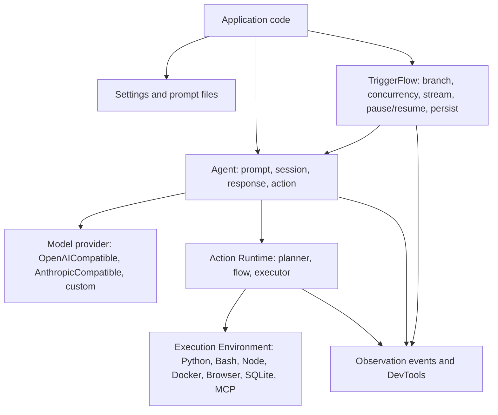

# Agently 4.1.2.2

Agently is a Python framework for building model-powered applications that need stable structured outputs, observable actions, and durable workflows.

[English](https://github.com/AgentEra/Agently/blob/main/README.md) | [中文介绍](https://github.com/AgentEra/Agently/blob/main/README_CN.md)

[](https://github.com/AgentEra/Agently/blob/main/LICENSE)
[](https://pypi.org/project/agently/)
[](https://pypistats.org/packages/agently)
[](https://github.com/AgentEra/Agently/stargazers)

## What Agently Optimizes For

Agently is for the point where a model prototype has to become application code:

- Stable contracts: `.output(...)` schemas, required field markers, validation, retries, and parsed response objects.
- Reusable model requests: one response can be consumed as text, structured data, metadata, or streaming events.
- Observable actions: local functions, MCP calls, built-in actions, and sandboxed execution produce structured action records.
- Durable workflows: TriggerFlow supports branching, concurrency, event streams, pause/resume, save/load, and explicit close snapshots.
- Production shape: settings files, prompt files, FastAPI helpers, DevTools observation, and companion coding-agent skills.

Current framework version: `4.1.2.2`.

Python: `>=3.10`.

## Install

```bash
pip install -U agently
```

For local model examples, run an OpenAI-compatible local endpoint such as Ollama:

```bash
ollama pull qwen2.5:7b
```

For hosted examples, set `DEEPSEEK_API_KEY` in your shell or `.env`.

## Quickstart

```python
from agently import Agently

Agently.set_settings(
    "OpenAICompatible",
    {
        "base_url": "https://api.deepseek.com/v1",
        "model": "deepseek-chat",
        "auth": "DEEPSEEK_API_KEY",
        "model_type": "chat",
        "request_options": {"temperature": 0.2},
    },
)

agent = Agently.create_agent()

result = (
    agent
    .input("Introduce Python in one sentence and list three strengths.")
    .output({
        "intro": (str, "one sentence", True),
        "strengths": [(str, "one strength")],
    })
    .start(ensure_all_keys=True)
)

print(result)
```

Use a local Ollama endpoint by changing only the provider settings:

```python
Agently.set_settings(
    "OpenAICompatible",
    {
        "base_url": "http://127.0.0.1:11434/v1",
        "model": "qwen2.5:7b",
        "api_key": "ollama",
        "model_type": "chat",
    },
)
```

## Core API Shape

### 1. Model Request

Prompts are structured slots, not one concatenated string:

```python
response = (
    agent
    .role("You are a concise release-note writer.")
    .info({"version": "4.1.2.2"})
    .instruct("Return only facts grounded in the input.")
    .input("Summarize the release line for an engineering changelog.")
    .output({
        "headline": (str, "short headline", True),
        "bullets": [(str, "one stable fact")],
    })
    .get_response()
)

data = response.result.get_data()
text = response.result.get_text()
meta = response.result.get_meta()
```

Prefer `get_response()` when the same model call will be inspected in more than one way.

### 2. Output Control

For fixed required leaves, mark the leaf directly in `.output(...)` with the third tuple item:

```python
ticket = (
    agent
    .input("The billing export fails for accounts with archived invoices.")
    .output({
        "category": (str, "billing / auth / data / unknown", True),
        "severity": (int, "1-5", True),
        "next_actions": [(str, "recommended action")],
    })
    .start()
)
```

Use `ensure_keys=` only for conditional or runtime-dependent paths. Use `.validate(...)` or `validate_handler=` for business rules, and `ensure_all_keys=True` when the whole schema must be present.

### 3. Structured Streaming

Instant events let you update a UI or downstream consumer as each structured field changes:

```python
response = (
    agent
    .input("Explain recursion with two examples.")
    .output({
        "definition": (str, "one sentence", True),
        "examples": [(str, "example with explanation")],
    })
    .get_response()
)

for event in response.get_generator(type="instant"):
    if event.path == "definition" and event.delta:
        print(event.delta, end="", flush=True)
    if event.wildcard_path == "examples[*]" and event.is_complete:
        print("\nEXAMPLE:", event.value)
```

### 4. Actions

Actions are model-callable capabilities. New code should start with `@agent.action_func` and `agent.use_actions(...)`:

```python
from agently import Agently

agent = Agently.create_agent()

@agent.action_func
def calculate_total(price: float, quantity: int) -> float:
    """Calculate an order total."""
    return price * quantity

agent.use_actions(calculate_total)

response = (
    agent
    .input("Use the available action to calculate 19.5 * 4, then explain the result.")
    .get_response()
)

print(response.result.get_text())
print(response.result.full_result_data["extra"].get("action_logs", []))
```

Common execution helpers:

```python
agent.enable_python()
agent.enable_shell(root=".", commands=["pwd", "rg"])
agent.enable_workspace(root=".", read=True, write=False)
agent.enable_sqlite(db_path="app.db")
```

Use `agent.use_mcp(...)` for MCP servers. Use `agent.register_action(..., executor=..., execution_environments=[...])` for custom execution backends.

### 5. TriggerFlow

TriggerFlow is the workflow layer for branching, concurrency, event-driven input, runtime streams, and restart-safe execution.

```python
import asyncio
from agently import TriggerFlow

flow = TriggerFlow(name="ticket-flow")

async def classify(data):
    text = data.input["text"]
    category = "billing" if "invoice" in text.lower() else "unknown"
    await data.async_set_state("category", category)
    return category

async def route(data):
    await data.async_set_state("handler", f"{data.input}-team")

flow.to(classify).to(route)

async def main():
    execution = flow.create_execution()
    await execution.async_start({"text": "Invoice export failed."})
    snapshot = await execution.async_close()
    print(snapshot)

asyncio.run(main())
```

For services, workers, webhooks, human review, or SSE/WebSocket routes, keep the execution handle and close it explicitly:

```python
execution = flow.create_execution(auto_close=False)
await execution.async_start(initial_input)
await execution.async_emit("UserApproved", {"approved": True})
snapshot = await execution.async_close()
```

`close()` / `async_close()` is the canonical completion path in the 4.1 line. The close snapshot is the durable result contract.

## Architecture



Extension points are intentionally separate:

| Layer | Extension point |
|---|---|
| Prompt/request | request hooks, prompt generator, response parser |
| Model | provider plugin or OpenAI-compatible endpoint |
| Actions | `ActionRuntime`, `ActionFlow`, `ActionExecutor`, built-in action packages |
| Managed resources | `ExecutionEnvironmentProvider` |
| Workflow | TriggerFlow chunks, conditions, runtime stream, persistence |
| Observation | event hookers, `agently-devtools` bridge |

## Examples

The current example rules are:

- Recommended model-app examples must call a real model through DeepSeek or local Ollama.
- Model-owned planning, routing, evaluation, revision, action selection, and final response generation must not be replaced with deterministic local substitutes.
- Low-level smoke examples may run without a model only when they are explicitly scoped to infrastructure behavior.
- Recommended examples must include an `Expected key output` source comment with stable facts from a real run.

Useful entry points:

| Directory | Use it for |
|---|---|
| `examples/cookbook/` | model-backed application patterns |
| `examples/action_runtime/` | function, MCP, sandbox, and plugin action examples |
| `examples/execution_environment/` | managed Python, shell, Node, SQLite, Browser, and provider lifecycle examples |
| `examples/trigger_flow/` | focused TriggerFlow mechanics |
| `examples/builtin_actions/` | Search/Browse package examples |
| `examples/fastapi/` | service exposure examples |

Archived examples live under `examples/archived/` and are compatibility references, not the recommended starting point for new apps.

## Project Structure

For application code, keep model settings, prompt assets, workflow code, and domain logic separate:

```text
my_ai_project/
  .env
  config/
    global.yaml
    agents/
      triage.yaml
  prompts/
    classify_ticket.yaml
  app/
    agents.py
    actions.py
    flows.py
    main.py
  tests/
```

Load file-based settings with environment substitution:

```python
from agently import Agently

Agently.load_settings("yaml_file", "config/global.yaml", auto_load_env=True)

triage = Agently.create_agent()
triage.load_settings("yaml_file", "config/agents/triage.yaml", auto_load_env=True)
```

## Companion Repositories

### Agently Skills

Agently-Skills gives coding agents the current Agently implementation guidance.

- Repository: https://github.com/AgentEra/Agently-Skills
- Current catalog generation: `v2`
- Recommended bundle: `app`
- Agently 4.1.2.2 compatibility: Skills authoring protocol `agently-skills.authoring.v1`

Use it when asking Codex, Claude Code, Cursor, or another coding agent to implement Agently patterns.

### Agently DevTools

`agently-devtools` is optional and covers local observation, evaluation, interactive wrappers, and project scaffolding.

```bash
pip install agently-devtools
agently-devtools init my_project
```

Agently 4.1.2.2 recommends `agently-devtools >=0.1.4,<0.2.0`.

## Documentation

| Resource | Link |
|---|---|
| Documentation (EN) | https://agently.tech/docs |
| Documentation (中文) | https://agently.cn/docs |
| Quickstart | https://agently.tech/docs/en/start/quickstart.html |
| Output Control | https://agently.tech/docs/en/requests/output-control.html |
| Model Response | https://agently.tech/docs/en/requests/model-response.html |
| Actions | https://agently.tech/docs/en/actions/overview.html |
| TriggerFlow | https://agently.tech/docs/en/triggerflow/overview.html |
| FastAPI Helper | https://agently.tech/docs/en/services/fastapi.html |
| Coding Agents | https://agently.tech/docs/en/development/coding-agents.html |

## Compatibility Notes

- The current package version is `4.1.2.2`.
- The current release manifest is `compatibility/releases/4.1.2.2.json`.
- The old `tool_*` names and some TriggerFlow result APIs remain compatibility surfaces, but README examples use the current Action and close-snapshot paths.
- Do not treat planned future versions as released. Development-line planning belongs in `compatibility/in-development.json`.

## Community

- Discussions: https://github.com/AgentEra/Agently/discussions
- Issues: https://github.com/AgentEra/Agently/issues
- WeChat group: https://doc.weixin.qq.com/forms/AIoA8gcHAFMAScAhgZQABIlW6tV3l7QQf

## License

Agently follows an open-core model:

- Open-source core: [Apache 2.0](LICENSE)
- Trademark usage policy: [TRADEMARK.md](TRADEMARK.md)
- Contributor rights agreement: [CLA.md](CLA.md)
- Enterprise extensions and services: separate commercial agreements
