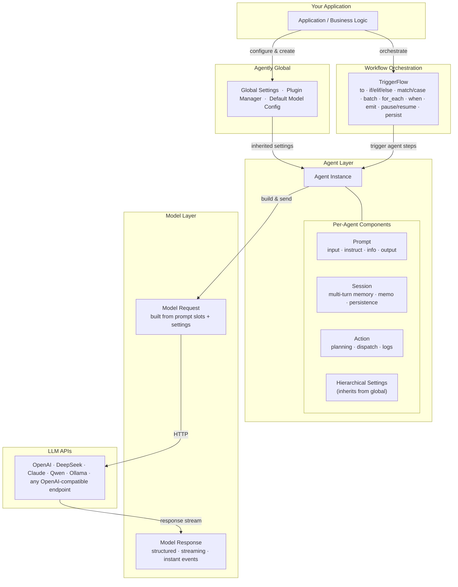
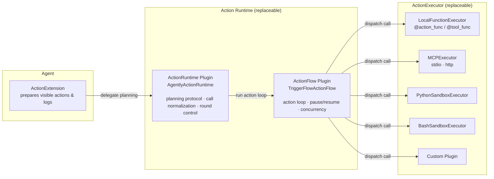
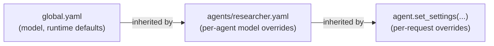
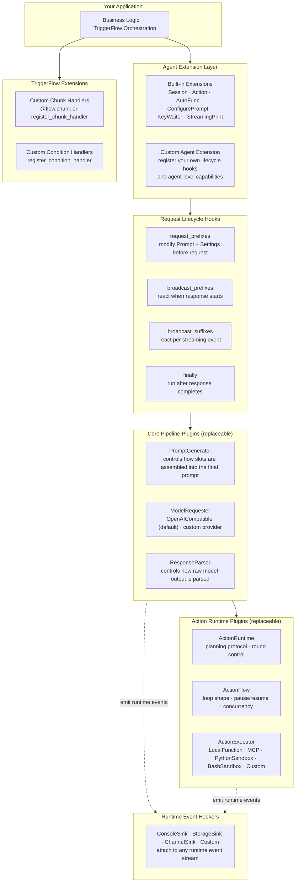

# Agently 4.1 — AI Application Development Framework

> **Build production-grade AI applications with stable outputs, composable agents, observable actions, and testable workflows.**

[English](https://github.com/AgentEra/Agently/blob/main/README.md) | [中文介绍](https://github.com/AgentEra/Agently/blob/main/README_CN.md)

[](https://github.com/AgentEra/Agently/blob/main/LICENSE)
[](https://pypi.org/project/agently/)
[](https://pypistats.org/packages/agently)
[](https://github.com/AgentEra/Agently/stargazers)
[](https://x.com/AgentlyTech)
<a href="https://doc.weixin.qq.com/forms/AIoA8gcHAFMAScAhgZQABIlW6tV3l7QQf">

</a>

<p align="center">
  <a href="https://github.com/AgentEra/Agently/discussions"></a>
  <a href="https://agently.tech"></a>
  <a href="https://github.com/AgentEra/Agently/issues"></a>
</p>

---

<p align="center">
  <b>🔥 <a href="https://agently.tech/docs">Docs</a> · 🚀 <a href="#quickstart">Quickstart</a> · 🏗️ <a href="#architecture">Architecture</a> · 💡 <a href="#core-capabilities">Capabilities</a> · 🧩 <a href="#ecosystem">Ecosystem</a></b>
</p>

---

## Why Agently?

LangChain, CrewAI, and AutoGen each solve a real problem — but they optimize for exploration, not delivery. Teams that ship AI-powered products into production consistently run into the same walls:

| Framework | What it's great at | Where production teams hit walls |
|:--|:--|:--|
| LangChain | Ecosystem breadth, quick prototypes | Untyped outputs, chains hard to unit-test, state management complexity |
| CrewAI | Role-based agent teams, natural language coordination | Black-box routing, limited observability, hard to debug failures |
| AutoGen | Conversational multi-agent, research exploration | Unpredictable loops, no built-in state persistence, hard to deploy deterministically |
| **Agently** | **Engineering-grade AI applications** | Contract-first outputs · testable/pausable/serializable TriggerFlow · full action logs · project-scale config management |

Agently is designed from the start for the gap between "works in a notebook" and "runs reliably in production":

- **Stable outputs** — contract-first schema with mandatory field enforcement and automatic retries
- **Testable orchestration** — every TriggerFlow branch is a plain Python function, independently unit-testable
- **Observable actions** — every tool/MCP/sandbox call is logged with input, output, and timing
- **Pause, resume, persist** — TriggerFlow executions can be saved to disk and restored after process restart
- **Project-scale config** — hierarchical YAML/TOML/JSON settings files, env-variable substitution, and scaffolding via `agently-devtools init`

**Agently 4.1 adds a fully rewritten Action Runtime**: a three-layer extensible plugin stack (planning → loop → execution) with native support for local functions, MCP servers, Python/Bash sandboxes, and custom backends.

---

## Architecture

### Layer Model

Agently organizes every AI application into four clear layers. Each layer has a stable interface — replaceable, extendable, and independently testable.



### Action Runtime (v4.1)

Three independently replaceable layers — swap only what you need.



---

## Core Capabilities

### 1. Contract-First Output Control

Define the schema once. Mark required leaves with `True`. Use `ensure_keys` as a supplement for runtime-dependent paths, use `.validate()` / `validate_handler=` for value-level business rules, and use `ensure_all_keys=True` when you want the whole structure strictly enforced.

```python
result = (
    agent
    .input("Analyze this review: 'Great product, but slow shipping.'")
    .output({
        "sentiment": (str, "positive / neutral / negative", True),
        "key_issues": [(str, "issue summary")],
        "priority": (int, "1–5, 5 is most urgent", True),
    })
    .start(ensure_keys=["key_issues[*]"])
)
# Always a dict — "sentiment" and "priority" are schema-required; "key_issues" is additionally checked at runtime.
# For strict whole-structure enforcement, pass `ensure_all_keys=True`.
```

Prompt templates can set `ensure_all_keys` at the outer layer as well (`$ensure_all_keys` in YAML/JSON) to make strict whole-structure enforcement the default.

### 2. Structured Streaming — Instant Events

Each output field streams independently. Drive UI updates or downstream logic as fields complete, not after the whole response.

```python
response = (
    agent
    .input("Explain recursion with 3 examples")
    .output({
        "definition": (str, "one-sentence definition"),
        "examples": [(str, "code example with explanation")],
    })
    .get_response()
)

for event in response.get_generator(type="instant"):
    if event.path == "definition" and event.delta:
        ui.update_header(event.delta)             # stream definition character by character
    if event.wildcard_path == "examples[*]" and event.is_complete:
        ui.append_example(event.value)            # append each complete example
```

### 3. Action Runtime — Functions, MCP, Sandboxes (v4.1)

Mount any combination. The runtime handles planning, execution, retries, and full structured logs.

```python
@agent.action_func
def search_docs(query: str) -> str:
    """Search internal documentation."""
    return docs_db.search(query)

agent.use_mcp("docs-server", transport="stdio", command=["python", "mcp_server.py"])
agent.use_sandbox("python")                          # isolated Python execution

agent.use_actions([search_docs, "docs-server", "python"])

response = agent.input("Find auth docs and show a login code example.").get_response()

# Every call: what was invoked, with what args, what it returned
print(response.result.full_result_data["extra"]["action_logs"])
```

Legacy `tool` APIs (`@agent.tool_func`, `agent.use_tool()`) continue to work and map to the same runtime.

### 4. TriggerFlow — Serious Workflow Orchestration

TriggerFlow goes well beyond chaining functions. It's a full workflow engine with concurrency, event-driven branching, human-in-the-loop interrupts, and execution persistence.

**Concurrency — `batch` and `for_each`**

Run steps in parallel with a configurable concurrency limit:

```python
# Process a list of URLs, max 5 in parallel
flow.for_each(url_list, concurrency=5).to(fetch_page).to(summarize).end_for_each().to(store_summaries)

# Fan out to N fixed branches simultaneously
flow.batch(
    ("a", strategy_a),
    ("b", strategy_b),
    ("c", strategy_c),
).to(store_strategy_outputs)
```

**Event-driven — `when` and `emit`**

Branch on signals, chunk completions, or data changes — not just linear sequence:

```python
flow.when("UserInput").to(process_input).to(plan_next_step)
flow.when("ToolResult").to(evaluate_result)

# Emit from inside a chunk to trigger other branches
async def plan_next_step(data: TriggerFlowEventData):
    if needs_tool:
        await data.async_emit("ToolCall", tool_args)
    else:
        await data.async_emit("UserInput", final_reply)
```

**Pause, Resume, and Persistence**

Save execution state to disk, restore it after a process restart — critical for long-running or human-in-the-loop workflows:

```python
# Start execution, save checkpoint immediately
execution = flow.create_execution(auto_close=False)
await execution.async_start(initial_input, wait_for_result=False)
execution.save("checkpoint.json")

# Later — new process, restored state, continue from where it paused
restored = flow.create_execution(auto_close=False)
restored.load("checkpoint.json")
await restored.async_emit("UserFeedback", {"approved": True, "note": "Looks good."})
state = await restored.async_close()
```

This makes Agently workflows genuinely restart-safe — suitable for approval gates, multi-day pipelines, and human review loops.

**Blueprint Serialization**

The flow topology itself can be exported to JSON/YAML and reloaded, enabling dynamic workflow definitions and versioned flow configurations:

```python
flow.get_yaml_flow(save_to="flows/main_flow.yaml")
# later
flow.load_flow_config("flows/main_flow.yaml")
```

### 5. Session — Multi-Turn Memory

Activate a session by ID. Agently maintains chat history, applies window trimming, supports custom memo strategies, and persists state to JSON/YAML.

```python
agent.activate_session(session_id="user-42")
agent.set_settings("session.max_length", 10000)

session = agent.activated_session
session.register_analysis_handler(decide_when_to_summarize)
session.register_resize_handler("summarize_oldest", summarize_handler)

reply1 = agent.input("My name is Alice.").start()
reply2 = agent.input("What's my name?").start()   # correctly returns "Alice"
```

### 6. Project-Scale Configuration Management

Real AI projects involve multiple agents, multiple prompt templates, and multiple environments. Agently's hierarchical settings system supports YAML/JSON/TOML config files at every layer, with `${ENV.VAR}` substitution and layered inheritance.

**Recommended project structure:**

```
my_ai_project/
├── .env                          # API keys and secrets
├── config/
│   ├── global.yaml               # global model + runtime settings
│   └── agents/
│       ├── researcher.yaml       # per-agent model overrides
│       └── writer.yaml
├── prompts/
│   ├── researcher_role.yaml      # reusable prompt templates
│   └── writer_role.yaml
├── flows/
│   ├── main_flow.py              # TriggerFlow definitions
│   └── main_flow.yaml            # serialized flow blueprint (optional)
├── agents/
│   ├── researcher.py
│   └── writer.py
└── main.py
```

**Config hierarchy — each layer inherits and overrides:**



```python
# global.yaml loaded once at startup
Agently.load_settings("yaml", "config/global.yaml", auto_load_env=True)

# each agent loads its own overrides
researcher = Agently.create_agent()
researcher.load_settings("yaml", "config/agents/researcher.yaml")

# request-level override if needed
researcher.set_settings("OpenAICompatible.request_options", {"temperature": 0.2})
```

**Scaffold a new project instantly:**

```bash
pip install agently-devtools
agently-devtools init my_project
```

See real-world project examples:
- [Agently-Daily-News-Collector](https://github.com/AgentEra/Agently-Daily-News-Collector) — scheduled multi-source news pipeline
- [Agently-Talk-to-Control](https://github.com/AgentEra/Agently-Talk-to-Control) — conversational control flow with TriggerFlow

### 7. Layered Prompt Management

Prompts are structured slots, not raw strings. Each slot has a role: `input` (the task), `instruct` (constraints), `info` (context data), `output` (schema). Agent-level slots persist across requests; request-level slots apply once.

```python
agent.role("You are a senior Python code reviewer.")   # always present

result = (
    agent
    .input(user_code)
    .instruct("Focus on security and performance.")
    .info({"context": "Public-facing API handler", "framework": "FastAPI"})
    .output({"issues": [(str, "issue description")], "score": (int, "0–100", True)})
    .start()
)
```

When you use `${...}` placeholders, pass substitutions explicitly with `mappings=...`, for example `agent.instruct("Hello ${name}", mappings={"name": "Alice"})`.

Prompt templates can be loaded from YAML/JSON files via the `configure_prompt` extension for team-level prompt governance.

### 8. Unified Model Settings

One config object, any provider, no vendor lock-in.

```python
Agently.set_settings(
    "OpenAICompatible",
    {
        "base_url": "https://api.deepseek.com/v1",
        "model": "deepseek-chat",
        "auth": "DEEPSEEK_API_KEY",   # reads from env automatically
    },
)
# Change base_url + model to switch providers — business code unchanged
```

Supported: OpenAI · DeepSeek · Anthropic Claude (native) · Qwen · Mistral · Llama · local Ollama · OpenAI-compatible endpoints.

---

## Quickstart

```bash
pip install -U agently
```

*Python ≥ 3.10 required.*

```python
from agently import Agently

Agently.set_settings("OpenAICompatible", {
    "base_url": "https://api.deepseek.com/v1",
    "model": "deepseek-chat",
    "auth": "DEEPSEEK_API_KEY",
})

agent = Agently.create_agent()

result = (
    agent.input("Introduce Python in one sentence and list 3 strengths")
    .output({
        "intro": (str, "one sentence", True),
        "strengths": [(str, "strength")],
    })
    .start(ensure_all_keys=True)
)

print(result)
# {"intro": "Python is ...", "strengths": ["...", "...", "..."]}
```

---

## Ecosystem

### Agently Skills — Coding Agent Extensions

Official Agently Skills give AI coding assistants (Claude Code, Cursor, etc.) the knowledge to implement Agently patterns correctly, without re-explaining the framework each session.

- **Repo:** https://github.com/AgentEra/Agently-Skills
- **Install:** choose your target agent first, then install the `app` bundle from the Agently-Skills README. For Codex, start with `export AGENT=codex`.

Covers: new app development via the `app` bundle, plus LangChain/LangGraph/LlamaIndex/CrewAI migration via the `migration` bundle.

### Agently DevTools — Runtime Observation & Scaffolding

`agently-devtools` is an optional companion package for runtime inspection and project scaffolding.

```bash
pip install agently-devtools
agently-devtools init my_project    # scaffold a new Agently project
```

- Runtime observation: `ObservationBridge`, `create_local_observation_app`
- Examples: `examples/devtools/`
- Compatibility: `agently-devtools 0.1.x` targets `agently >=4.1.0,<4.2.0`

### Integrations

| Integration | What it enables |
|:--|:--|
| `agently.integrations.chromadb` | `ChromaCollection` — RAG knowledge base with embedding agent |
| `agently.integrations.fastapi` | SSE streaming, WebSocket, and standard POST endpoint patterns |

---

## Extensibility — Customize at Every Layer

Agently is designed to be extended at multiple independent levels. You don't have to fork the framework to change how it behaves — every major component is a replaceable plugin, hook, or registered handler.



### Extension Points at a Glance

| Layer | Extension type | What you can customize |
|:--|:--|:--|
| **Agent Extensions** | Register a custom extension class | Add new capabilities to every agent: new prompt slots, new response hooks, new lifecycle behavior |
| **Request lifecycle hooks** | `request_prefixes` / `broadcast_prefixes` / `broadcast_suffixes` / `finally` | Intercept and modify requests, responses, or streaming events at each stage |
| **PromptGenerator** (plugin) | Replace the built-in plugin | Control exactly how prompt slots are assembled into the final message list sent to the model |
| **ModelRequester** (plugin) | Register a new provider class | Add any non-OpenAI-compatible model API — the interface contract stays the same |
| **ResponseParser** (plugin) | Replace the built-in plugin | Change how raw model output is parsed into structured data and streaming events |
| **ActionRuntime** (plugin) | Replace `AgentlyActionRuntime` | Change planning protocol, call normalization, or round-limit logic |
| **ActionFlow** (plugin) | Replace `TriggerFlowActionFlow` | Change how the action loop is orchestrated — different concurrency, pause/resume, or branching |
| **ActionExecutor** (plugin) | Register alongside or replace builtins | Add a new execution backend: cloud functions, RPC, custom sandboxes |
| **TriggerFlow chunks** | `@flow.chunk` / `register_chunk_handler` | Any Python function or coroutine becomes a composable flow step |
| **TriggerFlow conditions** | `register_condition_handler` | Custom routing logic between branches |
| **Runtime hookers** | Implement and register a hooker | Attach to the runtime event stream for observability, storage, or channel forwarding |

### Example: Registering a Custom ActionExecutor

```python
from agently.types.plugins import ActionExecutor, ActionRunContext, ActionExecutionRequest, ActionResult

class MyCloudExecutor:
    name = "my-cloud-executor"
    DEFAULT_SETTINGS = {}

    async def execute(
        self,
        context: ActionRunContext,
        request: ActionExecutionRequest,
    ) -> list[ActionResult]:
        # call your cloud function / RPC / custom backend
        ...

Agently.plugin_manager.register("ActionExecutor", MyCloudExecutor)
```

### Example: Adding a Request Lifecycle Hook

```python
agent = Agently.create_agent()

# Inject context into every request this agent makes
def inject_tenant_context(prompt, settings):
    prompt.info({"tenant_id": get_current_tenant()})

agent.extension_handlers.append("request_prefixes", inject_tenant_context)
```

---

## Agently and the "Harness" Concept

The term **AI application harness** describes a layer that wraps LLM calls with engineering controls — stable interfaces, observable internals, pluggable components. It's an architectural quality, not a product category.

Agently is a **development framework**, but it's designed to satisfy exactly those properties:

| Harness property | How Agently delivers it |
|:--|:--|
| **Stable output interfaces** | `output()` schema `True` markers + `ensure_keys` supplements + custom `validate()` handlers + `ensure_all_keys` strict mode |
| **Observable internals** | `action_logs`, `tool_logs`, DevTools `ObservationBridge`, per-layer structured logs |
| **Pluggable runtime layers** | ActionRuntime, ActionFlow, and ActionExecutor are independent plugin slots |
| **Separation of concerns** | Prompt slots, settings hierarchy, Session, and TriggerFlow are distinct composable layers |
| **Testability** | Each TriggerFlow chunk is a plain function; structured outputs have fixed schemas to assert against |

These properties are a consequence of Agently's design philosophy — what you get when you structure an AI application the Agently way.

---

## Who Uses Agently?

> "Agently helped us turn evaluation rules into executable workflows and keep key scoring accuracy at 75%+, significantly improving bid-evaluation efficiency." — Project lead at a large energy SOE

> "Agently enabled a closed loop from clarification to query planning to rendering, reaching 90%+ first-response accuracy and stable production performance." — Data lead at a large energy group

> "Agently's orchestration and session capabilities let us ship a teaching assistant for course management and Q&A quickly, with continuous iteration." — Project lead at a university teaching-assistant initiative

📢 [Share your case on GitHub Discussions →](https://github.com/AgentEra/Agently/discussions/categories/show-and-tell)

---

## FAQ

**Q: What makes Agently different from LangChain?**
LangChain is excellent for prototyping and has a broad ecosystem. Agently is optimized for the post-prototype phase: contract-first outputs prevent interface drift, TriggerFlow branches are individually unit-testable, and the project-scale config system supports real engineering workflows. If you've shipped with LangChain and hit maintainability walls, Agently is built for exactly that.

**Q: How is Agently different from CrewAI or AutoGen?**
CrewAI and AutoGen are designed around agent teams with natural-language coordination — great for exploration, hard to make deterministic. Agently uses explicit code-based orchestration (TriggerFlow) where every branch is a Python function with clear inputs and outputs, every action call is logged, and executions can be paused, serialized, and resumed — properties that matter when you're shipping to users.

**Q: What is the Action Runtime, and why was it rewritten in v4.1?**
The old tool system was a single flat layer — enough for simple use cases, but not extensible. The new Action Runtime separates planning ("what to call"), loop orchestration ("how many rounds, with what concurrency"), and execution ("actually run the function/MCP/sandbox"). Each layer is a plugin. You can swap just the sandbox backend without touching the planning logic, or replace just the planning algorithm without changing how loops run.

**Q: How do I deploy an Agently service?**
Agently doesn't prescribe a deployment model. It provides full async APIs. The `examples/fastapi/` directory covers SSE streaming, WebSocket, and standard POST. See [Agently-Talk-to-Control](https://github.com/AgentEra/Agently-Talk-to-Control) for a complete deployed example.

**Q: Is there enterprise support?**
Yes. The core framework is open-source under Apache 2.0. Enterprise extensions, private deployment support, governance modules, and SLA-backed collaboration are available under separate commercial agreements. Contact us via the [community](https://doc.weixin.qq.com/forms/AIoA8gcHAFMAScAhgZQABIlW6tV3l7QQf).

---

## Docs

| Resource | Link |
|:--|:--|
| Documentation (EN) | https://agently.tech/docs |
| Documentation (中文) | https://agently.cn/docs |
| Quickstart | https://agently.tech/docs/en/quickstart.html |
| Output Control | https://agently.tech/docs/en/output-control/overview.html |
| Instant Streaming | https://agently.tech/docs/en/output-control/instant-streaming.html |
| Session & Memo | https://agently.tech/docs/en/agent-extensions/session-memo/ |
| TriggerFlow | https://agently.tech/docs/en/triggerflow/overview.html |
| Actions & MCP | https://agently.tech/docs/en/agent-extensions/tools.html |
| Prompt Management | https://agently.tech/docs/en/prompt-management/overview.html |
| Agent Systems Playbook | https://agently.tech/docs/en/agent-systems/overview.html |
| Agently Skills | https://github.com/AgentEra/Agently-Skills |

---

## Community

- Discussions: https://github.com/AgentEra/Agently/discussions
- Issues: https://github.com/AgentEra/Agently/issues
- WeChat Group: https://doc.weixin.qq.com/forms/AIoA8gcHAFMAScAhgZQABIlW6tV3l7QQf

## License

Agently follows an open-core model:

- Open-source core (this repository): [Apache 2.0](LICENSE)
- Trademark usage policy: [TRADEMARK.md](TRADEMARK.md)
- Contributor rights agreement: [CLA.md](CLA.md)
- Enterprise extensions and services: separate commercial agreements

---

<p align="center">
  <b>Build AI applications that actually ship →</b><br>
  <code>pip install -U agently</code>
</p>

<p align="center">
  <sub>Questions? <a href="https://agently.tech/docs">Read the docs</a> or <a href="https://doc.weixin.qq.com/forms/AIoA8gcHAFMAScAhgZQABIlW6tV3l7QQf">join the community</a>.</sub>
</p>
