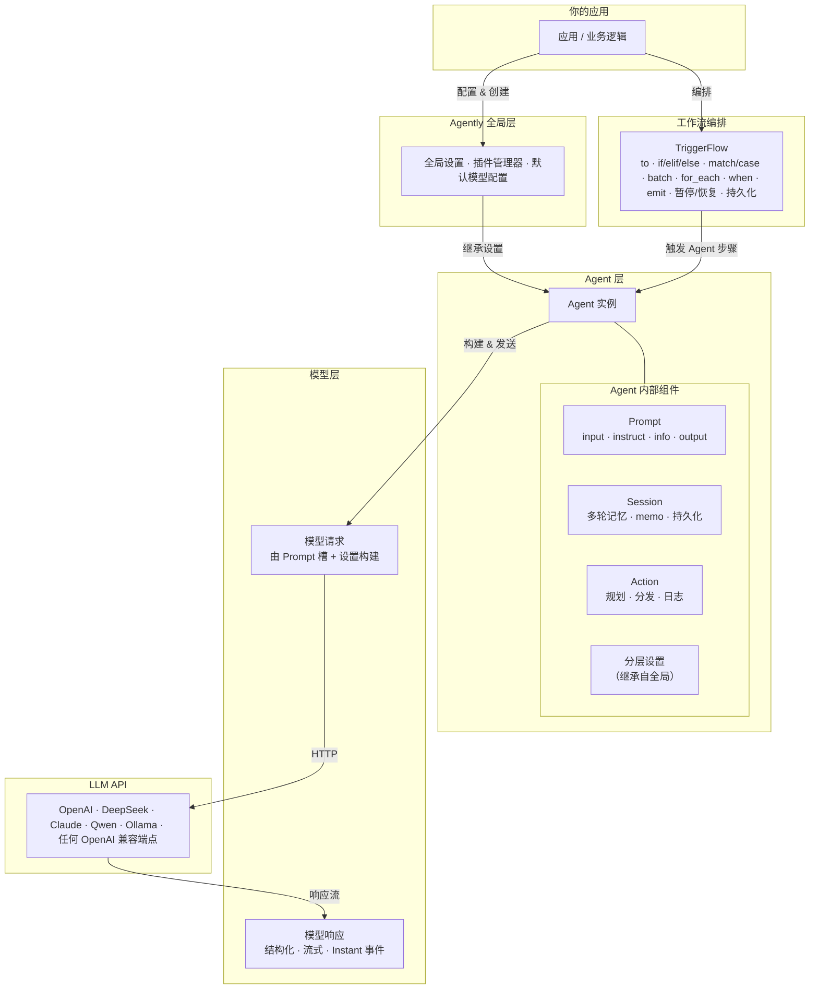
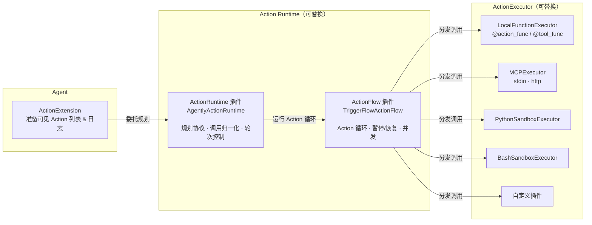
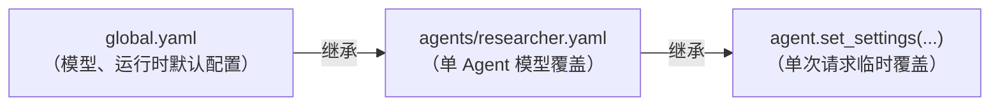
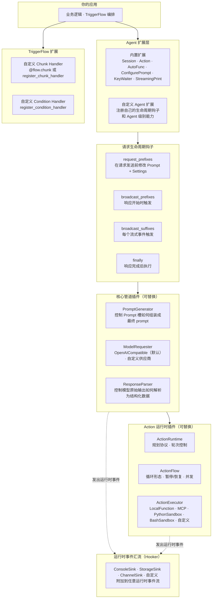

# Agently 4.1 — AI 应用开发框架

> **构建输出稳定、行为可观测、流程可维护的生产级 AI 应用。**

[English](https://github.com/AgentEra/Agently/blob/main/README.md) | [中文介绍](https://github.com/AgentEra/Agently/blob/main/README_CN.md)

[](https://github.com/AgentEra/Agently/blob/main/LICENSE)
[](https://pypi.org/project/agently/)
[](https://pypistats.org/packages/agently)
[](https://github.com/AgentEra/Agently/stargazers)
[](https://x.com/AgentlyTech)
<a href="https://doc.weixin.qq.com/forms/AIoA8gcHAFMAScAhgZQABIlW6tV3l7QQf">

</a>

<p align="center">
  <a href="https://github.com/AgentEra/Agently/discussions"></a>
  <a href="https://agently.cn"></a>
  <a href="https://github.com/AgentEra/Agently/issues"></a>
</p>

---

<p align="center">
  <b>🔥 <a href="https://agently.cn/docs">文档</a> · 🚀 <a href="#快速开始">快速开始</a> · 🏗️ <a href="#架构设计">架构设计</a> · 💡 <a href="#核心能力">核心能力</a> · 🧩 <a href="#生态工具">生态工具</a></b>
</p>

---

## 为什么需要 Agently？

LangChain、CrewAI、AutoGen 各自解决了真实问题——但它们都是为探索而优化，不是为交付。把 AI 应用真正送上线的团队，往往在同样的地方碰墙：

| 框架 | 擅长的事 | 生产交付时遇到的问题 |
|:--|:--|:--|
| LangChain | 生态广、原型快 | 输出无类型约束、Chain 难以单元测试、状态管理复杂 |
| CrewAI | 角色化 Agent 团队、自然语言任务协调 | 路由黑盒、可观测性弱、生产故障难排查 |
| AutoGen | 会话式多 Agent、科研探索 | 循环不可预期、无内置状态持久化、难以确定性部署 |
| **Agently** | **工程级 AI 应用** | 契约式输出 · 可测/可暂停/可持久化的 TriggerFlow · 完整 Action 日志 · 工程项目级配置管理 |

Agently 从一开始就为"能跑的 demo"和"稳定运行的生产系统"之间的鸿沟而设计：

- **稳定输出** — 契约式 schema，强制关键字段存在，失败自动重试
- **可测试的编排** — TriggerFlow 每个分支都是普通 Python 函数，可以独立单元测试
- **可观测的 Action** — 每次工具/MCP/沙箱调用都有完整的输入输出日志
- **暂停、恢复、持久化** — 执行状态可保存到磁盘，进程重启后从断点继续
- **工程项目级配置** — 分层 YAML/TOML/JSON 配置文件、环境变量替换、`agently-devtools init` 快速脚手架

**Agently 4.1 全面重写了 Action Runtime**：三层独立可替换的插件栈（规划 → 循环 → 执行），原生支持本地函数、MCP 服务器、Python/Bash 沙箱及自定义后端。

---

## 架构设计

### 分层模型

Agently 将 AI 应用组织成四个清晰的层次，每层有稳定接口，可独立替换、扩展和测试。



### Action Runtime（v4.1）

三层独立可替换的插件——按需替换，不动其余。



---

## 核心能力

### 1. 契约式输出控制

一次定义结构，使用第三槽 `True` 标记必填叶子。`ensure_keys` 作为补充手段用于运行时依赖路径；当你需要整棵结构严格保障时，使用 `ensure_all_keys=True`。

```python
result = (
    agent
    .input("分析这条用户评价：'产品很好，但物流太慢了。'")
    .output({
        "情感倾向": (str, "积极 / 中立 / 消极", True),
        "关键问题": [(str, "问题摘要")],
        "紧急程度": (int, "1–5，5 最紧急", True),
    })
    .start(ensure_keys=["关键问题[*]"])
)
# 始终是 dict，"情感倾向"和"紧急程度"由 schema 保证；"关键问题"另外做运行时检查。
# 如果要对整体结构做严格保障，传 `ensure_all_keys=True`。
```

Prompt 模板也可以在外层设置 `ensure_all_keys`（YAML/JSON 里写成 `$ensure_all_keys`），让严格整棵结构保障成为默认值。

### 2. 结构化流式 — Instant 事件

每个输出字段独立流式传输。字段完成即可用，不用等完整响应，直接驱动 UI 更新或下游逻辑。

```python
response = (
    agent
    .input("解释递归，并给出 3 个示例")
    .output({
        "definition": (str, "一句话定义"),
        "examples": [(str, "带说明的代码示例")],
    })
    .get_response()
)

for event in response.get_generator(type="instant"):
    if event.path == "definition" and event.delta:
        ui.update_header(event.delta)             # 定义逐字流式展示
    if event.wildcard_path == "examples[*]" and event.is_complete:
        ui.append_example(event.value)            # 每个示例完成后追加
```

### 3. Action Runtime — 函数、MCP、沙箱（v4.1）

任意组合挂载，运行时负责规划、执行、重试和完整结构化日志。

```python
@agent.action_func
def search_docs(query: str) -> str:
    """搜索内部文档。"""
    return docs_db.search(query)

agent.use_mcp("docs-server", transport="stdio", command=["python", "mcp_server.py"])
agent.use_sandbox("python")                          # 隔离进程中执行代码

agent.use_actions([search_docs, "docs-server", "python"])

response = agent.input("帮我找认证相关的文档，并给出登录示例代码。").get_response()

# 每次调用：调用了什么、参数是什么、返回了什么
print(response.result.full_result_data["extra"]["action_logs"])
```

旧版 `tool` API（`@agent.tool_func`、`agent.use_tool()`）仍然有效，底层映射到同一个运行时。

### 4. TriggerFlow — 正经的工作流编排

TriggerFlow 远不止是函数链。它是一个完整的工作流引擎，支持并发、事件驱动分支、人工审批中断和执行状态持久化。

**并发 — `batch` 与 `for_each`**

以可配置的并发上限并行运行步骤：

```python
# 并发处理 URL 列表，最多 5 个并行
(
    flow.for_each(url_list, concurrency=5)
    .to(fetch_page)
    .to(summarize)
    .end()
)

# 同时展开 N 个固定分支
flow.batch(3).to(strategy_a).collect("results", "a")
flow.batch(3).to(strategy_b).collect("results", "b")
flow.batch(3).to(strategy_c).collect("results", "c")
```

**事件驱动 — `when` 与 `emit`**

基于信号、chunk 完成或数据变化触发分支，不局限于线性序列：

```python
flow.when("UserInput").to(process_input).to(plan_next_step)
flow.when("ToolResult").to(evaluate_result)
flow.when({"runtime_data": "user_decision"}).to(apply_decision)

# 在 chunk 内部 emit 触发其他分支
async def plan_next_step(data: TriggerFlowEventData):
    if needs_tool:
        await data.async_emit("ToolCall", tool_args)
    else:
        await data.async_emit("UserInput", final_reply)
```

**暂停、恢复与持久化**

执行状态保存到磁盘，进程重启后从断点恢复——对长时间运行或需要人工审批的工作流至关重要：

```python
# 启动执行，立即保存检查点
execution = flow.start_execution(initial_input, wait_for_result=False)
execution.save("checkpoint.json")

# 之后——新进程，恢复状态，从暂停处继续
restored = flow.create_execution()
restored.load("checkpoint.json")
restored.emit("UserFeedback", {"approved": True, "note": "材料审核通过。"})
result = restored.get_result(timeout=30)
```

这让 Agently 工作流真正做到**进程重启安全**——适合审批门控、多天长流程和人工复核场景。

**蓝图序列化**

流程拓扑本身可以导出为 JSON/YAML 并重新加载，支持动态工作流定义和版本化流程配置：

```python
flow.get_yaml_flow(save_to="flows/main_flow.yaml")
# 之后
flow.load_flow_config("flows/main_flow.yaml")
```

### 5. Session — 多轮记忆管理

按 ID 激活会话，自动维护对话历史、裁剪上下文窗口、支持自定义 Memo 策略，持久化到 JSON/YAML。

```python
agent.activate_session(session_id="user-42")
agent.set_settings("session.max_length", 10000)

session = agent.activated_session
session.register_analysis_handler(decide_when_to_summarize)
session.register_resize_handler("summarize_oldest", summarize_handler)

reply1 = agent.input("我叫 Alice。").start()
reply2 = agent.input("我叫什么名字？").start()   # 正确返回 "Alice"
```

### 6. 工程项目级配置管理

真实 AI 项目涉及多个 Agent、多套 Prompt 模板、多个运行环境。Agently 的分层设置系统支持在每一层加载 YAML/JSON/TOML 配置文件，内置 `${ENV.VAR}` 环境变量替换和分层继承。

**推荐的工程项目结构：**

```
my_ai_project/
├── .env                          # API Key 和密钥
├── config/
│   ├── global.yaml               # 全局模型 + 运行时默认配置
│   └── agents/
│       ├── researcher.yaml       # 单 Agent 模型覆盖配置
│       └── writer.yaml
├── prompts/
│   ├── researcher_role.yaml      # 可复用的 Prompt 模板
│   └── writer_role.yaml
├── flows/
│   ├── main_flow.py              # TriggerFlow 定义
│   └── main_flow.yaml            # 序列化的流程蓝图（可选）
├── agents/
│   ├── researcher.py
│   └── writer.py
└── main.py
```

**配置分层继承——每层继承并覆盖上层：**



```python
# 启动时加载全局配置（支持 ${ENV.xxx} 占位符自动替换）
Agently.load_settings("yaml", "config/global.yaml", auto_load_env=True)

# 每个 Agent 加载自己的覆盖配置
researcher = Agently.create_agent()
researcher.load_settings("yaml", "config/agents/researcher.yaml")

# 必要时做单次请求级别的覆盖
researcher.set_settings("OpenAICompatible.request_options", {"temperature": 0.2})
```

**一行命令快速初始化工程脚手架：**

```bash
pip install agently-devtools
agently-devtools init my_project
```

参考真实项目示例：
- [Agently-Daily-News-Collector](https://github.com/AgentEra/Agently-Daily-News-Collector) — 定时多源新闻采集与整理 Pipeline
- [Agently-Talk-to-Control](https://github.com/AgentEra/Agently-Talk-to-Control) — 基于 TriggerFlow 的对话式控制流

### 7. 分层 Prompt 管理

Prompt 不是字符串——它是结构化的槽，各司其职：`input`（任务）、`instruct`（约束）、`info`（上下文数据）、`output`（输出 schema）。Agent 级别的槽跨请求持久存在，请求级别的槽只对当次有效。

```python
agent.role("你是一位资深 Python 代码审查员。")   # 始终存在

result = (
    agent
    .input(user_code)
    .instruct("重点关注安全性和性能问题。")
    .info({"context": "对外的 API 处理器", "framework": "FastAPI"})
    .output({"issues": [(str, "问题描述")], "score": (int, "0–100", True)})
    .start()
)
```

Prompt 模板可通过 `configure_prompt` 扩展从 YAML/JSON 文件加载，支持团队级 Prompt 治理。

### 8. 统一模型配置

一套配置，任意供应商，零锁定。

```python
Agently.set_settings(
    "OpenAICompatible",
    {
        "base_url": "https://api.deepseek.com/v1",
        "model": "deepseek-chat",
        "auth": "DEEPSEEK_API_KEY",   # 字符串匹配环境变量名时自动读取
    },
)
# 只改 base_url 和 model 两个字段，即可切换到任何 OpenAI 兼容端点
```

支持：OpenAI · DeepSeek · Anthropic Claude（通过兼容代理）· 通义千问 · Mistral · Llama · 本地 Ollama · 任何 OpenAI 兼容端点。

---

## 快速开始

```bash
pip install -U agently
```

*需要 Python ≥ 3.10。*

```python
from agently import Agently

Agently.set_settings("OpenAICompatible", {
    "base_url": "https://api.deepseek.com/v1",
    "model": "deepseek-chat",
    "auth": "DEEPSEEK_API_KEY",
})

agent = Agently.create_agent()

result = (
    agent.input("用一句话介绍 Python，并列出 3 个优点")
    .output({
        "intro": (str, "一句话介绍", True),
        "strengths": [(str, "优点描述")],
    })
    .start(ensure_all_keys=True)
)

print(result)
# {"intro": "Python 是...", "strengths": ["...", "...", "..."]}
```

---

## 生态工具

### Agently Skills — Coding Agent 扩展

官方 Agently Skills 让 AI 编程助手（Claude Code、Cursor 等）掌握正确的 Agently 使用模式，不用每次会话重新解释框架。

- **仓库：** https://github.com/AgentEra/Agently-Skills
- **安装：** `npx skills add AgentEra/Agently-Skills`

覆盖：单次请求设计 · TriggerFlow 编排 · 多智能体 · MCP · Session · FastAPI 集成 · LangChain/LangGraph 迁移 Playbook。

### Agently DevTools — 运行时观测与脚手架

`agently-devtools` 是可选配套包，提供运行时检查和工程脚手架能力。

```bash
pip install agently-devtools
agently-devtools init my_project    # 快速初始化 Agently 工程
```

- 运行时观测：`ObservationBridge`、`create_local_observation_app`
- 示例：`examples/devtools/`
- 兼容说明：`agently-devtools 0.1.x` 对应 `agently >=4.1.0,<4.2.0`

### 集成

| 集成 | 功能 |
|:--|:--|
| `agently.integrations.chromadb` | `ChromaCollection` — 基于向量检索的知识库（RAG） |
| `agently.integrations.fastapi` | SSE 流式、WebSocket 及标准 POST 接口模式 |

---

## 扩展性 — 在每一层自定义

Agently 设计为可在多个独立层面进行扩展。你不需要 fork 框架才能改变它的行为——每个主要组件都是可替换的插件、钩子或注册处理器。



### 扩展点一览

| 层级 | 扩展类型 | 可自定义的内容 |
|:--|:--|:--|
| **Agent 扩展** | 注册自定义扩展类 | 为每个 Agent 添加新能力：新 Prompt 槽、新响应钩子、新生命周期行为 |
| **请求生命周期钩子** | `request_prefixes` / `broadcast_prefixes` / `broadcast_suffixes` / `finally` | 在请求发送前、响应开始时、每个流式事件时、响应完成后拦截并处理 |
| **PromptGenerator**（插件） | 替换内置插件 | 精确控制各 Prompt 槽如何组装为最终发送给模型的消息列表 |
| **ModelRequester**（插件） | 注册新供应商类 | 接入任意非 OpenAI 兼容的模型 API，接口契约保持不变 |
| **ResponseParser**（插件） | 替换内置插件 | 改变原始模型输出解析为结构化数据和流式事件的方式 |
| **ActionRuntime**（插件） | 替换 `AgentlyActionRuntime` | 更换规划协议、调用归一化逻辑或轮次控制方式 |
| **ActionFlow**（插件） | 替换 `TriggerFlowActionFlow` | 更换 Action 循环的编排形态——不同的并发策略、暂停/恢复或分支逻辑 |
| **ActionExecutor**（插件） | 在内置基础上追加或替换 | 添加新的执行后端：云函数、RPC、自定义沙箱 |
| **TriggerFlow Chunk** | `@flow.chunk` / `register_chunk_handler` | 任意 Python 函数或协程都可以成为可组合的流程步骤 |
| **TriggerFlow Condition** | `register_condition_handler` | 自定义分支之间的路由判断逻辑 |
| **运行时 Hooker** | 实现并注册一个 Hooker | 附加到运行时事件流，用于可观测性、存储或频道转发 |

### 示例：注册自定义 ActionExecutor

```python
from agently.types.plugins import ActionExecutor, ActionRunContext, ActionExecutionRequest, ActionResult

class MyCloudExecutor:
    name = "my-cloud-executor"
    DEFAULT_SETTINGS = {}

    async def execute(
        self,
        context: ActionRunContext,
        request: ActionExecutionRequest,
    ) -> list[ActionResult]:
        # 调用你的云函数 / RPC / 自定义后端
        ...

Agently.plugin_manager.register("ActionExecutor", MyCloudExecutor)
```

### 示例：添加请求生命周期钩子

```python
agent = Agently.create_agent()

# 在该 Agent 的每次请求中注入上下文
def inject_tenant_context(prompt, settings):
    prompt.info({"tenant_id": get_current_tenant()})

agent.extension_handlers.append("request_prefixes", inject_tenant_context)
```

---

## 关于"Harness"概念与 Agently 的关系

业界近年出现了 **AI application harness** 这一概念——用来描述在 LLM 调用之上叠加工程控制：稳定的输出接口、可观测的内部状态、可替换的组件。它是一种架构属性，而不是某种产品类型。

Agently 是一个 **AI 应用开发框架**，但在设计上天然满足这些属性：

| Harness 属性 | Agently 的实现方式 |
|:--|:--|
| **输出接口稳定** | `output()` 的 `True` 必填标记 + `ensure_keys` 补充校验 + `ensure_all_keys` 严格模式 |
| **内部状态可观测** | `action_logs`、`tool_logs`、DevTools `ObservationBridge`、逐层结构化日志 |
| **运行时层可替换** | ActionRuntime、ActionFlow、ActionExecutor 均为独立插件槽 |
| **关注点分离** | Prompt 槽、设置层级、Session、TriggerFlow 是独立且可组合的层 |
| **可测试性** | TriggerFlow 每个 chunk 都是普通函数；结构化输出有固定 schema 可断言 |

这些属性是 Agently 设计哲学的自然结果——按照 Agently 的方式正确组织 AI 应用，就能得到这些保障。

---

## 谁在用 Agently 解决真实问题？

> "Agently 帮助我们将评标细则转为可执行流程，模型评分关键项准确率稳定在 75%+，评标效率显著提升。" — 某能源央企项目负责人

> "Agently 让问数系统形成从澄清到查询到呈现的闭环，业务问题首次回复准确率达 90%+，上线后稳定运行。" — 某大型能源集团数据负责人

> "Agently 的工作流编排与会话能力，让教学助手在课程管理与答疑场景快速落地，并保持持续迭代。" — 某高校教学助手项目负责人

📢 [来 GitHub Discussions 分享你的案例 →](https://github.com/AgentEra/Agently/discussions/categories/show-and-tell)

---

## 常见问题

**Q：Agently 和 LangChain 的主要区别是什么？**
LangChain 在快速原型和生态广度上有优势。Agently 专注于 POC 之后的工程阶段：契约式输出防止接口漂移，TriggerFlow 分支可以独立单元测试，工程项目级配置系统支持真实的团队工作流。如果你用 LangChain 交付过项目并遇到了可维护性问题，Agently 正是为此而设计的。

**Q：和 CrewAI 或 AutoGen 有什么不同？**
CrewAI 和 AutoGen 围绕自然语言协调的 Agent 团队设计——适合探索，难以做到确定性。Agently 使用基于代码的显式编排（TriggerFlow），每个分支都是有明确输入输出的 Python 函数，每次 Action 调用都有日志，执行状态可暂停、序列化和恢复——这些正是面向用户交付时真正重要的属性。

**Q：Action Runtime 是什么？为什么 v4.1 要重写？**
旧版 Tool 系统是单层扁平结构，简单场景够用，但不可扩展。新的 Action Runtime 将"调用什么"（ActionRuntime 规划层）、"怎么循环"（ActionFlow 循环层）和"怎么执行"（ActionExecutor 执行层）分开，每层都是独立插件。你可以只换沙箱后端而不动规划逻辑，或者只换规划算法而不改循环方式。

**Q：如何将基于 Agently 的服务部署上线？**
框架不绑定部署方式，提供完整异步接口。`examples/fastapi/` 中有 SSE、WebSocket 和普通 POST 的开箱即用示例。完整的部署案例参见 [Agently-Talk-to-Control](https://github.com/AgentEra/Agently-Talk-to-Control)。

**Q：是否有企业版或商业支持？**
有。本仓库核心框架继续采用 Apache 2.0 开源协议。企业扩展包、私有化部署支持、治理模块和 SLA 保障通过独立商业协议提供。欢迎通过[社区](https://doc.weixin.qq.com/forms/AIoA8gcHAFMAScAhgZQABIlW6tV3l7QQf)联系我们。

---

## 文档导航

| 资源 | 链接 |
|:--|:--|
| 官方文档（中文） | https://agently.cn/docs |
| 官方文档（英文） | https://agently.tech/docs |
| 快速开始 | https://agently.cn/docs/quickstart.html |
| 结构化输出控制 | https://agently.cn/docs/output-control/overview.html |
| Instant 流式 | https://agently.cn/docs/output-control/instant-streaming.html |
| Session & Memo | https://agently.cn/docs/agent-extensions/session-memo/ |
| TriggerFlow 编排 | https://agently.cn/docs/triggerflow/overview.html |
| Action 与 MCP | https://agently.cn/docs/agent-extensions/tools.html |
| Prompt 管理 | https://agently.cn/docs/prompt-management/overview.html |
| 智能体系统 Playbook | https://agently.cn/docs/agent-systems/overview.html |
| 官方 Agently Skills | https://github.com/AgentEra/Agently-Skills |

---

## 加入社区

- 交流讨论：https://github.com/AgentEra/Agently/discussions
- 报告问题：https://github.com/AgentEra/Agently/issues
- 微信群：https://doc.weixin.qq.com/forms/AIoA8gcHAFMAScAhgZQABIlW6tV3l7QQf

## 开源协议

Agently 采用"开源核心 + 商业扩展"模式：

- 本仓库开源核心：[Apache 2.0](LICENSE)
- 商标使用规范：[TRADEMARK.md](TRADEMARK.md)
- 贡献者授权协议：[CLA.md](CLA.md)
- 企业扩展与商业服务：通过独立商业协议提供

---

<p align="center">
  <b>立即开始构建真正能上线的 AI 应用 →</b><br>
  <code>pip install -U agently</code>
</p>

<p align="center">
  <sub>有问题？查看<a href="https://agently.cn/docs">完整文档</a>或加入<a href="https://doc.weixin.qq.com/forms/AIoA8gcHAFMAScAhgZQABIlW6tV3l7QQf">社区交流</a>。</sub>
</p>
