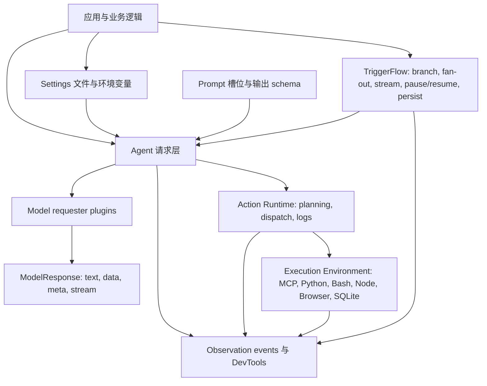
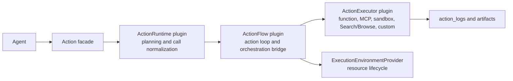

# Agently 4.1.3.1 - AI 应用运行时框架

> 构建具备结构化输出、可观测 Actions、运行时 Skills、MCP 能力、过程流和可恢复工作流的 AI 服务后端。

[English](https://github.com/AgentEra/Agently/blob/main/README.md) | [中文介绍](https://github.com/AgentEra/Agently/blob/main/README_CN.md)

[](https://github.com/AgentEra/Agently/blob/main/LICENSE)
[](https://pypi.org/project/agently/)
[](https://pypistats.org/packages/agently)
[](https://github.com/AgentEra/Agently/stargazers)
[](https://x.com/AgentlyTech)
<a href="https://doc.weixin.qq.com/forms/AIoA8gcHAFMAScAhgZQABIlW6tV3l7QQf">

</a>

<p align="center">
  <b><a href="https://agently.cn/docs">文档</a> · <a href="#快速开始">快速开始</a> · <a href="#为什么选择-agently">为什么选择 Agently</a> · <a href="#核心能力">核心能力</a> · <a href="#架构">架构</a> · <a href="#生态">生态</a></b>
</p>

---

## 这份 README 面向谁

Agently 面向的是正在从“模型偶尔能做对”走向“应用必须稳定做对”的团队：

- 构建 assistant、内部 copilot、知识工具、运营流程或 AI API 的产品工程师
- 需要清晰扩展模型 provider、工具、MCP server、沙箱、工作流和观测能力的平台团队
- 正在比较 AI 框架的技术负责人，关注可维护性、显式控制、可调试性和生产交付边界
- 使用 coding agent 的开发者，希望框架推荐实践可以沉淀成可复用的项目指导

核心设计问题是：怎样保留模型能力，同时让应用代码拥有稳定契约、可观测执行和可重启的工作流边界？

Agently 4.1.3.1 在 4.1.3 runtime line 之上补上 Workspace foundation，用于显式
多轮任务信息管理。应用代码可以把 observations、decisions、checkpoints、links 和
action outputs 写入持久 Workspace，再通过 Recall context plugins 打包相关记录。
完整版本叙事见 [4.1.3.1 Release Notes](docs/cn/development/release-notes-4.1.3.1.md)
和 [4.1.3 Release Notes](docs/cn/development/release-notes-4.1.3.md)。

## 为什么选择 Agently

很多 AI 框架擅长探索，或擅长组装广泛的 integration stack。Agently 优化的是让模型应用扛住模型切换、输出漂移、流式 UX、Action 执行、工作流信号和服务边界的工程层。

当你关心这些问题时，Agently 会比较合适：

- **AI 服务应该是运行时执行，不是 prompt glue** - 一次 Agent turn 可以声明候选 Actions、Skills、MCP 服务、Dynamic Task 规划、过程流和输出契约，并通过同一套运行时表面执行。阅读 [4.1.3 Release Notes](docs/cn/development/release-notes-4.1.3.md)、[Agent Auto Orchestration 示例](examples/agent_auto_orchestration/) 和 [Skills Executor 示例](examples/skills_executor/)。
- **换模型不应重写业务逻辑** - Agently 把 provider setup、Prompt 槽位、响应解析、Action 执行和响应读取归一到同一套 request/runtime contract。阅读 [模型设置](docs/cn/start/model-setup.md)、[模型概览](docs/cn/models/overview.md) 和 [Requests 概览](docs/cn/requests/overview.md)。
- **结构化输出应是框架保障，不只是 provider 能力** - `.output(...)` schema、必填字段提取、parser feedback、重试、`ensure_keys`、`ensure_all_keys` 和 validation handlers 在 Agently 内部协同工作。阅读 [Schema as Prompt](docs/cn/requests/schema-as-prompt.md)、[输出控制](docs/cn/requests/output-control.md) 和 [`examples/basic/`](examples/basic/)。
- **流式输出应在最后一个 token 前暴露结构** - `instant` mode 允许消费者在模型仍在流式输出时响应结构化字段，适合 UI 更新、SSE routes 和 workflow signals。阅读 [模型响应](docs/cn/requests/model-response.md)、[FastAPI 服务封装](docs/cn/services/fastapi.md) 和 [`examples/fastapi/`](examples/fastapi/)。
- **Actions 应该可观测且可跨模型迁移** - 本地函数、内置 actions、MCP servers、Shell/Python/Node/SQLite/workspace helpers 和自定义 executors 都会产生结构化记录，并共享同一套 Action Runtime。阅读 [Action Runtime](docs/cn/actions/action-runtime.md)、[MCP](docs/cn/actions/mcp.md) 和 [`examples/action_runtime/`](examples/action_runtime/)。
- **Skills 应该是运行时能力，不是内联 prompt 片段** - `agent.use_skills(...)` 可以声明本地或远程 Skill sources；Skills Executor 负责发现、安装、选择、挂接 MCP/script 能力、输出诊断，并且只在 planner 命中时执行。阅读 [Skills Executor](docs/cn/development/skills-executor.md) 和 [`examples/skills_executor/`](examples/skills_executor/)。
- **执行依赖应该有生命周期所有者** - Execution Environment providers 管理 MCP 进程、浏览器会话、Shell/Python/Node runtimes、SQLite handles 和沙箱等可复用资源。阅读 [Execution Environment](docs/cn/actions/execution-environment.md) 和 [`examples/execution_environment/`](examples/execution_environment/)。
- **生成式计划应落成可校验任务图** - Dynamic Task 通过 `Agently.create_dynamic_task(...)` 把模型生成或应用提交的 DAG 数据变成可校验、可观测的任务执行。阅读 [Dynamic Task](docs/cn/dynamic-task/README.md) 和 [`examples/dynamic_task/`](examples/dynamic_task/)。
- **工作流应是信号驱动，而不只是图结构** - TriggerFlow 支持 events、fan-out、runtime streams、pause/resume、save/load、sub-flows 和 close snapshots；`instant` 结构化输出可以不等完整响应结束就成为工作流输入。阅读 [TriggerFlow 概览](docs/cn/triggerflow/overview.md)、[事件与流](docs/cn/triggerflow/events-and-streams.md) 和 [`examples/trigger_flow/`](examples/trigger_flow/)。
- **常见模型应用模式应该可组合** - router、To-Do/dependency execution、planning、reflection、evaluator/reviser 和多 Agent 协作，都可以由同一套 request/action/signal primitives 组合出来。阅读 [Playbooks](docs/cn/playbooks/overview.md)、[TriggerFlow 模型集成](docs/cn/triggerflow/model-integration.md) 和 [`examples/step_by_step/`](examples/step_by_step/)。
- **服务应保持清晰项目边界** - async API、FastAPI helpers、settings 文件、prompt 文件、DevTools 观测和 companion coding-agent skills 适合非一次性项目。阅读 [项目结构](docs/cn/start/project-framework.md)、[FastAPI 服务封装](docs/cn/services/fastapi.md) 和 [观测概览](docs/cn/observability/overview.md)。

当前框架版本：`4.1.3.1`。

Python：`>=3.10`。

## 框架定位

这不是说其他框架不对。它们只是重心不同。

| 框架 | 主要强项 | Agently 有意不同的地方 |
|---|---|---|
| LangChain | 广泛集成、预置 agents 和应用构建块 | Agently 更窄也更系统：provider 适配、Prompt 槽位、结构化输出、响应解析、Action 执行、settings 和观测被归一到同一套 request/runtime 契约。见 [Requests](docs/cn/requests/overview.md)、[Action Runtime](docs/cn/actions/action-runtime.md) 和 [`examples/action_runtime/`](examples/action_runtime/)。 |
| LangGraph | 面向长跑 stateful agents 的低层编排 runtime | TriggerFlow 是 Agently 模型应用栈里的编排层：workflow signals 可以直接组合结构化响应事件、actions、runtime streams、pause/resume、execution state 和 close snapshots。见 [TriggerFlow 事件与流](docs/cn/triggerflow/events-and-streams.md)、[持久化与 Blueprint](docs/cn/triggerflow/persistence-and-blueprint.md) 和 [`examples/trigger_flow/`](examples/trigger_flow/)。 |
| CrewAI | 多 agent crew 和 flow 控制下的 agent team 协作 | Agently 把多 agent 协作视为建立在 request、action、signal、workflow 等底层原语之上的可开发模式，而不是唯一应用形态。见 [Playbooks](docs/cn/playbooks/overview.md) 和 [`examples/step_by_step/`](examples/step_by_step/)。 |
| AutoGen | conversable agents 和多 agent 对话模式 | Agently 默认强调模型输出契约、显式 Action logs、信号驱动工作流、生命周期 snapshots 和服务侧 execution handles，而不是开放式 agent chat。 |
| 直接调用 SDK | 最少抽象和最大控制 | Agently 在 SDK 调用之上补上输出解析、Action、Session、配置、观测和工作流契约，但不强迫你引入独立编排服务。 |

当应用需要一层 AI 执行底座时使用 Agently。如果产品只有一两个简单 Prompt，直接 SDK 更轻。如果自然语言 agent 协作本身就是产品核心，可以选择更专门的多 agent 框架。

实际差异主要体现在四层：

- **相对 LangChain 的 integration-first 风格：** LangChain 适合需要广泛、灵活地组合模型、工具、检索和 agent 构建块的场景。Agently 的判断是：生产级模型应用需要更统一的 request contract，不同模型 provider 仍应进入同一套 Prompt 槽位、结构化 parser、retry/validation 路径、`ModelResponse` 读取方式和 Action Runtime。这样在替换基础模型或 provider 时，下游业务逻辑更不容易被输出形态或工具调用形态冲击。可从 [Requests 概览](docs/cn/requests/overview.md) 和 [Action Runtime](docs/cn/actions/action-runtime.md) 开始。
- **相对只依赖 provider-native structured output：** Agently 可以使用模型 provider，但输出质量保障不只依赖 provider 侧 JSON schema 或 tool-calling 参数。框架内建 schema-as-prompt authoring、必填字段提取、parser feedback、重试、`ensure_keys`、`ensure_all_keys` 和 validation handlers。当目标模型没有和另一个 provider 完全一致的 structured-output 或 tool-calling 语义时，这一点尤其重要。见 [Schema as Prompt](docs/cn/requests/schema-as-prompt.md) 和 [输出控制](docs/cn/requests/output-control.md)。
- **相对 graph-only orchestration：** LangGraph 很适合图式 stateful agents 和 durable execution。TriggerFlow 的核心是事件/信号驱动，Agently 的 `instant` response mode 可以在模型仍在流式输出时暴露结构化字段，因此 workflow signals 可以由局部结构化输出、Action 结果、人工输入或 sub-flow state 驱动，而不必等完整模型响应结束。见 [模型响应](docs/cn/requests/model-response.md)、[TriggerFlow 事件与流](docs/cn/triggerflow/events-and-streams.md) 和 [`examples/fastapi/`](examples/fastapi/) 中的流式/服务化模式。
- **相对把多 Agent 当作框架根抽象：** 多 Agent 协作很有用，但在 Agently 里它是建立在 requests、Actions、TriggerFlow signals、sub-flows、Session 和 runtime resources 之上的可开发场景。Router、To-Do/dependency execution、planning、reflection、evaluator/reviser 和 agent-team patterns 都是同一套底层工程底座之上的组合。见 [Playbooks](docs/cn/playbooks/overview.md)、[TriggerFlow 模型集成](docs/cn/triggerflow/model-integration.md) 和 [`examples/step_by_step/`](examples/step_by_step/)。

## 快速开始

安装：

```bash
pip install -U agently
```

使用 DeepSeek 或其他 OpenAI-compatible 托管端点：

```python
from agently import Agently

Agently.set_settings(
    "OpenAICompatible",
    {
        "base_url": "https://api.deepseek.com/v1",
        "model": "deepseek-chat",
        "auth": "DEEPSEEK_API_KEY",
        "model_type": "chat",
        "request_options": {"temperature": 0.2},
    },
)

agent = Agently.create_agent()

result = (
    agent
    .input("用一句话介绍 Python，并列出三个优势。")
    .output({
        "intro": (str, "一句话介绍", True),
        "strengths": [(str, "一个优势")],
    })
    .start(ensure_all_keys=True)
)

print(result)
```

切到本地 Ollama 只需要换 provider 设置：

```bash
ollama pull qwen2.5:7b
```

```python
Agently.set_settings(
    "OpenAICompatible",
    {
        "base_url": "http://127.0.0.1:11434/v1",
        "model": "qwen2.5:7b",
        "api_key": "ollama",
        "model_type": "chat",
    },
)
```

同一个应用需要切换多个模型时，使用 Model Pool：

```python
agent.set_settings("model_pool", {
    "ollama-qwen2.5": "qwen2.5:7b",
    "deepseek-v4": "deepseek-chat",
})
agent.set_settings("key_pool", {
    "local": "ollama",
    "deepseek-main": "${ENV.DEEPSEEK_API_KEY}",
    "deepseek-backup": "${ENV.DEEPSEEK_BACKUP_API_KEY}",
})
agent.set_settings("key_pool_strategy", {
    "qwen2.5:7b": {"mode": "fixed", "pool": ["local"]},
    "deepseek-chat": {"mode": "round_robin", "pool": ["deepseek-main", "deepseek-backup"]},
})

agent.activate_model("ollama-qwen2.5")
```

`activate_model(...)` 会切换后续 Agent 自己创建和持有请求使用的默认
model key。单次请求覆盖可以使用 `agent.create_request(model_key="deepseek-v4")`。

文件化 settings 推荐这样加载：

```python
from agently import Agently

Agently.load_settings("yaml_file", "settings.yaml", auto_load_env=True)
```

## 核心能力

### 1. 结构化请求

Prompt 由命名槽位组成。这样应用意图、约束、上下文和输出契约都可以被审阅：

```python
response = (
    agent
    .role("你是简洁的 release note 作者。")
    .info({"version": "4.1.3.1", "audience": "framework users"})
    .instruct("只基于输入事实作答。")
    .input("为工程 changelog 总结这个发布线。")
    .output({
        "headline": (str, "短标题", True),
        "bullets": [(str, "一个稳定事实")],
    })
    .get_response()
)

data = response.result.get_data()
text = response.result.get_text()
meta = response.result.get_meta()
```

当同一次模型调用需要用多种方式读取时，使用 `get_response()`。

### 2. 契约式输出控制

固定必填字段直接在 `.output(...)` 的 tuple 第三项标 `True`：

```python
ticket = (
    agent
    .input("归档发票账户的账单导出失败。")
    .output({
        "category": (str, "billing / auth / data / unknown", True),
        "severity": (int, "1-5", True),
        "next_actions": [(str, "建议动作")],
    })
    .start()
)
```

`ensure_keys=` 用于条件路径或运行时决定路径。值级业务规则用 `.validate(...)` 或 `validate_handler=`。需要整棵 schema 都存在时使用 `ensure_all_keys=True`。

YAML 和 JSON prompt 文件也可以通过 `$ensure: true` 承载同样的契约，让团队脱离 Python 代码审阅 Prompt 与响应结构。

### 3. 结构化流式

Instant 事件允许 UI、服务或下游消费者在结构化字段变化时立刻响应：

```python
response = (
    agent
    .input("解释递归，并给两个示例。")
    .output({
        "definition": (str, "一句话定义", True),
        "examples": [(str, "带解释的示例")],
    })
    .get_response()
)

for event in response.get_generator(type="instant"):
    if event.path == "definition" and event.delta:
        print(event.delta, end="", flush=True)
    if event.wildcard_path == "examples[*]" and event.is_complete:
        print("\nEXAMPLE:", event.value)
```

这适合 dashboard、chat UI、SSE response，以及需要在完整响应结束前消费局部结构化结果的工作流。

### 4. Actions 与工具调用

Actions 是模型可调用的能力。新代码从 `@agent.action_func` 和 `agent.use_actions(...)` 起步：

```python
from agently import Agently

agent = Agently.create_agent()

@agent.action_func
def calculate_total(price: float, quantity: int) -> float:
    """Calculate an order total."""
    return price * quantity

agent.use_actions(calculate_total)

response = (
    agent
    .input("使用可用 action 计算 19.5 * 4，并解释结果。")
    .get_response()
)

print(response.result.get_text())
print(response.result.full_result_data["extra"].get("action_logs", []))
```

常用能力 helper：

```python
agent.enable_python()
agent.enable_shell(root=".", commands=["pwd", "rg"])
agent.enable_workspace(root=".", read=True, write=False)
agent.enable_nodejs()
agent.enable_sqlite(database="app.db")
```

内置 action package：

```python
from agently.builtins.actions import Browse, Search

agent.use_actions(Search(timeout=15, backend="duckduckgo"))
agent.use_actions(Browse())
```

MCP server 使用 `agent.use_mcp(...)`。构建带显式托管资源的自定义后端时使用 `agent.register_action(..., executor=..., execution_environments=[...])`。

指令较重的 actions 会把后续模型上下文保持紧凑，只放 execution digest 和 artifact refs。应用如果需要完整代码、shell 输出、网页内容、SQL 行、截图或日志，可以显式读取 raw artifact：

```python
records = agent.get_action_result()
artifact_ref = records[0]["artifact_refs"][0]

raw = agent.action.read_action_artifact(
    artifact_id=artifact_ref["artifact_id"],
    action_call_id=artifact_ref["action_call_id"],
)
```

旧的 `tool_func` / `use_tools` / `use_mcp` / `use_sandbox` family 仍然是兼容面，但新示例使用 actions。

### 5. Runtime Skills

Skills 是可复用的任务指导和能力包。在 4.1.3 中，推荐的应用入口是
`agent.use_skills(...)`：在 Agent 上声明候选 Skill sources，由 Skills Executor
执行轻量发现、规划选择、按需 materialize、能力挂接和执行诊断。

```python
agent.use_skills(
    [
        {"source": "GarethManning/education-agent-skills"},
        {"source": "anthropics/skills", "subpath": "skills/docx"},
        {"source": "anthropics/skills", "subpath": "skills/pptx"},
        {"source": "anthropics/skills", "subpath": "skills/xlsx"},
    ],
    mode="model_decision",
)

execution = await agent.async_run_skills_task(
    "Create a four-week B1 business English course package.",
    effort="normal",
    output={
        "course_plan": (dict, "course goals and weekly structure", True),
        "teacher_guide": (str, "teacher-facing guide summary", True),
        "progress_tracker": ([str], "tracking columns and checkpoints", True),
    },
)
```

业务价值：可复用 Skills 可以把一次模型调用升级成可交付的业务过程，例如教学包、
研究 memo、QA 证据包、旅行计划或运营评审。应用代码只需要关注业务输入和输出契约，
不需要手动 clone 远端仓库、解析 Skill 文件或逐个接工具。

Skill 声明的 MCP、shell 和脚本能力会通过 Action Runtime 与 Execution Environment
挂接，因此副作用仍然可观测、受策略控制。高风险本地执行需要审批或
`auto_allow=True`；安全纯计算能力缺口可以合成为 sandboxed Python action；业务系统
能力如果没有真实 connector，会 fail closed。

### 6. TriggerFlow 编排

TriggerFlow 是 Agently 的工作流层，用于显式阶段、分支、fan-out、事件输入、runtime stream、pause/resume、持久化和重启安全执行。

```python
import asyncio
from agently import TriggerFlow, TriggerFlowRuntimeData

flow = TriggerFlow(name="ticket-flow")

async def classify(data: TriggerFlowRuntimeData):
    text = data.input["text"]
    category = "billing" if "invoice" in text.lower() else "unknown"
    await data.async_set_state("category", category)
    return category

async def route(data: TriggerFlowRuntimeData):
    category = data.input
    await data.async_set_state("handler", f"{category}-team")

flow.to(classify).to(route)

async def main():
    execution = flow.create_execution()
    await execution.async_start({"text": "Invoice export failed."})
    snapshot = await execution.async_close()
    print(snapshot)

asyncio.run(main())
```

服务、worker、webhook、人工审核或 SSE/WebSocket 路径应保留 execution handle 并显式 close：

```python
execution = flow.create_execution(auto_close=False)
await execution.async_start(initial_input)
await execution.async_emit("UserApproved", {"approved": True})
snapshot = await execution.async_close()
```

在 4.1 线，`close()` / `async_close()` 是规范完成路径，close snapshot 是 durable result contract。

当你需要这些能力时，TriggerFlow 是合适的层：

| 需求 | TriggerFlow surface |
|---|---|
| 基于中间结果分支 | `if_condition`、`elif_condition`、`else_condition`、`match`、`case` |
| 多个 item 并行处理 | `for_each(concurrency=...)`、`batch(...)` |
| 外部事件或人工审核 | `when(...)`、`emit(...)`、`pause_for(...)`、`continue_with(...)` |
| 实时 UI 或服务输出 | runtime stream APIs |
| 重启安全 | `save(...)`、`load(...)`、close snapshot |
| 可复用工作流拓扑 | blueprint export/import |

### 7. Dynamic Task

Dynamic Task 是 Agently 的框架级动态任务面，用来执行模型生成或应用提交的 DAG。它是应用 API，不是 TriggerFlow 子 API；内部 executor 会把通过校验的任务图编译到 TriggerFlow，从而复用 lifecycle、stream、pause/resume 和 runtime resource 机制。

```python
from agently import Agently

async def local_handler(context):
    return {"task_id": context.task.id, "deps": dict(context.dependency_results)}

task = Agently.create_dynamic_task(
    target="review policy",
    plan={
        "graph_id": "review",
        "task_schema_version": "task_dag/v1",
        "tasks": [
            {"id": "extract", "kind": "local", "binding": "local_handler"},
            {"id": "final", "kind": "local", "binding": "local_handler", "depends_on": ["extract"]},
        ],
        "semantic_outputs": {"final": "final"},
    },
    handlers={"local_handler": local_handler},
)
snapshot = await task.async_start(timeout=10)
```

当任务计划本身是需要规划、校验、裁剪和执行的数据时，用 Dynamic Task。你自己掌握稳定工作流拓扑时，直接用 TriggerFlow。

### 8. Session 记忆

当问题仍然是一个对话线程，而不是完整工作流时，Session 用于维护有边界的多轮状态：

```python
agent.activate_session(session_id="user-42")
agent.set_settings("session.max_length", 10000)

reply1 = agent.input("My name is Alice.").start()
reply2 = agent.input("What is my name?").start()
```

对于长跑流程、事件等待、fan-out 或人工审批，应在请求层之上使用 TriggerFlow，不要把 Session 拉伸成工作流存储。

### 9. 知识、服务与观测

Agently 在请求层和工作流层周围提供集成面：

- Knowledge base helpers 用于 retrieval-backed context。
- `FastAPIHelper` 可把 agents、requests、generators、TriggerFlow definitions 和 TriggerFlow executions 暴露成 POST、SSE、WebSocket。
- Observation events 覆盖 request、action、execution environment 和 TriggerFlow 内部事件。
- 可选 `agently-devtools` 用于本地观测、评估、playground workflow 和项目脚手架。

```bash
pip install agently-devtools
agently-devtools init my_project
```

Agently 4.1.3 推荐 `agently-devtools >=0.1.5,<0.2.0`。

## 架构

### 分层模型

Agently 把 AI 应用代码组织成显式层次。这些层可以独立使用，也可以组合起来：



### Action 栈

Action Runtime 把 planning、loop orchestration、backend execution 和 managed resource lifecycle 拆开：



主要扩展点：

| 层 | 扩展点 |
|---|---|
| Agent | custom agent extension 与 lifecycle hooks |
| Request | prompt generator、model requester、response parser |
| Actions | `ActionRuntime`、`ActionFlow`、`ActionExecutor` |
| 托管资源 | `ExecutionEnvironmentProvider` |
| Workflow | TriggerFlow chunks、conditions、events、runtime stream、persistence |
| 观测 | event hookers、sinks、DevTools bridge |

## 项目形态

只要超过一个小脚本，就建议把 settings、prompts、actions、flows 和 service code 拆开：

```text
my-agently-app/
  pyproject.toml
  .env
  settings.yaml
  prompts/
    summarize.yaml
    triage.yaml
  app/
    agents.py
    actions.py
    api.py
    main.py
  flows/
    triage.py
  tests/
    test_triage_flow.py
```

`settings.yaml`：

```yaml
plugins:
  ModelRequester:
    OpenAICompatible:
      base_url: ${ENV.OPENAI_BASE_URL}
      api_key: ${ENV.OPENAI_API_KEY}
      model: ${ENV.OPENAI_MODEL}
debug: false
```

启动时加载：

```python
from agently import Agently

Agently.load_settings("yaml_file", "settings.yaml", auto_load_env=True)
```

Prompt 文件可以承载 Prompt 槽位和输出契约：

```yaml
.request:
  instruct: |
    You are a concise editor. Keep facts intact.
  output:
    title:
      $type: str
      $ensure: true
    body:
      $type: str
      $ensure: true
```

## 示例

推荐的 model-app 示例会通过 DeepSeek 或本地 Ollama 调真实模型，并包含 `Expected key output` 源码注释，记录一次真实运行中的稳定 key values。

推荐入口：

| 目录 | 用途 |
|---|---|
| `examples/cookbook/` | 模型驱动应用模式 |
| `examples/agent_auto_orchestration/` | 一次 Agent turn 协调 Actions、Skills、Dynamic Task 和过程流 |
| `examples/skills_executor/` | 远程 Skills、effort-aware planning、MCP/script 挂接和 model pool 示例 |
| `examples/action_runtime/` | function、MCP、sandbox、plugin action 示例 |
| `examples/execution_environment/` | 托管 Python、Shell、Node、SQLite、Browser 和 provider 生命周期示例 |
| `examples/dynamic_task/` | Dynamic Task DAG 规划、校验和执行示例 |
| `examples/trigger_flow/` | TriggerFlow 机制示例 |
| `examples/builtin_actions/` | Search/Browse package 示例 |
| `examples/fastapi/` | 服务暴露示例 |
| `examples/devtools/` | 可选 DevTools 观测示例 |

`examples/archived/` 是兼容参考，不是新应用默认起点。

## 生态

### Agently Skills

Agently-Skills 为 coding agent 提供当前 Agently 实现指导。

- Repository: https://github.com/AgentEra/Agently-Skills
- 当前 catalog generation: `v2`
- 推荐 bundle: `app`
- Agently 4.1.3 compatibility: Skills authoring protocol `agently-skills.authoring.v2`

当你让 Codex、Claude Code、Cursor 或其他 coding agent 实现 Agently 模式时，应使用它。

### Agently DevTools

`agently-devtools` 是可选 companion package，覆盖本地观测、评估、交互式 wrappers 和项目脚手架。

```bash
pip install agently-devtools
agently-devtools init my_project
```

### Integrations

| Integration | 能力 |
|---|---|
| `agently.integrations.chromadb` | `ChromaCollection` knowledge-base workflow |
| `agently.integrations.fastapi` | POST、SSE 和 WebSocket 服务暴露 |
| OpenAI-compatible requester | OpenAI、DeepSeek、Qwen、Ollama、Kimi、GLM、MiniMax、Doubao、SiliconFlow、Groq、ERNIE、Gemini-via-OpenAI |
| Anthropic-compatible requester | 通过 Anthropic native API 调用 Claude |

## FAQ

**Agently 和直接调用 SDK 有什么不同？**

直接 SDK 调用适合只需要少量 Prompt 的应用。Agently 在模型调用周围补上契约：Prompt 槽位、输出解析、校验、重试、响应复用、Action logs、Session memory、配置、服务 helper 和 TriggerFlow。

**Agently 和 LangChain 有什么不同？**

LangChain 提供广泛集成、预置 agents 和灵活构建块。Agently 更窄，也更强调模型请求边界：provider setup、Prompt 槽位、结构化输出、parser feedback、重试、校验、响应复用、Action 执行、settings 和观测被设计成同一个契约。目标是让团队更换底层模型或 provider 时，不需要让下游业务逻辑重新适配输出或工具调用形态。

**Agently 和 LangGraph 有什么不同？**

LangGraph 擅长图式 agent state 和 durable execution。TriggerFlow 是 Agently 的信号驱动工作流层：模型侧 `instant` 结构化事件、Action 结果、外部事件、pause/resume、runtime stream items、execution state 和 close snapshots 都能进入同一套编排语义。

**Agently 和 CrewAI / AutoGen 有什么不同？**

CrewAI 和 AutoGen 在以 agent 协作为核心的设计里很强。Agently 是更底层的应用框架：多 Agent 协作可以作为一种模式，建立在结构化模型请求、Actions、TriggerFlow signals、sub-flows、Session、runtime resources 和服务侧 execution handles 之上。

**每个多步任务都需要 TriggerFlow 吗？**

不需要。简单线性任务可以用普通 Python 或 async functions。需要分支、fan-out、外部事件、pause/resume、runtime stream、持久化或重启安全时，再使用 TriggerFlow。

**旧 tool API 还能继续用吗？**

可以。旧 tool family 仍然是兼容面，并映射到当前 Action Runtime。新代码推荐 `@agent.action_func`、`agent.use_actions(...)` 和 `enable_*` helpers。

**Agently 服务如何部署？**

可以直接使用 async request APIs，也可以用 `FastAPIHelper` 包装 agents、requests、generators、TriggerFlow definitions 或 TriggerFlow executions。参考 FastAPI 文档和 `examples/fastapi/`。

## 文档

| Resource | Link |
|---|---|
| Documentation (EN) | https://agently.tech/docs |
| Documentation (中文) | https://agently.cn/docs |
| Quickstart | https://agently.tech/docs/en/start/quickstart.html |
| Model Setup | https://agently.tech/docs/en/start/model-setup.html |
| Project Framework | https://agently.tech/docs/en/start/project-framework.html |
| Output Control | https://agently.tech/docs/en/requests/output-control.html |
| Model Response and Streaming | https://agently.tech/docs/en/requests/model-response.html |
| Session Memory | https://agently.tech/docs/en/requests/session-memory.html |
| Actions | https://agently.tech/docs/en/actions/overview.html |
| Execution Environment | https://agently.tech/docs/en/actions/execution-environment.html |
| TriggerFlow | https://agently.tech/docs/en/triggerflow/overview.html |
| FastAPI Helper | https://agently.tech/docs/en/services/fastapi.html |
| Observability | https://agently.tech/docs/en/observability/overview.html |
| Coding Agents | https://agently.tech/docs/en/development/coding-agents.html |
| Agently Skills | https://github.com/AgentEra/Agently-Skills |

## 兼容说明

- 当前 package version 是 `4.1.3.1`。
- 当前 release manifest 是 `compatibility/releases/4.1.3.1.json`。
- 开发线计划写入 `compatibility/in-development.json`；不要把未来计划版本当作已发布版本。
- README 示例使用当前 Action 和 TriggerFlow close-snapshot 路径。
- deprecated API 默认每个 Python 进程只警告一次，除非关闭 `runtime.show_deprecation_warnings`。

## 社区

- Discussions: https://github.com/AgentEra/Agently/discussions
- Issues: https://github.com/AgentEra/Agently/issues
- 微信群: https://doc.weixin.qq.com/forms/AIoA8gcHAFMAScAhgZQABIlW6tV3l7QQf
- Twitter / X: https://x.com/AgentlyTech

## License

Agently 采用 open-core 模式：

- 开源核心：[Apache 2.0](LICENSE)
- Trademark usage policy: [TRADEMARK.md](TRADEMARK.md)
- Contributor rights agreement: [CLA.md](CLA.md)
- Enterprise extensions and services: 独立商业协议
