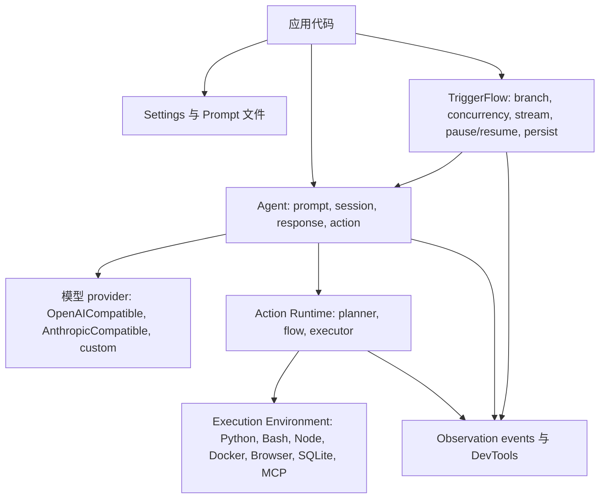

# Agently 4.1.2.2

Agently 是面向模型应用的 Python 框架，重点解决结构化输出稳定性、Action 可观测性和工作流可持续运行的问题。

[English](https://github.com/AgentEra/Agently/blob/main/README.md) | [中文介绍](https://github.com/AgentEra/Agently/blob/main/README_CN.md)

[](https://github.com/AgentEra/Agently/blob/main/LICENSE)
[](https://pypi.org/project/agently/)
[](https://pypistats.org/packages/agently)
[](https://github.com/AgentEra/Agently/stargazers)

## Agently 解决什么问题

Agently 面向的是“模型 demo 要变成应用代码”的阶段：

- 稳定契约：`.output(...)` schema、必填字段标记、校验、重试和结构化响应对象。
- 响应复用：同一次模型请求可以按文本、结构化数据、metadata 或流式事件消费。
- 可观测 Action：本地函数、MCP、内置能力和沙箱执行都会留下结构化 Action 记录。
- 可持续工作流：TriggerFlow 支持分支、并发、事件流、暂停/恢复、保存/加载和显式 close snapshot。
- 工程化形态：settings 文件、prompt 文件、FastAPI Helper、DevTools 观测和 coding-agent companion skills。

当前框架版本：`4.1.2.2`。

Python：`>=3.10`。

## 安装

```bash
pip install -U agently
```

本地模型示例可使用 Ollama 这类 OpenAI-compatible 端点：

```bash
ollama pull qwen2.5:7b
```

托管模型示例可在 shell 或 `.env` 中设置 `DEEPSEEK_API_KEY`。

## 快速开始

```python
from agently import Agently

Agently.set_settings(
    "OpenAICompatible",
    {
        "base_url": "https://api.deepseek.com/v1",
        "model": "deepseek-chat",
        "auth": "DEEPSEEK_API_KEY",
        "model_type": "chat",
        "request_options": {"temperature": 0.2},
    },
)

agent = Agently.create_agent()

result = (
    agent
    .input("用一句话介绍 Python，并列出三个优势。")
    .output({
        "intro": (str, "一句话介绍", True),
        "strengths": [(str, "一个优势")],
    })
    .start(ensure_all_keys=True)
)

print(result)
```

切到本地 Ollama 只需要换 provider 设置：

```python
Agently.set_settings(
    "OpenAICompatible",
    {
        "base_url": "http://127.0.0.1:11434/v1",
        "model": "qwen2.5:7b",
        "api_key": "ollama",
        "model_type": "chat",
    },
)
```

## 核心 API 形态

### 1. 模型请求

Prompt 是结构化槽位，不是一条拼接字符串：

```python
response = (
    agent
    .role("你是简洁的 release note 作者。")
    .info({"version": "4.1.2.2"})
    .instruct("只基于输入事实作答。")
    .input("为工程 changelog 总结这个发布线。")
    .output({
        "headline": (str, "短标题", True),
        "bullets": [(str, "一个稳定事实")],
    })
    .get_response()
)

data = response.result.get_data()
text = response.result.get_text()
meta = response.result.get_meta()
```

当同一次模型调用需要用多种方式读取时，优先 `get_response()`，不要重复请求模型。

### 2. 输出控制

固定必填字段直接在 `.output(...)` 的 tuple 第三项标 `True`：

```python
ticket = (
    agent
    .input("归档发票账户的账单导出失败。")
    .output({
        "category": (str, "billing / auth / data / unknown", True),
        "severity": (int, "1-5", True),
        "next_actions": [(str, "建议动作")],
    })
    .start()
)
```

`ensure_keys=` 只用于条件路径或运行时决定路径。业务规则用 `.validate(...)` 或 `validate_handler=`。需要整棵结构都存在时使用 `ensure_all_keys=True`。

### 3. 结构化流式

Instant 事件允许 UI 或下游消费者在字段变化时立刻更新：

```python
response = (
    agent
    .input("解释递归，并给两个示例。")
    .output({
        "definition": (str, "一句话定义", True),
        "examples": [(str, "带解释的示例")],
    })
    .get_response()
)

for event in response.get_generator(type="instant"):
    if event.path == "definition" and event.delta:
        print(event.delta, end="", flush=True)
    if event.wildcard_path == "examples[*]" and event.is_complete:
        print("\nEXAMPLE:", event.value)
```

### 4. Actions

Actions 是模型可调用的能力。新代码从 `@agent.action_func` 和 `agent.use_actions(...)` 起步：

```python
from agently import Agently

agent = Agently.create_agent()

@agent.action_func
def calculate_total(price: float, quantity: int) -> float:
    """Calculate an order total."""
    return price * quantity

agent.use_actions(calculate_total)

response = (
    agent
    .input("使用可用 action 计算 19.5 * 4，并解释结果。")
    .get_response()
)

print(response.result.get_text())
print(response.result.full_result_data["extra"].get("action_logs", []))
```

常用执行能力 helper：

```python
agent.enable_python()
agent.enable_shell(root=".", commands=["pwd", "rg"])
agent.enable_workspace(root=".", read=True, write=False)
agent.enable_sqlite(db_path="app.db")
```

MCP server 使用 `agent.use_mcp(...)`。自定义后端使用 `agent.register_action(..., executor=..., execution_environments=[...])`。

### 5. TriggerFlow

TriggerFlow 是工作流层，用于分支、并发、事件输入、运行时流和重启安全执行。

```python
import asyncio
from agently import TriggerFlow

flow = TriggerFlow(name="ticket-flow")

async def classify(data):
    text = data.input["text"]
    category = "billing" if "invoice" in text.lower() else "unknown"
    await data.async_set_state("category", category)
    return category

async def route(data):
    await data.async_set_state("handler", f"{data.input}-team")

flow.to(classify).to(route)

async def main():
    execution = flow.create_execution()
    await execution.async_start({"text": "Invoice export failed."})
    snapshot = await execution.async_close()
    print(snapshot)

asyncio.run(main())
```

服务、worker、webhook、人工审核或 SSE/WebSocket 路径应保留 execution handle 并显式 close：

```python
execution = flow.create_execution(auto_close=False)
await execution.async_start(initial_input)
await execution.async_emit("UserApproved", {"approved": True})
snapshot = await execution.async_close()
```

在 4.1 线，`close()` / `async_close()` 是规范收尾路径，close snapshot 是稳定完成契约。

## 架构



主要扩展点保持分离：

| 层 | 扩展点 |
|---|---|
| Prompt/request | request hooks、prompt generator、response parser |
| Model | provider plugin 或 OpenAI-compatible endpoint |
| Actions | `ActionRuntime`、`ActionFlow`、`ActionExecutor`、内置 action packages |
| 托管资源 | `ExecutionEnvironmentProvider` |
| 工作流 | TriggerFlow chunks、conditions、runtime stream、persistence |
| 观测 | event hookers、`agently-devtools` bridge |

## Examples

当前 examples 规则是：

- 推荐的 model-app 示例必须通过 DeepSeek 或本地 Ollama 调真实模型。
- 模型负责的 planning、routing、evaluation、revision、action selection 和 final response 不能用确定性本地替代物冒充。
- 底层 smoke 示例可以不调模型，但必须明确只覆盖基础设施行为。
- 推荐示例必须包含 `Expected key output` 源码注释，记录一次真实运行中的稳定事实。

推荐入口：

| 目录 | 用途 |
|---|---|
| `examples/cookbook/` | 模型驱动应用模式 |
| `examples/action_runtime/` | function、MCP、sandbox、plugin action 示例 |
| `examples/execution_environment/` | 托管 Python、Shell、Node、SQLite、Browser 和 provider 生命周期 |
| `examples/trigger_flow/` | TriggerFlow 机制示例 |
| `examples/builtin_actions/` | Search/Browse package 示例 |
| `examples/fastapi/` | 服务暴露示例 |

`examples/archived/` 是兼容参考，不是新应用默认起点。

## 项目结构

应用代码建议拆分模型设置、prompt 资产、工作流代码和领域逻辑：

```text
my_ai_project/
  .env
  config/
    global.yaml
    agents/
      triage.yaml
  prompts/
    classify_ticket.yaml
  app/
    agents.py
    actions.py
    flows.py
    main.py
  tests/
```

文件配置建议启用环境变量替换：

```python
from agently import Agently

Agently.load_settings("yaml_file", "config/global.yaml", auto_load_env=True)

triage = Agently.create_agent()
triage.load_settings("yaml_file", "config/agents/triage.yaml", auto_load_env=True)
```

## Companion Repositories

### Agently Skills

Agently-Skills 为 coding agent 提供当前 Agently 实现指导。

- Repository: https://github.com/AgentEra/Agently-Skills
- 当前 catalog generation: `v2`
- 推荐 bundle: `app`
- Agently 4.1.2.2 compatibility: Skills authoring protocol `agently-skills.authoring.v1`

当你让 Codex、Claude Code、Cursor 或其他 coding agent 实现 Agently 模式时，应使用该 companion repo。

### Agently DevTools

`agently-devtools` 是可选 companion package，覆盖本地观测、评估、交互式 wrapper 和项目脚手架。

```bash
pip install agently-devtools
agently-devtools init my_project
```

Agently 4.1.2.2 推荐 `agently-devtools >=0.1.4,<0.2.0`。

## 文档

| Resource | Link |
|---|---|
| Documentation (EN) | https://agently.tech/docs |
| Documentation (中文) | https://agently.cn/docs |
| Quickstart | https://agently.tech/docs/en/start/quickstart.html |
| Output Control | https://agently.tech/docs/en/requests/output-control.html |
| Model Response | https://agently.tech/docs/en/requests/model-response.html |
| Actions | https://agently.tech/docs/en/actions/overview.html |
| TriggerFlow | https://agently.tech/docs/en/triggerflow/overview.html |
| FastAPI Helper | https://agently.tech/docs/en/services/fastapi.html |
| Coding Agents | https://agently.tech/docs/en/development/coding-agents.html |

## 兼容说明

- 当前 package version 是 `4.1.2.2`。
- 当前 release manifest 是 `compatibility/releases/4.1.2.2.json`。
- 旧 `tool_*` 名称和部分 TriggerFlow result API 仍是兼容面，但 README 示例只使用当前 Action 与 close snapshot 路径。
- 不要把未来计划版本当作已发布版本；开发线计划写入 `compatibility/in-development.json`。

## 社区

- Discussions: https://github.com/AgentEra/Agently/discussions
- Issues: https://github.com/AgentEra/Agently/issues
- 微信群: https://doc.weixin.qq.com/forms/AIoA8gcHAFMAScAhgZQABIlW6tV3l7QQf

## License

Agently 采用 open-core 模式：

- 开源核心：[Apache 2.0](LICENSE)
- Trademark usage policy: [TRADEMARK.md](TRADEMARK.md)
- Contributor rights agreement: [CLA.md](CLA.md)
- Enterprise extensions and services: 独立商业协议
