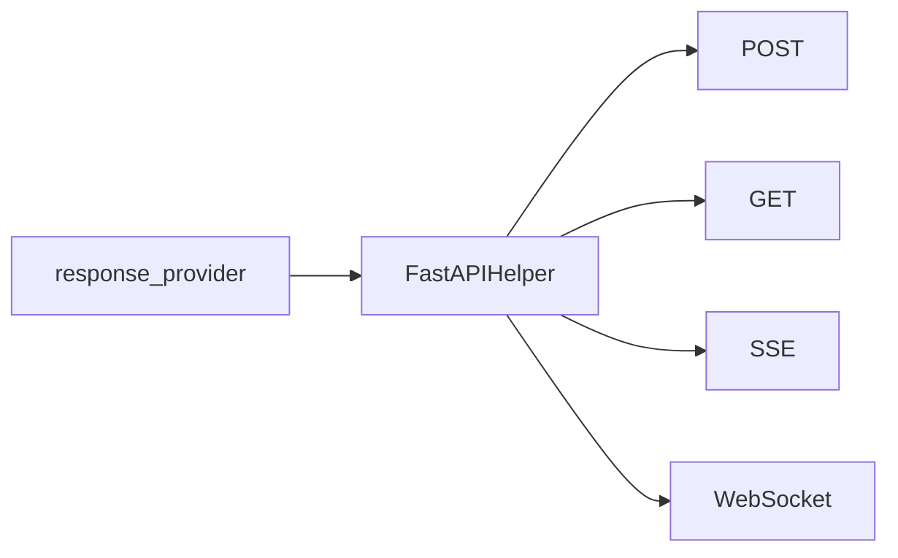

# FastAPIHelper Integration

> Applies to: 4.0.8.1+

`FastAPIHelper` is Agently's FastAPI integration layer for turning response providers (Agent / Request / Flow) directly into HTTP endpoints.

## 1. Mapping response providers to transport protocols



### How to read this diagram

- `FastAPIHelper` is a transport adapter, not a new runtime.
- It wraps the same response provider into several HTTP / realtime interfaces instead of redefining orchestration.

### Design rationale

That is why you can start with a plain `Agent` and later move to `TriggerFlowExecution` while keeping the external API shape mostly unchanged.

Good fit when:

- you need to stand up an AI service API quickly
- you want both regular requests and streaming interfaces (SSE / WS)
- you want to reuse Agently input shaping, output parsing, and error wrapping

## 2. Supported `response_provider` types

`FastAPIHelper(response_provider=...)` supports:

- `BaseAgent`
- `ModelRequest`
- `TriggerFlow`
- `TriggerFlowExecution`
- custom `Generator` / `AsyncGenerator` functions

## 3. Full server example

```python
import os
import uvicorn

from agently import Agently
from agently.integrations.fastapi import FastAPIHelper

OLLAMA_BASE_URL = os.environ.get("OLLAMA_BASE_URL", "http://127.0.0.1:11434/v1")

Agently.set_settings(
    "OpenAICompatible",
    {
        "base_url": OLLAMA_BASE_URL,
        "model": "qwen2.5:7b",
        "options": {"temperature": 0.3},
    },
)

agent = Agently.create_agent()
agent.role("You are a concise and helpful assistant.", always=True)

app = FastAPIHelper(response_provider=agent)

(
    app
    .use_post("/agent/chat")
    .use_get("/agent/chat/get")
    .use_sse("/agent/chat/sse")
    .use_websocket("/agent/chat/ws")
)

@app.get("/health")
async def health():
    return {"ok": True, "provider": "agent", "model": "qwen2.5:7b"}

if __name__ == "__main__":
    uvicorn.run(app, host="127.0.0.1", port=8000)
```

## 4. Request and response contract

### 4.1 Request body

Unified shape:

```json
{
  "data": { "input": "hello" },
  "options": {}
}
```

- `data`: input passed to the provider
- `options`: optional arguments passed to the provider method

### 4.2 Default response wrapper

Success:

```json
{ "status": 200, "data": "...", "msg": null }
```

Failure:

```json
{
  "status": 422,
  "data": null,
  "msg": "Invalid request payload ...",
  "error": {
    "type": "ValueError",
    "module": "builtins",
    "message": "..."
  }
}
```

Default status mapping:

- `ValueError` -> `422`
- `TimeoutError` -> `504`
- other exceptions -> `400`

To customize the wrapper, pass `response_warper`.

## 5. Route types

| Method | Example path | Notes |
| --- | --- | --- |
| POST | `/agent/chat` | most common JSON body route |
| GET | `/agent/chat/get` | JSON string in `payload` query param |
| SSE | `/agent/chat/sse` | stream events via `data:` lines |
| WS | `/agent/chat/ws` | bidirectional realtime channel |

## 6. TriggerFlow concurrency integration

When the provider is `TriggerFlowExecution` and `options` includes `concurrency`, FastAPIHelper calls `execution.set_concurrency(...)` so each request can tune its own concurrency limit.

```json
{
  "data": {"input": "..."},
  "options": {"concurrency": 2}
}
```

## 7. Production guidance

- put authentication, rate limiting, and auditing at the gateway layer
- validate `payload` with FastAPI/Pydantic schemas
- set timeouts and reconnect strategy for SSE/WS
- keep `error.type` and request trace IDs in failure responses
- combine with TriggerFlow runtime streams for observable long-running flows

## 8. Example references

- `examples/fastapi/fastapi_helper_agent_ollama.py`
- `examples/fastapi/fastapi_helper_triggerflow_ollama.py`
- `examples/fastapi/fastapi_helper_agent_request.py`
