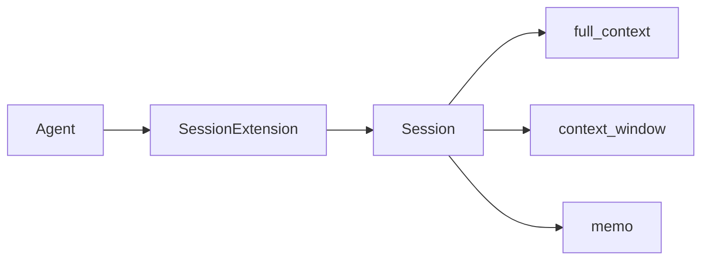
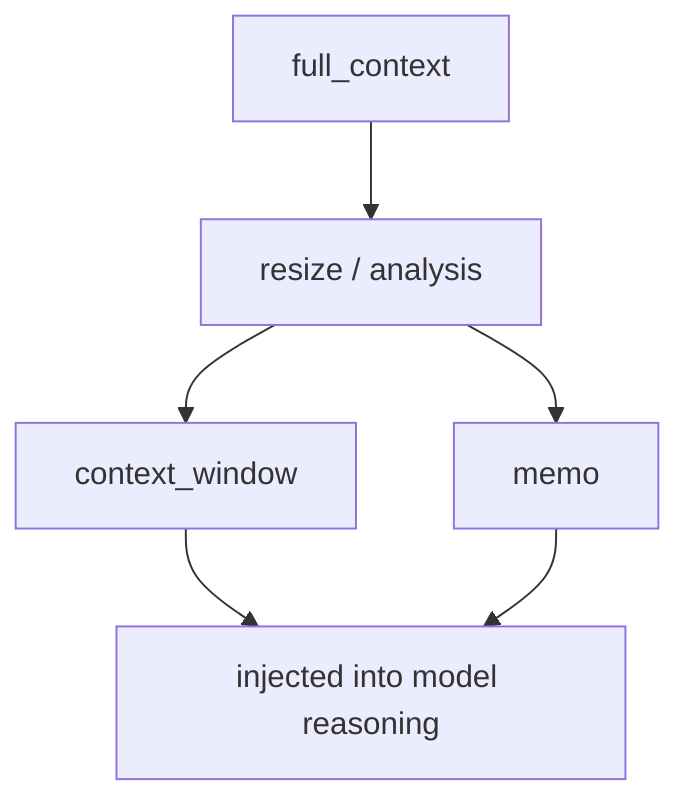

# Core Concepts

> Applies to: 4.0.8.1+

## 1. Session architecture layers



### How to read this diagram

- `Session` owns state and strategy execution.
- `SessionExtension` attaches Session behavior to the Agent request lifecycle.

## 2. How the three core states interact



### Design rationale

- `full_context` is for auditability and full recovery
- `context_window` is what actually reaches the model
- `memo` is for long-lived structured facts, preferences, and constraints

The modern session model has two layers:

- `Session` for state and strategy execution
- `SessionExtension` for Agent lifecycle integration

That split lets you:

- use `Session` directly as a pure state/strategy object
- or use it through `Agent` for automatic injection and recording

## 3. Automatic trimming (`auto_resize`)

By default, `auto_resize=True`:

- `resize` runs after `set_chat_history` / `add_chat_history`
- the default analyzer reads `session.max_length`
- when over the limit, the default `simple_cut` strategy runs

Example:

```python
agent.set_settings("session.max_length", 12000)
```

## 4. Programmable extension points

### 4.1 Analyzer (decides strategy name)

```python
def analysis_handler(full_context, context_window, memo, session_settings):
    if len(context_window) > 6:
        return "keep_last_six"
    return None
```

### 4.2 Executor (returns new state)

The executor returns:

1. `new_full_context` or `None`
2. `new_context_window` or `None`
3. `new_memo` or `None`

```python
def keep_last_six(full_context, context_window, memo, session_settings):
    return None, list(context_window[-6:]), memo
```

Register them:

```python
session.register_analysis_handler(analysis_handler)
session.register_execution_handlers("keep_last_six", keep_last_six)
```

## 5. SessionExtension in the Agent lifecycle

- `request_prefixes`: injects `context_window` into `chat_history`
- `finally`: extracts request input and reply, then writes them back into Session

Input/output extraction keys:

- `session.input_keys`
- `session.reply_keys`

Supported key styles:

- dot path: `info.task`
- slash path: `info/task`
- special prefixes: `.request.*`, `.agent.*`

## 6. Interface evolution

Legacy Session shortcuts are no longer the recommended path.  
Prefer `activate_session/deactivate_session`, `session.max_length`, and `register_*_handler`.

Recommended reading: [Session activation and migration](/en/agent-extensions/session-memo/quick-session)
