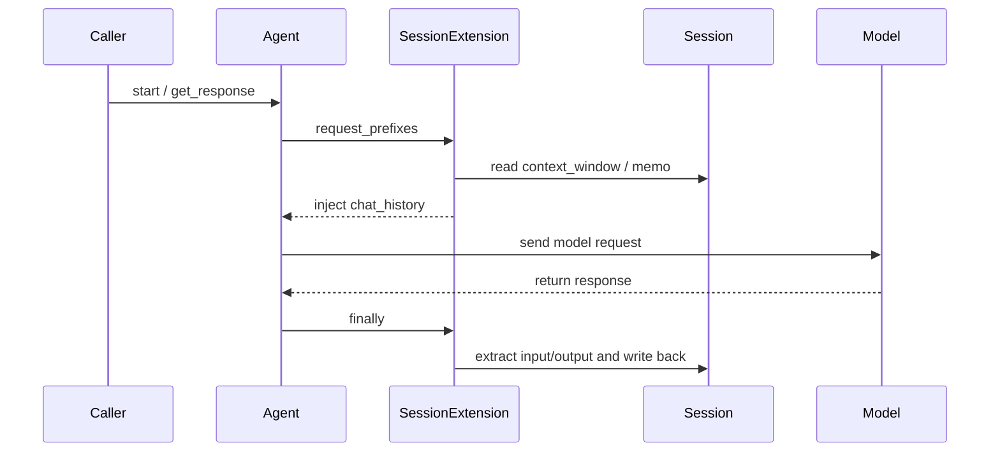

# Agent Integration Details

> Applies to: 4.0.8.1+

`SessionExtension` is already integrated into Agent by default. This page explains how it works and how to control its recording behavior precisely.

## 1. Request lifecycle hooks



### How to read this diagram

- Session does not intercept the model directly. It integrates through Agent lifecycle hooks.
- That is why Session can still be used standalone, while also supporting zero-invasive Agent integration.

## 2. Lifecycle hooks

### Before request (`request_prefixes`)

- inject `activated_session.context_window` into `chat_history`
- inject `CHAT SESSION MEMO` when `memo` is non-empty

### After request (`finally`)

- extract input and output
- write them back into `full_context/context_window` according to settings

## 3. Session pool management

Inside Agent:

- `agent.sessions: dict[str, Session]`
- `agent.activated_session: Session | None`

Recommended pattern:

```python
agent.activate_session(session_id=user_id)
# ...
agent.deactivate_session()
```

## 4. Input/output recording control

### 4.1 `session.input_keys`

Record only selected input fields:

```python
agent.set_settings("session.input_keys", [
    ".request",
    "info.task",
    "input/lang",
    ".agent.system",
])
```

### 4.2 `session.reply_keys`

Record only selected structured reply fields:

```python
agent.set_settings("session.reply_keys", ["summary", "scores.total"])
```

If `input_keys/reply_keys` is `None`, the full request text and full result are recorded.

## 5. Behavior of chat_history APIs under an activated session

When a session is active, these APIs operate on the current Session:

- `set_chat_history(...)`
- `add_chat_history(...)`
- `reset_chat_history()`
- `clean_context_window()`

## 6. Combining with temporary requests

Inside custom executors, `create_temp_request()` is the recommended way to generate memo summaries:

- it does not inherit current agent prompt/session handlers
- it avoids recursive pollution of session context

```python
memo_request = agent.create_temp_request()
```

## 7. Team convention

Prefer only the modern Session APIs:

- `activate_session` / `deactivate_session`
- `session.max_length`
- `register_analysis_handler` / `register_execution_handlers`
