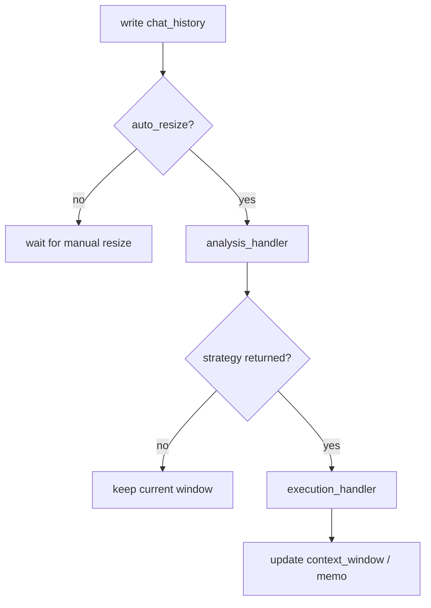

# Resize and Strategy Extension

> Applies to: 4.0.8.1+

`resize` is the entrypoint for Session window governance:

- it controls `context_window`
- it can also update `memo`

## 1. `auto_resize` decision flow



### How to read this diagram

- the analyzer decides whether resizing should happen and which strategy name to use
- the executor actually mutates `context_window` and `memo`

## 2. Default behavior: `max_length + simple_cut`

The default analyzer:

- returns `simple_cut` when `session.max_length` is an integer and the window is over limit

The default executor `simple_cut`:

- keeps messages from newest backward until total length is within `max_length`

Example:

```python
agent.set_settings("session.max_length", 12000)
```

## 3. Automatic and manual triggers

- automatic: when `auto_resize=True` (default), resize runs after history writes
- manual: call `session.resize()` whenever you want

```python
agent.activate_session(session_id="resize_demo")
session = agent.activated_session

session.resize()
# await session.async_resize()
```

## 4. Custom strategy: keep last N rounds

```python
def analysis_handler(full_context, context_window, memo, session_settings):
    if len(context_window) > 10:
        return "keep_last_ten"
    return None


def keep_last_ten(full_context, context_window, memo, session_settings):
    return None, list(context_window[-10:]), memo


session.register_analysis_handler(analysis_handler)
session.register_execution_handlers("keep_last_ten", keep_last_ten)
```

## 5. When to disable automatic resize

If you want to batch writes and compress later in one pass:

```python
from agently.core import Session

session = Session(auto_resize=False, settings=agent.settings)
# ... batch writes
session.resize()
```

## 6. Common pitfalls

- setting `session.max_length` without activating a session: no effect
- returning a strategy name that was never registered: warning, no update
- returning the wrong executor shape: always return `(new_full, new_window, new_memo)`
