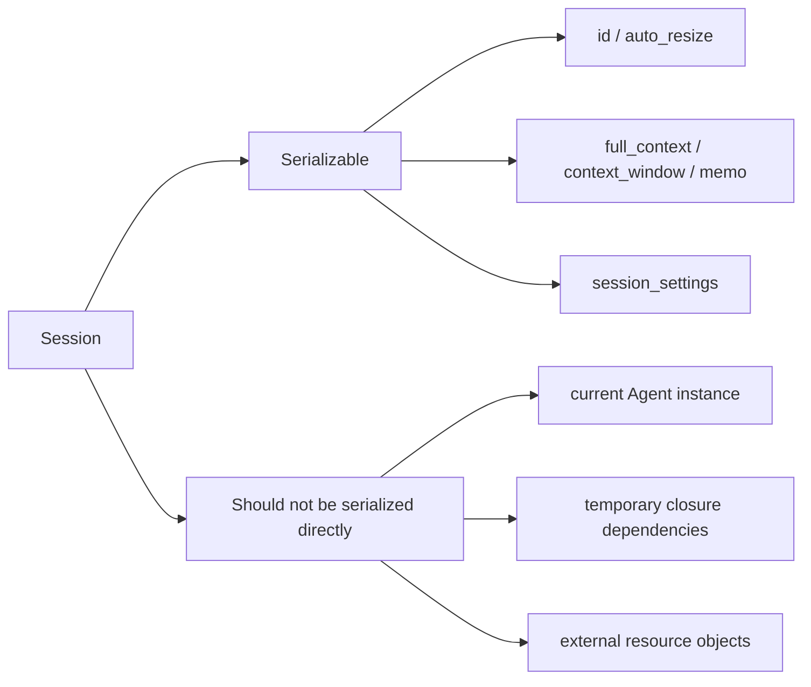

# Export, Import, and Recovery

> Applies to: 4.0.8.1+

`Session` has built-in JSON/YAML serialization, suitable for:

- persisting sessions
- cross-process recovery
- runtime snapshot auditing

## 1. What gets serialized



### How to read this diagram

- Session serialization stores conversational state, not the whole runtime environment.
- If an object depends on the current process, network connection, or closure scope, do not expect Session snapshots to recreate it.

## 2. Export

```python
session_json = session.get_json_session()
session_yaml = session.get_yaml_session()

# aliases also work
session_json_2 = session.to_json()
session_yaml_2 = session.to_yaml()
```

Exported content includes:

- `id`
- `auto_resize`
- `full_context`
- `context_window`
- `memo`
- `session_settings`

## 3. Import (string or file path)

```python
from agently.core import Session

session = Session(settings=agent.settings)
session.load_json_session(session_json)
session.load_yaml_session("./session.snapshot.yaml")

# aliases
session.load_json(session_json)
session.load_yaml("./session.snapshot.yaml")
```

## 4. Extract from a larger object

When session data is nested inside a larger JSON/YAML object, use `session_key_path`:

```python
session.load_json_session(
    "./snapshot.json",
    session_key_path="payload.session",
)
```

## 5. Restore into the Agent session pool

```python
restored = Session(settings=agent.settings)
restored.load_json_session("./session.snapshot.json")

agent.sessions[restored.id] = restored
agent.activate_session(session_id=restored.id)
```

## 6. Compatibility and validation advice

- record a version field when persisting (for example `app_schema_version`)
- validate key fields after import (`memo` shape, `context_window` length)
- never blindly trust external input; degrade gracefully on import failures
