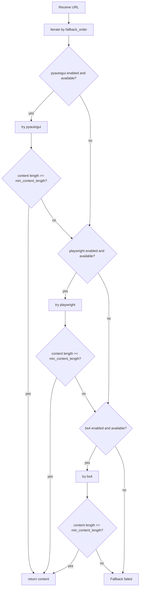
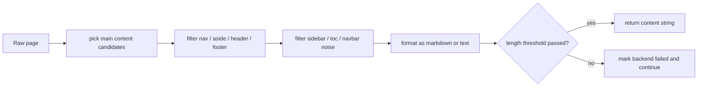

# Browse Tool

> Applies to: `v4.0.8.2`

`Browse` is now the only built-in browsing tool. `Playwright` and `PyAutoGUI` are no longer exposed as standalone tools; they are internal backends of `Browse`.

## 1. Fallback decision chain



### How to read this diagram

- `fallback_order` decides ordering, but each stage is still gated by `enable_*` flags and environment availability.
- “Failure” is not only exceptions. Content that is too short also counts as a failed backend attempt.

## 2. Why there is one Browse tool instead of many browsing tools

This is an architectural simplification, not a capability reduction:

- business logic only says “I need reliable page content”
- backend selection is centralized in `Browse`
- fallback strategy, content quality checks, and dynamic rendering behavior all stay in one tool

That is why projects like Daily News Collector no longer need application-level branching between Playwright and plain HTML fetching.

## 3. Key parameters

Default backend order:

```python
("pyautogui", "playwright", "bs4")
```

Common setup:

```python
from agently.builtins.tools import Browse

browse = Browse(
    enable_pyautogui=False,
    enable_playwright=True,
    enable_bs4=True,
    response_mode="markdown",
    min_content_length=80,
)
```

Important parameters:

- `fallback_order`
- `enable_pyautogui`
- `enable_playwright`
- `enable_bs4`
- `response_mode`
- `min_content_length`
- `max_content_length`
- `playwright_headless`
- `playwright_timeout`
- `playwright_include_links`
- `pyautogui_open_mode`

## 4. Content extraction and failure semantics



### Design rationale

The core of `Browse` is not “opening a page”. It is “returning text evidence that is long enough and content-like enough to be useful”. That is what makes it better than a naive `httpx + BeautifulSoup.get_text()` approach for docs sites and news sites.

Under the `bs4` path, it prefers:

- `main/article/.vp-doc/[role=main]` style content roots
- filtering `nav/aside/header/footer`
- filtering `sidebar/toc/navbar`-style noise selectors

## 5. Return value and failure contract

Public API:

```python
content = await browse.browse(url)
```

On success:

- extracted content string

On failure:

- `Can not browse '...'. Fallback failed: ...`

So `browse()` still returns a string, not a structured trace object. Wrap it yourself if you need strict error handling.

## 6. Why Daily News Collector enables Playwright by default

Its `SETTINGS.yaml` uses:

```yaml
BROWSE:
  enable_playwright: true
```

because many news sites:

- render useful content only after browser execution
- rely on dynamic loading
- produce content that is too thin under plain HTML fetch

With `min_content_length`, this makes the fallback model especially suitable for news collection.

## 7. Recommended usage

```python
from agently import Agently
from agently.builtins.tools import Search, Browse

agent = Agently.create_agent()
search = Search(region="us-en")
browse = Browse(enable_playwright=True, min_content_length=80)

agent.use_tools([search.search, search.search_news, browse.browse])
```

Best practices:

- search first, browse second
- check Browse output length and error strings
- cite evidence or URLs in the final answer
