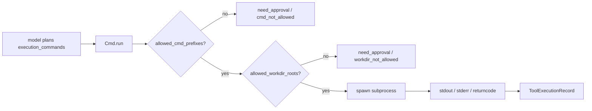

# Cmd Tool

> Applies to: `v4.0.8.2`

`Cmd` is not designed for arbitrary shell access. It is a controlled command executor with explicit allowlists.

## 1. Command execution boundary



### How to read this diagram

- `Cmd` is a controlled executor, not a default shell for the model.
- Command allowlists and workdir allowlists are independent boundaries. Either one can stop execution.

## 2. Initialization

```python
from agently.builtins.tools import Cmd

cmd = Cmd(
    allowed_cmd_prefixes=["ls", "rg", "cat", "pwd"],
    allowed_workdir_roots=["/workspace/project"],
    timeout=20,
    env=None,
)
```

Default prefixes are intentionally conservative:

- `ls`
- `rg`
- `cat`
- `pwd`
- `whoami`
- `date`
- `head`
- `tail`

## 3. Two safety boundaries

### Command allowlist

If the first token is not allowed:

```python
{
    "ok": False,
    "need_approval": True,
    "reason": "cmd_not_allowed",
}
```

### Workdir allowlist

If `workdir` is outside allowed roots:

```python
{
    "ok": False,
    "need_approval": True,
    "reason": "workdir_not_allowed",
}
```

## 4. Public API

```python
result = await cmd.run(
    cmd="rg TriggerFlow .",
    workdir="/workspace/project",
    allow_unsafe=False,
)
```

Notes:

- `cmd` can be a string or `list[str]`
- `allow_unsafe=True` skips the command-prefix check but still keeps the workdir check

## 5. Successful return

```python
{
    "ok": True,
    "returncode": 0,
    "stdout": "...",
    "stderr": "",
}
```

## 6. Design rationale

`Cmd` works best in “read-only diagnostics” or “approval before execution” flows:

- the model proposes intent
- `Cmd` enforces hard boundaries
- the surrounding system decides whether to feed results back into the Tool Loop

That is why dangerous write operations should not be part of the default tool loop.

## 7. Usage advice

- expose read-oriented commands only
- scope `workdir` tightly to the project root
- put truly risky writes behind human approval
