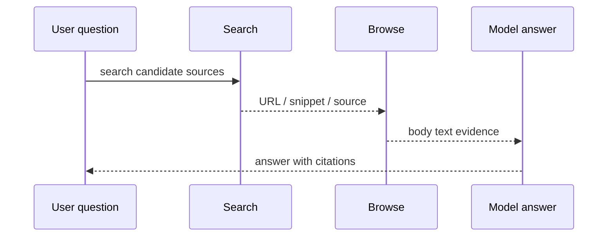

# Search Tool

> Applies to: `v4.0.8.2`

`Search` is built on `ddgs`, and the source requires `ddgs>=9.10.0`.

## 1. Recommended Search + Browse flow



### How to read this diagram

- `Search` discovers candidates; it does not guarantee high-quality body text.
- `Browse` turns those candidates into readable evidence, which is why the v4.0.8.2 mental model is now “Search + Browse”, not “Search + Playwright”.

## 2. Available methods

- `search(query, timelimit=None, max_results=10)`
- `search_news(query, timelimit=None, max_results=10)`
- `search_wikipedia(query, timelimit=None, max_results=10)`
- `search_arxiv(query, max_results=10)`

## 3. Initialization

```python
from agently.builtins.tools import Search

search = Search(
    proxy=None,
    timeout=20,
    backend="auto",
    search_backend=None,
    news_backend=None,
    region="us-en",
    options=None,
)
```

Notes:

- `backend` is the default fallback backend
- `search_backend` and `news_backend` can override it separately
- `options` is passed through to `ddgs`

## 4. Use it as an Agent tool

```python
from agently import Agently
from agently.builtins.tools import Search

agent = Agently.create_agent()
search = Search(region="us-en", backend="google")

agent.use_tools([
    search.search,
    search.search_news,
    search.search_wikipedia,
    search.search_arxiv,
])
```

## 5. Return shape

`search` / `search_news` / `search_wikipedia` commonly return:

- `title`
- `href` or `url`
- `body` / `snippet`
- `source`
- `date`

`search_arxiv` returns:

- `feed_title`
- `updated`
- `entries[]`

## 6. Recommended composition

The recommended pipeline is now:

- `Search + Browse`

because:

- `Browse` already encapsulates Playwright / PyAutoGUI / bs4 fallback
- workflow code should not decide which browser backend to call

## 7. Daily News Collector usage

`Agently-Daily-News-Collector` primarily uses:

- `search_news(...)`

and then feeds results into `Browse` for body extraction. That is the most recommended “search first, read second” pattern in `v4.0.8.2`.
