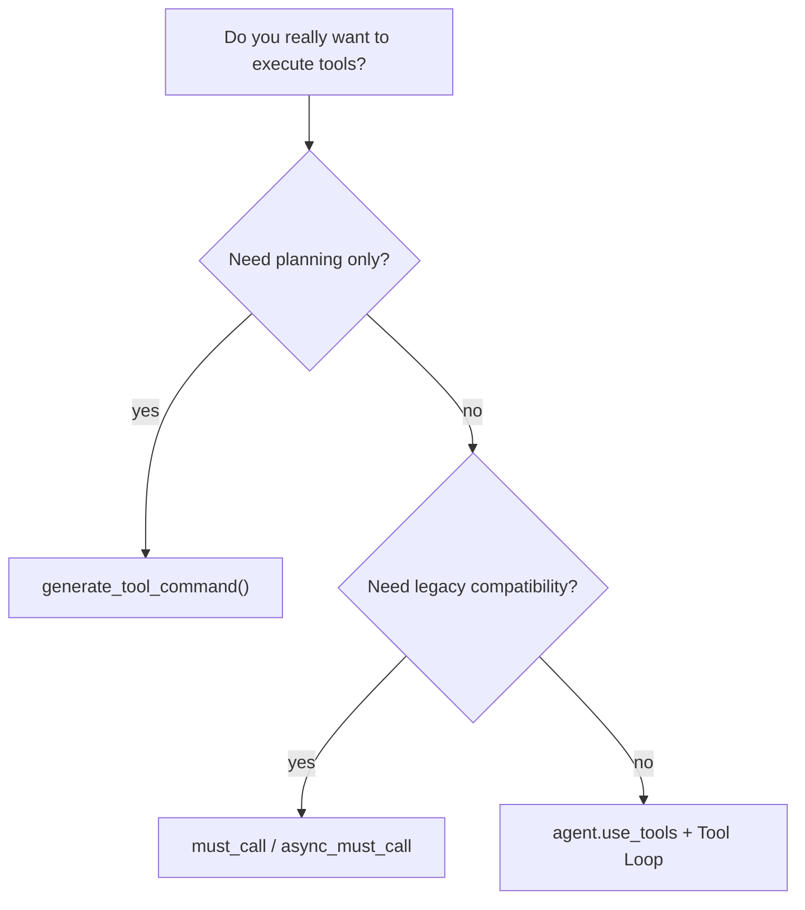

# Tool Notes and Best Practices

> Applies to: `v4.0.8.2`

## 1. Entry-point decision map

### How to read this diagram

- `generate_tool_command()` is the formal entry because it explicitly means “plan only”.
- `must_call()` and `async_must_call()` still work, but should now be treated as compatibility wrappers.

## 2. Prefer protocol stability

- use `next_action + execution_commands[]` in new code
- do not omit `execution_commands[*].todo_suggestion`
- do not keep designing new systems around `tool_commands`

## 3. Keep planning and execution separate

- planner decides what should happen
- executor performs side effects
- final response consumes `action_results`

This separation makes loops easier to audit and less likely to spin out of control.

## 4. Where `generate_tool_command()` fits

Use it for:

- external approval
- custom execution sandboxes
- multi-system orchestration

`must_call()` and `async_must_call()` are now compatibility-only concepts.

## 5. Correct mental model for Browse

`Browse` returns readable evidence, not the final answer itself.

Recommended chain:

1. `Search` finds candidates
2. `Browse` reads body content
3. the model answers from evidence
4. the final answer cites evidence or URLs

## 6. Safety boundaries

- high-risk tools like `Cmd` must have allowlists
- do not rely on model self-restraint for writes
- validate `Browse` and `Search` outputs for length and error strings

## 7. Concurrency and timeout

- start conservatively with `max_rounds=3~5`
- keep `concurrency` low when dependencies are unstable
- Playwright-based Browse runs cost more time and resources

## 8. Observability and debugging

Check first:

- `extra.tool_logs`
- `success`
- `error`
- `todo_suggestion`

If needed, enable:

- `runtime.show_tool_logs`

## 9. Daily News Collector takeaway

`Agently-Daily-News-Collector` enables `BROWSE.enable_playwright: true` by default because many news sites require browser rendering before stable body text becomes available.

The practical lesson is:

- treat `Browse` as a multi-backend page reader
- stop treating Playwright/PyAutoGUI as standalone business-layer tools
