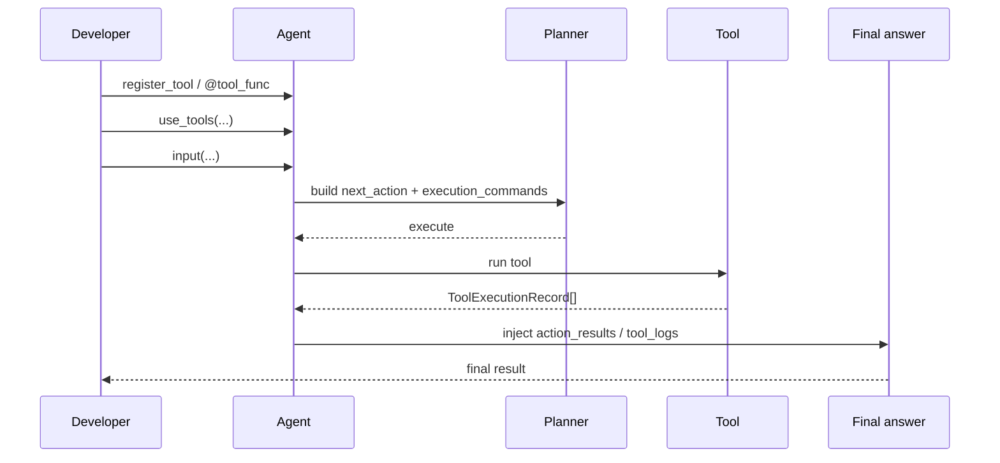

# Tool Quickstart

> Applies to: `v4.0.8.2`

## 1. From registration to final answer



### How to read this diagram

- This is not “the model executing tools on its own”; the Agent mediates planning, execution, and evidence injection.
- If you only need planning, the flow stops at the planner.

## 2. Register a tool

### Option A: `@agent.tool_func`

```python
from agently import Agently

agent = Agently.create_agent()

@agent.tool_func
def add(a: int, b: int) -> int:
    return a + b
```

### Option B: `register_tool`

```python
agent.register_tool(
    name="search_docs",
    desc="Search keywords in internal docs",
    kwargs={"query": (str, "query")},
    func=lambda query: [f"doc:{query}"],
)
```

## 3. Make the agent use tools

```python
agent.use_tools([add, "search_docs"])

response = agent.input("Use a tool to compute 12 + 34 and also search internal docs").get_response()
print(response.result.get_data())
```

`agent.use_tools(...)` essentially marks which tools are visible to the current agent, and the Tool Loop only sees that visible set.

## 4. Tune Tool Loop settings

```python
agent.set_tool_loop(
    enabled=True,
    max_rounds=4,
    concurrency=2,
    timeout=20,
)
```

Related settings:

- `tool.loop.enabled`
- `tool.loop.max_rounds`
- `tool.loop.concurrency`
- `tool.loop.timeout`

## 5. Inspect execution logs

```python
full = response.result.full_result_data
tool_logs = full.get("extra", {}).get("tool_logs", [])
print(tool_logs)
```

Typical `ToolExecutionRecord` fields:

- `purpose`
- `tool_name`
- `kwargs`
- `todo_suggestion`
- `success`
- `result`
- `error`

## 6. Plan only, do not execute

```python
commands = agent.generate_tool_command()
print(commands)
```

This only calls the planner and returns normalized `execution_commands`. Typical use cases:

- external schedulers
- approval before execution
- custom execution sandboxes

## 7. Recommended planner output

```python
{
    "next_action": "execute",
    "execution_commands": [
        {
            "purpose": "search official docs",
            "tool_name": "search",
            "tool_kwargs": {"query": "Agently TriggerFlow"},
            "todo_suggestion": "browse the URLs after search",
        }
    ],
}
```

Notes:

- `execution_commands` is the primary field
- `todo_suggestion` feeds the next round
- `must_call()` and `async_must_call()` are no longer the preferred entry points

## 8. What gets injected automatically

When the Tool Loop really executes tools and produces records, the framework automatically:

1. converts records into `prompt.action_results`
2. injects `prompt.extra_instruction`
3. writes full records into `extra.tool_logs`

Next: [Tool Runtime (Tool Loop)](/en/agent-extensions/tool-runtime)
