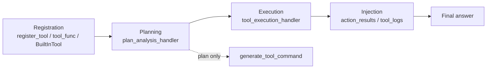

# Tool System Overview

> Applies to: `v4.0.8.2`

In `v4.0.8.2`, the tool system is a standardized loop of **plan -> execute -> inject evidence**:

- the canonical planning schema is `next_action + execution_commands[]`
- the default Tool Loop is implemented on top of `TriggerFlow`
- tool results are injected into `prompt.action_results` and `extra.tool_logs`
- `Browse` is now the only built-in browsing tool, with internal `pyautogui -> playwright -> bs4` fallback

## 1. Four-layer architecture



### How to read this diagram

- Read it from left to right: the system is not “the model directly calling functions”.
- `generate_tool_command()` stops at the planning layer; `agent.use_tools(...)` activates the full loop.

### Design rationale

Putting the Tool Loop on top of `TriggerFlow` instead of hiding it inside a black-box while loop gives two direct benefits:

- each round has explicit state: `done_plans`, `last_round_records`, `round_index`
- planning, execution, and evidence injection are naturally separated for replacement and auditing

## 2. How to think about the tool system

There are four layers:

1. registration: `register_tool()`, `@agent.tool_func`, BuiltInTool
2. planning: `plan_analysis_handler` returns a `ToolPlanDecision`
3. execution: `tool_execution_handler` runs `ToolCommand`
4. injection: `ToolExecutionRecord[]` becomes `action_results` and `tool_logs`

Canonical public shape:

```python
ToolPlanDecision = {
    "next_action": "execute" | "response",
    "execution_commands": [
        {
            "purpose": str,
            "tool_name": str,
            "tool_kwargs": dict,
            "todo_suggestion": str,
        }
    ],
}
```

Compatibility notes:

- `tool_commands` and `tool_command` are still normalized if returned
- `must_call()` and `async_must_call()` still exist, but only as soft-compat entry points
- new code should use `execution_commands` and `generate_tool_command()`

## 3. Built-in tools in v4.0.8.2

The built-in tool set exposed by source code is:

- [Search Tool](/en/agent-extensions/tool-builtin-search)
- [Browse Tool](/en/agent-extensions/tool-builtin-browse)
- [Cmd Tool](/en/agent-extensions/tool-builtin-cmd)
- [MCP Integration](/en/agent-extensions/mcp)

Important:

- `Playwright` and `PyAutoGUI` are no longer exposed as standalone built-in tools
- they now live behind `Browse` as internal backends

## 4. Tool Loop at a glance

```mermaid
flowchart TD
    A["register_tool / tool_func / BuiltInTool"] --> B[agent.use_tools]
    B --> C[request_prefix triggers Tool Loop]
    C --> D[plan_analysis_handler]
    D --> E{next_action}
    E -- response --> F[stop planning]
    E -- execute --> G[tool_execution_handler]
    G --> H[ToolExecutionRecord[]]
    H --> I["update done_plans / last_round_records / round_index"]
    I --> D
    F --> J[action_results + extra.tool_logs]
```

### How to read this diagram

- This is a runtime loop, not a static configuration chart.
- The planner can always read the previous round, so `todo_suggestion` and failures can shape the next decision.

The internal round state is always:

- `done_plans`
- `last_round_records`
- `round_index`

## 5. Recommended reading order

1. [Tool Quickstart](/en/agent-extensions/tool-quickstart)
2. [Tool Runtime (Tool Loop)](/en/agent-extensions/tool-runtime)
3. [Tool Handlers (Default & Replace)](/en/agent-extensions/tool-handlers)
4. [Browse Tool](/en/agent-extensions/tool-builtin-browse)
5. [Tool Notes & Best Practices](/en/agent-extensions/tool-notes)

## 6. Real project reference

`AgentEra/Agently-Daily-News-Collector` already runs on `v4.0.8.2`.

It uses:

- `Search.search_news()`
- `Browse` with `enable_playwright`
- `TriggerFlow.for_each(concurrency=...)`
- `runtime_resources` to inject `logger/search_tool/browse_tool`

See: [Daily News Collector](/en/case-studies/daily-news-collector)
