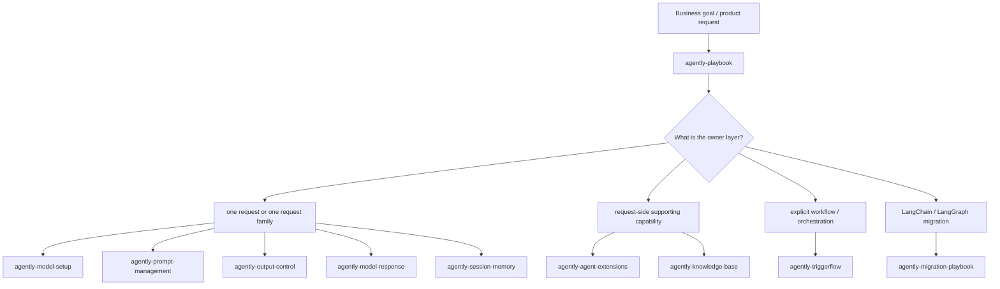

# Agently Development Playbook (Aligned with Official Agently Skills)

This page is for teams building real systems with Agently. The goal is not to repeat API references. The goal is to turn **business problem -> owner layer -> official skill -> docs entry** into an executable path.

> Scope: Agently 4.x docs. The routing language on this page follows the official `Agently-Skills` model.

## 1. Route by skill first, then drill into docs

### How to read this diagram

- `agently-playbook` is the top-level router. Use it to decide whether the problem belongs to the request side, supporting capability side, orchestration side, or migration side.
- Pick the **narrowest** skill first, then open the matching docs. Do not escalate everything into orchestration on day one.
- A real system usually combines several capabilities, but it should still have one clear owner layer.

## 2. Native-first rules

1. First ask whether one request is enough.
2. If the problem fits on the request side, do not jump to TriggerFlow first.
3. Prefer native Agently surfaces before inventing wrappers, parsers, retry glue, or pseudo-workflows.
4. Upgrade to `agently-triggerflow` only when branching, concurrency, waits, resume, or runtime events are the actual core problem.
5. Tools, MCP, knowledge-base, and session memory are often supporting capabilities rather than the owner layer.

## 3. Scenario -> official skill -> docs entry

| Business problem | Priority skill | Docs entry | Why |
| --- | --- | --- | --- |
| New project or unclear owner layer | `agently-playbook` | [/en/agent-docs](/en/agent-docs) + this page | Route first, implement second |
| Provider wiring, env vars, model settings | `agently-model-setup` | [/en/model-settings](/en/model-settings) | Get config boundaries right before app logic |
| Prompt structure, reusable prompt config, prompt-as-data | `agently-prompt-management` | [/en/prompt-management/overview](/en/prompt-management/overview) | Prompt design is request-side, not workflow by default |
| Structured fields, required keys, machine-readable output | `agently-output-control` | [/en/output-control/overview](/en/output-control/overview) | Use `output()` / `ensure_keys` before writing custom parsers |
| Streaming consumption, response reuse, text/data/meta access | `agently-model-response` | [/en/model-response/overview](/en/model-response/overview) | Start here when one response feeds multiple consumers |
| Session continuity, memo, restore | `agently-session-memory` | [/en/agent-extensions/session-memo/](/en/agent-extensions/session-memo/) | Session state is not the same as workflow state |
| Tools, MCP, FastAPIHelper, KeyWaiter | `agently-agent-extensions` | [/en/agent-extensions/tools](/en/agent-extensions/tools), [/en/agent-extensions/mcp](/en/agent-extensions/mcp), [/en/agent-extensions/fastapi-helper](/en/agent-extensions/fastapi-helper), [/en/agent-systems/key-waiter](/en/agent-systems/key-waiter) | Extend native surfaces instead of hiding them behind a private abstraction layer |
| Retrieval, vector indexing, knowledge-base answers | `agently-knowledge-base` | [/en/case-studies/kb-dialog](/en/case-studies/kb-dialog) | The current docs site shows KB-to-answer mainly through runnable scenarios |
| Explicit control flow, concurrency, waits/resume, runtime stream | `agently-triggerflow` | [/en/triggerflow/overview](/en/triggerflow/overview) + [/en/agent-systems/triggerflow-orchestration](/en/agent-systems/triggerflow-orchestration) | Upgrade only when control flow becomes the owner layer |
| LangChain / LangGraph migration | `agently-migration-playbook` | [/en/agent-docs](/en/agent-docs) | Use the official migration skills to decide whether the target stays on the agent side or orchestration side |

## 4. Common solution recipes

| System shape | Recommended skill combination | Site entry |
| --- | --- | --- |
| Ticket triage / structured extraction | `agently-playbook` + `agently-output-control` | [/en/agent-systems/ticket-triage](/en/agent-systems/ticket-triage) |
| Live UI feedback plus structured downstream fields | `agently-playbook` + `agently-output-control` + `agently-model-response` | [/en/agent-systems/streaming-structured](/en/agent-systems/streaming-structured) |
| Multi-turn assistant with memory | `agently-playbook` + `agently-session-memory` | [/en/agent-systems/session-memo](/en/agent-systems/session-memo) |
| Early field handling | `agently-playbook` + `agently-agent-extensions` | [/en/agent-systems/key-waiter](/en/agent-systems/key-waiter) |
| Natural-language control with action planning and execution | `agently-playbook` + `agently-output-control` + `agently-model-response`, then add `agently-triggerflow` when execution stages and branching become explicit | [/en/case-studies/talk-to-control](/en/case-studies/talk-to-control) |
| Long-running flow, concurrency, state convergence | `agently-playbook` + `agently-triggerflow` | [/en/agent-systems/triggerflow-orchestration](/en/agent-systems/triggerflow-orchestration) |

## 5. Common mistakes

- Sending every slightly complex requirement straight to TriggerFlow.
- Writing custom JSON parsers when the real problem is output control.
- Treating prompt-role separation as if it already requires workflow orchestration.
- Mistaking transport or integration layers such as FastAPI or controller wiring for the owner layer itself.

## 6. Existing playbook pages

- [Ticket Triage](/en/agent-systems/ticket-triage)
- [Streaming + Structured](/en/agent-systems/streaming-structured)
- [KeyWaiter Early Fields](/en/agent-systems/key-waiter)
- [Session & Memo](/en/agent-systems/session-memo)
- [TriggerFlow Orchestration](/en/agent-systems/triggerflow-orchestration)

## 7. From playbook to full projects

If you have already identified the owner layer and want to see how capabilities become systems, continue with:

- [Knowledge-base Multi-turn QA](/en/case-studies/kb-dialog)
- [Daily News Collector](/en/case-studies/daily-news-collector)
- [Agently Talk to Control](/en/case-studies/talk-to-control)
