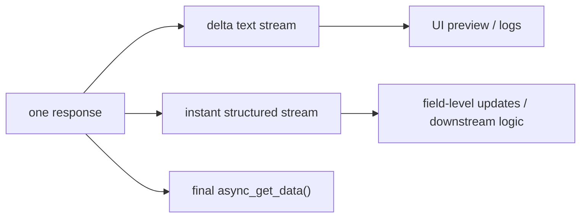

# Streaming + Structured Playbook

This playbook is not about “opening two streams at once”. Its real point is why **`async_generator + instant`** should be the default production pattern.

## Prerequisites

- [Model Response Overview](/en/model-response/overview)
- [Instant Structured Streaming](/en/output-control/instant-streaming)
- [Async First](/en/async-support)

## Scenario

You need live UI or logging output, and you also need structured fields for downstream systems.

## When this pattern fits

- the frontend should not stay blank for too long
- one request must serve both user-visible output and machine-consumable fields
- you already run inside an async service or event loop

## Recommended pattern

- text preview: `response.get_async_generator(type="delta")`
- structured fields: `response.get_async_generator(type="instant")`
- one request reuse: `response = ...get_response()`

This is intentionally async-first, not sync-first, because these scenes usually live inside:

- SSE or WebSocket
- FastAPI or workers
- services that may overlap several requests

## Data flow



## Full code

```python
import asyncio
from agently import Agently

Agently.set_settings(
    "OpenAICompatible",
    {
        "base_url": "http://localhost:11434/v1",
        "model": "qwen2.5:7b",
        "model_type": "chat",
    },
).set_settings("request_options", {"temperature": 0.2}).set_settings("debug", False)

agent = Agently.create_agent()

response = (
    agent.system("You are an operations-report assistant. Return structured output.")
    .input("Give me a 3-step growth experiment plan and a one-line summary.")
    .output(
        {
            "title": (str, "Title"),
            "summary": (str, "One-line summary"),
            "steps": [
                {
                    "step": (str, "Step"),
                    "owner": (str, "Owner role"),
                }
            ],
        }
    )
    .get_response()
)


async def stream_text():
    chunks = []
    async for chunk in response.get_async_generator(type="delta"):
        chunks.append(chunk)
    return "".join(chunks)


async def stream_structured():
    events = []
    async for item in response.get_async_generator(type="instant"):
        if item.is_complete:
            events.append(f"{item.path} => {item.value}")
    return events


async def main():
    text_stream, structured_events = await asyncio.gather(
        stream_text(),
        stream_structured(),
    )
    final_data = await response.async_get_data()

    print("TEXT_STREAM:")
    print(text_stream)
    print("\nSTRUCTURED_STREAM:")
    for event in structured_events:
        print(event)
    print("\nFINAL_DATA:")
    print(final_data)


if __name__ == "__main__":
    asyncio.run(main())
```

## Why this is the recommended practice

- one response supports several consumption modes without another request
- `instant` lets UI and downstream logic start earlier
- async consumption fits real services better than sync wrappers

## If you need to go further

If completed structured fields should immediately trigger workflow work, continue with:

- [From Token Output to Live Signals](/en/triggerflow/token-to-signal)
- [Runtime Stream and Side-channel Output](/en/triggerflow/runtime-stream)

## Related Skills

- `agently-model-response`
- `agently-output-control`
- `agently-triggerflow-model-integration`
