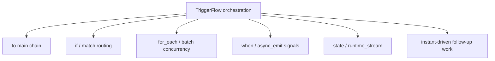

# TriggerFlow Orchestration Playbook

This playbook is not only about chaining chunks together. The real point is: **in real systems, TriggerFlow should be organized in an Async First way by default.**

## Prerequisites

- [TriggerFlow Overview](/en/triggerflow/overview)
- [Async First](/en/async-support)
- [From Token Output to Live Signals](/en/triggerflow/token-to-signal)

## Scenario

You need a multi-step workflow with branching, concurrency, async state signals, and intermediate state that can be observed by UI or services.

## Why Async First here

- chunks are a natural async boundary
- runtime-stream consumption is usually async
- once model output should trigger later work early, the pattern becomes `instant + async_emit(...)`

## Orchestration map



## Recommended pattern

1. async chunks own explicit workflow stages
2. `batch(...)` and `for_each(...)` own concurrency
3. `async_put_into_stream(...)` owns side-channel progress
4. `instant + async_emit(...)` owns early structured dispatch

## Full code

```python
import asyncio
from agently import TriggerFlow, TriggerFlowRuntimeData

flow = TriggerFlow()


@flow.chunk("normalize")
async def normalize(data: TriggerFlowRuntimeData):
    topic = str(data.value).strip()
    data.state.set("topic", topic)
    await data.async_put_into_stream({"stage": "normalized", "topic": topic})
    return topic


@flow.chunk("fetch_facts")
async def fetch_facts(data: TriggerFlowRuntimeData):
    await asyncio.sleep(0.05)
    await data.async_put_into_stream({"stage": "facts_ready", "topic": data.value})
    return f"facts({data.value})"


@flow.chunk("fetch_risks")
async def fetch_risks(data: TriggerFlowRuntimeData):
    await asyncio.sleep(0.03)
    await data.async_put_into_stream({"stage": "risks_ready", "topic": data.value})
    return f"risks({data.value})"


@flow.chunk("compile_report")
async def compile_report(data: TriggerFlowRuntimeData):
    topic = data.state.get("topic")
    report = {
        "topic": topic,
        "facts": data.value.get("fetch_facts"),
        "risks": data.value.get("fetch_risks"),
    }
    await data.async_put_into_stream({"stage": "compiled", "report": report})
    await data.async_stop_stream()
    return report


flow.to(normalize)
flow.when({"runtime_data": "topic"}).batch(fetch_facts, fetch_risks, concurrency=2).to(compile_report).end()
```

Consumer side:

```python
async def main():
    execution = flow.create_execution(concurrency=2)

    async def watch_stream():
        async for item in execution.get_async_runtime_stream("Agently TriggerFlow", timeout=5):
            print("STREAM:", item)

    stream_task = asyncio.create_task(watch_stream())
    result = await execution.async_start("Agently TriggerFlow")
    await stream_task
    print("RESULT:", result)


asyncio.run(main())
```

## Validation

- parallel work stays inside explicit async chunks
- `runtime_stream` emits observable stage events
- final result is separate from the side-channel observability path

## How to go one step further

If parallel stages should also react to model fields before the full answer finishes, combine:

- `response.get_async_generator(type="instant")`
- `await data.async_emit(...)`
- `await data.async_put_into_stream(...)`

That is the most valuable TriggerFlow practice direction right now.

## Related Skills

- `agently-triggerflow`
- `agently-triggerflow-model-integration`
