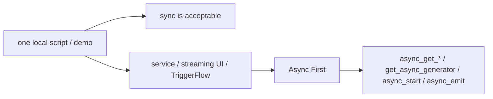
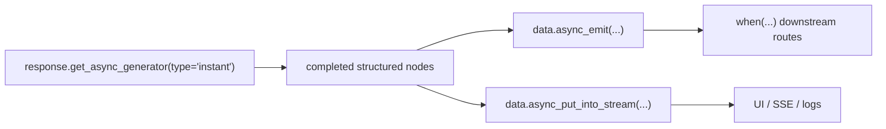

# Async First

Agently is async-first at the runtime layer. For ordinary developers, the important conclusion is not merely “async is supported”. The real conclusion is: **once you are building a service, streaming UI, or TriggerFlow workflow, async should become the default path.**

## When to read this

- You are putting Agently into FastAPI, workers, SSE, WebSocket, or another async runtime
- You need to stream partial output while keeping the rest of the system responsive
- You want to combine model streaming with TriggerFlow events or runtime stream

## What you will learn

- Why the handbook recommends Async First for real integrations
- Which scenes can stay sync and which should default to async
- Why `get_async_generator(type="instant") + TriggerFlow` is a high-value pattern

## Decision map



The point of this diagram is simple: sync is not wrong, but it fits demos and one-off scripts. For production integration, Async First is the recommended path.

## Recommended rules

- Single local script or teaching demo: sync is acceptable
- Already inside an event loop: prefer `async_get_*()` and `get_async_generator(...)`
- Structured streaming output: prefer `get_async_generator(type="instant")`
- TriggerFlow integration: prefer async chunks plus `async_emit(...)` and `async_put_into_stream(...)`

## Why Async First

- Better fit for web services and concurrent request handling
- Avoids blocking sync bridges inside an async runtime
- Makes it easier to connect model streams, business events, and TriggerFlow runtime stream
- Lets the system react to completed fields before the full response is finished

Do not oversell this. Async First mainly improves:

- concurrency and throughput
- service integration quality
- progressive UX and orchestration quality

It does not mean one isolated request will always have lower model latency.

## The most important production combination



This is the combination worth learning first:

- `instant` gives structured nodes, not noisy raw tokens
- `async_emit(...)` turns those nodes into controlled business events
- `runtime_stream` forwards intermediate states to UI or external consumers

## Minimal example

```python
import asyncio
from agently import Agently

agent = Agently.create_agent()


async def main():
    response = (
        agent
        .input("Give me a title and two bullet points")
        .output(
            {
                "title": (str, "Title"),
                "items": [(str, "Bullet point")],
            }
        )
        .get_response()
    )

    async for item in response.get_async_generator(type="instant"):
        if item.is_complete:
            print(item.path, item.value)

    final_data = await response.async_get_data()
    print(final_data)


asyncio.run(main())
```

## How to think about TriggerFlow together with this

- the model request is still an Agently request
- TriggerFlow decides when it runs and where the results go next
- `instant` exposes useful structured fields early
- async chunks use those fields for `async_emit(...)` or `async_put_into_stream(...)`

TriggerFlow does not replace model requests. It organizes async model consumption into a clearer runtime.

## Common mistakes

- Staying with sync getters and sync generators after moving into FastAPI or TriggerFlow
- Using only `delta` when the real need is structured streaming
- Spawning unbounded downstream work from tiny partial token events

## Next

- Field-level structured streaming: [Instant Structured Streaming](/en/output-control/instant-streaming)
- Streaming event choices: [Streaming Responses and Event Types](/en/model-response/streaming)
- Turning `instant` into TriggerFlow signals: [From Token Output to Live Signals](/en/triggerflow/token-to-signal)
- Runtime-stream integration: [Runtime Stream and Side-channel Output](/en/triggerflow/runtime-stream)

## Related Skills

- `agently-model-response`
- `agently-output-control`
- `agently-triggerflow-model-integration`
