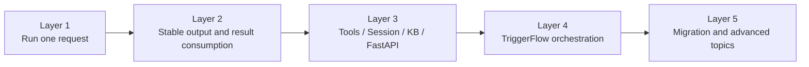

# Capability Map

This page helps you decide which layer your current problem belongs to.

## The upgrade path

## How to use this page

- still one high-quality request -> stay on the request side
- one request plus external capability -> move into extensions
- explicit stages, branching, concurrency, wait/resume -> move into TriggerFlow
- real services, streaming UI, or workflow runtime -> default to [Async First](/en/async-support)

## Next

- First request path: [Quickstart](/en/quickstart)
- Async production path: [Async First](/en/async-support)
- Workflow boundary: [TriggerFlow Overview](/en/triggerflow/overview)
