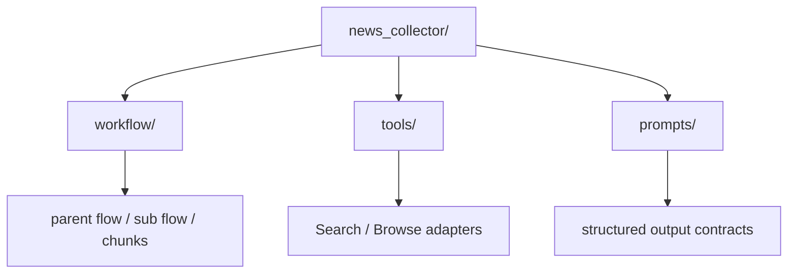

# Daily News Collector

## Project Link

- GitHub: [AgentEra/Agently-Daily-News-Collector](https://github.com/AgentEra/Agently-Daily-News-Collector)

## Positioning

This is a news collection and daily briefing project rewritten on top of Agently v4. After checking the current `v4.0.8.3` source, it is no longer just a Search + Browse + TriggerFlow example. It now serves as a fuller reference for parent flow / child flow composition, `capture / write_back`, `runtime_resources`, and structured outputs in one project.

## 1. Layered architecture



### How to read this diagram

- `news_collector/` is the application assembly layer, while the actual process logic lives in `workflow/`.
- `workflow/` is now clearly split into the parent flow, the per-column sub flow, report-level chunks, and column-level chunks, instead of hiding the whole column pipeline inside one oversized handler.

## 2. Runtime flow

```mermaid
flowchart LR
    A[prepare_request] --> B[generate_outline]
    B --> P
    subgraph Loop["for_each(column)"]
        direction TB
        P[to_sub_flow(column_sub_flow)]
        subgraph Child["column_sub_flow"]
            direction LR
            C1[search_column_news] --> C2[pick_column_news] --> C3[summarize_column_news] --> C4[write_column]
        end
        P -. capture .-> C1
        C4 -. write_back result .-> P
    end
    P --> D[render_report]
    D --> E[daily report output]
```

### Design rationale

The key point is no longer “call a generate-column function inside a loop.” The current shape is:

- the parent flow owns `prepare_request -> generate_outline -> for_each(column) -> render_report`
- `column_sub_flow` owns `search -> pick -> summarize -> write_column`
- parent and child communicate explicitly through `capture / write_back`
- `render_report` receives the converged list of column results after `end_for_each()`

That is also why this project is now a stronger `v4.0.8.3` reference:

- internal `for_each` nodes can be expanded in Mermaid
- nested `sub_flow` structure can be shown inline
- downstream parent nodes no longer get rendered inside the loop group by mistake

## 3. Structural layers

The project is split into four layers:

- `news_collector/`
  app/integration layer for config, CLI, and Agently setup
- `workflow/`
  TriggerFlow definition and chunk implementations, including the parent flow, column sub flow, report-level chunks, and column-level chunks
- `tools/`
  Search/Browse adapter layer
- `prompts/`
  structured output contracts

## 4. `v4.0.8.3` capabilities it actually uses

### 4.1 Parent/child flow composition plus concurrent fan-out

In `workflow/daily_news.py`, the parent flow is:

- `prepare_request`
- `generate_outline`
- `for_each(concurrency=settings.workflow.column_concurrency)`
- `to_sub_flow(column_sub_flow, capture=..., write_back=...)`
- `end_for_each()`
- `render_report`

The `column_sub_flow` is itself an independent chain:

- `search_column_news`
- `pick_column_news`
- `summarize_column_news`
- `write_column`

So the project directly uses:

- `TriggerFlow.for_each(concurrency=...)`
- `TriggerFlow.to_sub_flow(...)`
- `capture` to pass the parent flow's current `value`, `runtime_data.request`, and `logger / search_tool / browse_tool` into the child flow explicitly
- `write_back={"value": "result"}` to return the child flow's final result into the parent loop item output
- `.end_for_each()` to converge all per-column results for `render_report`

### 4.2 `runtime_resources` injection

In `news_collector/collector.py`, the flow is wired through:

```python
self.flow.update_runtime_resources(
    logger=self.logger,
    search_tool=search_tool,
    browse_tool=browse_tool,
)
```

This injects dependencies into execution runtime instead of capturing them in closures. The parent flow then forwards those resources to `column_sub_flow` explicitly through `capture["resources"]`.

### 4.3 Built-in `Search` and `Browse`

`tools/builtin.py` wraps:

- `Search`
- `Browse`

Its `Browse` setup directly uses:

- `enable_playwright`
- `response_mode`
- `max_content_length`
- `min_content_length`
- `playwright_headless`

### 4.4 Structured output contracts

In `workflow/report_chunks.py` and `workflow/column_chunks.py`, outline generation, story selection, summarization, and column writing all rely on YAML prompts plus structured result constraints to keep step interfaces stable.

### 4.5 `${ENV.xxx}` + `auto_load_env=True`

In `news_collector/collector.py`, the setup uses:

```python
Agently.set_settings(
    self.settings.model.provider,
    model_settings,
    auto_load_env=True,
)
```

and `SETTINGS.yaml` uses `${ENV.xxx}` placeholders.

## 5. Why this is now a more complete TriggerFlow reference

In the current `v4.0.8.3` code, Daily News Collector covers all of the following in one place:

- report-level parent flow orchestration
- `for_each` fan-out / fan-in
- `sub_flow` extraction and reuse
- explicit `capture / write_back` boundaries
- `runtime_resources` propagation across parent and child flows
- Mermaid visualization for loop internals and nested child-flow structure

So it is no longer just a tool-integration example. It is now closer to a real TriggerFlow composition reference for production-style projects.

## 6. Current typing style

The project's chunks and helper functions now consistently use:

```python
from agently import TriggerFlowRuntimeData
```

That means:

- the project no longer depends on the older `TriggerFlowEventData` compatibility alias
- the runtime handler signature now matches the current documentation recommendation
- parent data such as `request` is passed into the child flow through explicit `capture`, then read from `runtime_data` inside the child flow rather than through implicit shared state
