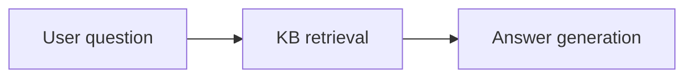

# Knowledge‑base Multi‑turn QA

## Scenario

Keep answers grounded across multiple turns using retrieval results from a knowledge base.

## Approach

- Build a KB with ChromaCollection + embeddings  
- TriggerFlow orchestrates “retrieve → answer”  
- Agent answers from `kb` only  



## Code

```python
import asyncio
from agently import Agently, TriggerFlow, TriggerFlowRuntimeData
from agently.integrations.chromadb import ChromaCollection

Agently.set_settings("prompt.add_current_time", False)
Agently.set_settings("OpenAICompatible", {
  "base_url": "http://localhost:11434/v1",
  "model": "qwen2.5:7b",
  "model_type": "chat",
})

agent = Agently.create_agent()

embedding_agent = Agently.create_agent()
embedding_agent.set_settings("OpenAICompatible", {
  "base_url": "http://localhost:11434/v1",
  "model": "qwen3-embedding:0.6b",
  "model_type": "embeddings",
})

kb = ChromaCollection(
  collection_name="agently_case_kb_en",
  embedding_agent=embedding_agent,
  get_or_create=True,
)

kb.add([
  {
    "id": "doc-1",
    "document": "Agently is a production-oriented AI application framework focused on controllable output and orchestration.",
    "metadata": {"source": "overview"},
  },
  {
    "id": "doc-2",
    "document": "TriggerFlow uses a when-emit signal mechanism for event-driven orchestration, suitable for complex signal systems.",
    "metadata": {"source": "triggerflow"},
  },
  {
    "id": "doc-3",
    "document": "Instant structured streaming allows partial structured results to be consumed while generation is still in progress.",
    "metadata": {"source": "output-control"},
  },
])

questions = [
  "What is Agently's core capability?",
  "How is TriggerFlow different from traditional DAG orchestration?",
]

flow = TriggerFlow()

@flow.chunk
def input_questions(_: TriggerFlowRuntimeData):
  return questions

@flow.chunk
async def retrieve(data: TriggerFlowRuntimeData):
  question = data.value
  results = kb.query(question, top_n=2)
  return {"question": question, "kb": results}

@flow.chunk
async def answer(data: TriggerFlowRuntimeData):
  payload = data.value
  result = await (
    agent
    .input(payload["question"])
    .info({"kb": payload["kb"]})
    .instruct("Answer using only {kb}. Keep it within 1-2 sentences.")
    .output({"answer": ("str", "short answer"), "sources": [("str", "doc id")]})
    .async_start()
  )
  return {"question": payload["question"], "answer": result}

(
  flow.to(input_questions)
  .for_each(concurrency=1)
  .to(retrieve)
  .to(answer)
  .end_for_each()
  .end()
)

async def main():
  result = await flow.async_start("run")
  print(result)

asyncio.run(main())
```

## Output

```text
[{'question': "What is Agently's core capability?", 'answer': {'answer': 'Agently is a production-oriented AI application framework focused on controllable output and orchestration.', 'sources': ['doc-1']}}, {'question': 'How is TriggerFlow different from traditional DAG orchestration?', 'answer': {'answer': 'TriggerFlow uses a when-emit signal mechanism for event-driven orchestration, which differs from traditional DAG orchestration that typically relies on predefined task sequences.', 'sources': ['doc-2']}}]
```
