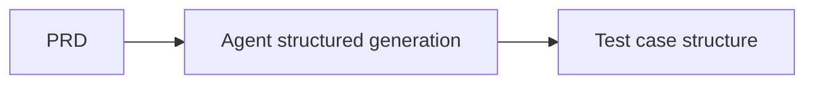

# PRD → Test Cases

## Scenario

After requirement review, you want a fast, structured set of critical test cases with edge coverage.

## Approach

- Agent converts PRD into structured cases  
- TriggerFlow orchestrates the pipeline  
- Output Format keeps fields stable  



## Code

```python
import asyncio
from agently import Agently, TriggerFlow, TriggerFlowRuntimeData

Agently.set_settings("prompt.add_current_time", False)
Agently.set_settings("OpenAICompatible", {
  "base_url": "http://localhost:11434/v1",
  "model": "qwen2.5:7b",
  "model_type": "chat",
})

agent = Agently.create_agent()

prd = """
Feature: SMS login
- User enters phone number and requests a verification code
- Invalid phone number should show an error
- Code expires in 5 minutes
- Same number can request a code only once every 60 seconds
- After successful verification, user is logged in and redirected to Home
""".strip()

flow = TriggerFlow()

@flow.chunk
async def gen_cases(_: TriggerFlowRuntimeData):
  result = await (
    agent
    .input(prd)
    .instruct("Generate 3 critical test cases, including boundary and error cases.")
    .output({
      "test_cases": [
        {
          "id": ("str", "case id"),
          "title": ("str", "case title"),
          "priority": ("str", "P0/P1/P2"),
          "type": ("str", "functional/negative/security"),
          "preconditions": [("str", "precondition")],
          "steps": [("str", "steps")],
          "expected": [("str", "expected")],
        }
      ],
      "risks": [("str", "risk")],
    })
    .async_start()
  )
  return result

flow.to(gen_cases).end()

async def main():
  result = await flow.async_start("run")
  print(result)

asyncio.run(main())
```

## Output

```text
{'test_cases': [{'id': 'TC_SMS_01', 'title': 'Valid Phone Number and Request Code', 'priority': 'P1', 'type': 'functional', 'preconditions': ['User knows their phone number'], 'steps': ['Enter a valid phone number (e.g., +1234567890)', "Click on the 'Request Code' button"], 'expected': ['Verification code is sent to the provided phone number', 'User can see a countdown timer showing 5 minutes remaining for the code', 'System allows making another request only after the expiration of 60 seconds']}, {'id': 'TC_SMS_02', 'title': 'Invalid Phone Number Input Fails', 'priority': 'P1', 'type': 'negative', 'preconditions': ['User enters an invalid phone number (e.g., +123456789012)'], 'steps': ['Enter an invalid phone number', "Click on the 'Request Code' button"], 'expected': ['Error message displayed indicating that the entered phone number is invalid', 'Code cannot be sent to this phone number']}, {'id': 'TC_SMS_03', 'title': 'Expired Verification Code Handling', 'priority': 'P1', 'type': 'negative', 'preconditions': ['User requests a verification code and waits for it to expire (5 minutes)'], 'steps': ['Enter the valid phone number', "Click on the 'Request Code' button", 'Wait until 5 minutes pass without entering the code'], 'expected': ['After 5 minutes, system prevents sending another code and shows an error message', 'System allows the user to request a new code after waiting for at least one cycle (60 seconds)']}], 'risks': ['User may face confusion if they do not receive the verification code within 5 minutes when retrying is allowed only after 60 seconds', 'Inadequate handling of invalid phone numbers could lead to user frustration and misuse of the system']}
```
