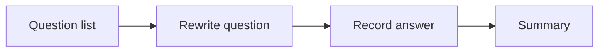

# Survey Multi‑turn Dialog

## Scenario

Collect goals, context, and risks across multiple turns, then output a reusable interview summary.

## Approach

- TriggerFlow serializes questions with `for_each`  
- Agent rewrites each question and writes the final summary  
- All Q/A are returned as structured data  



## Code

```python
import asyncio
from agently import Agently, TriggerFlow, TriggerFlowRuntimeData

Agently.set_settings("prompt.add_current_time", False)
Agently.set_settings("OpenAICompatible", {
  "base_url": "http://localhost:11434/v1",
  "model": "qwen2.5:7b",
  "model_type": "chat",
})

agent = Agently.create_agent()

questions = [
  {
    "id": "q1",
    "intent": "goal",
    "question": "What problem do you want this tool to solve?",
    "answer": "Turn PRDs into test cases fast and export to Jira.",
  },
  {
    "id": "q2",
    "intent": "context",
    "question": "At which stage would you use it?",
    "answer": "Right after requirement review, before test scheduling.",
  },
  {
    "id": "q3",
    "intent": "risk",
    "question": "What output issue is most unacceptable?",
    "answer": "Missing edge cases or incomplete steps.",
  },
]

flow = TriggerFlow()

@flow.chunk
def input_questions(_: TriggerFlowRuntimeData):
  return questions

@flow.chunk
async def ask_and_collect(data: TriggerFlowRuntimeData):
  item = data.value
  ask = await (
    agent
    .input({"intent": item["intent"], "question": item["question"]})
    .instruct("You are a survey assistant. Ask the question in a friendly, concise way.")
    .output({"ask": ("str", "question wording"), "tone": ("str", "tone keyword")})
    .async_start()
  )
  return {"ask": ask["ask"], "answer": item["answer"], "intent": item["intent"]}

@flow.chunk
async def summarize(data: TriggerFlowRuntimeData):
  qa_list = data.value
  result = await (
    agent
    .input({"qa": qa_list})
    .instruct("Summarize user goals, context, and risks in 3 bullets.")
    .output({"summary": [("str", "bullet")]})
    .async_start()
  )
  return {"qa": qa_list, "summary": result["summary"]}

(
  flow.to(input_questions)
  .for_each(concurrency=1)
  .to(ask_and_collect)
  .end_for_each()
  .to(summarize)
  .end()
)

async def main():
  result = await flow.async_start("run")
  print(result)

asyncio.run(main())
```

## Output

```text
{'qa': [{'ask': 'What problem is this tool aiming to solve for you?', 'answer': 'Turn PRDs into test cases fast and export to Jira.', 'intent': 'goal'}, {'ask': 'At what stage would you use it?', 'answer': 'Right after requirement review, before test scheduling.', 'intent': 'context'}, {'ask': 'Which output problem is least acceptable to you?', 'answer': 'Missing edge cases or incomplete steps.', 'intent': 'risk'}], 'summary': ['The tool aims to streamline the process of converting product requirements documents (PRDs) into test cases quickly and exporting them directly to Jira to enhance testing efficiency.', 'It is intended for use immediately after the requirement review stage, ensuring that all necessary steps are captured before scheduling tests, which helps maintain a seamless transition between documentation and execution phases.', 'The least acceptable risk is missing edge cases or incomplete test case steps, as these issues can lead to gaps in the testing process and potential product defects.']}
```
