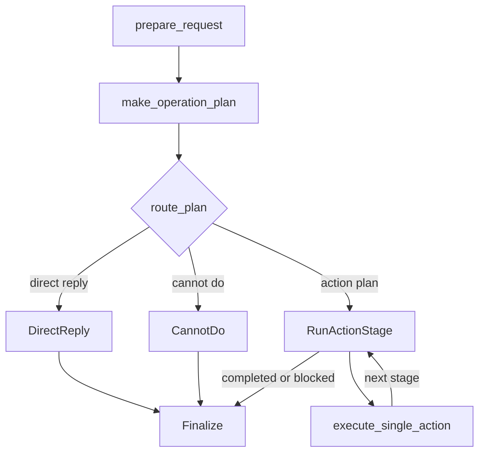

# Agently Talk to Control

## Project Link

- GitHub: [AgentEra/Agently-Talk-to-Control](https://github.com/AgentEra/Agently-Talk-to-Control)

## Positioning

This project is a natural-language-to-control example built on Agently v4. It is useful when the real question is:

- can the user be answered directly from current state
- if not, should the request be split into ordered control actions
- if not safely executable either, how should the system reject it and suggest the next step

That makes it more than a chat demo. It puts **state inspection, action planning, controller execution, rejection paths, and streamed UI feedback** into one runtime.

## 1. Project layers

```mermaid
flowchart TD
    A[Gradio Chat UI] --> B[app.py]
    B --> C[build_flow()]
    D[SETTINGS.yaml] --> B
    D --> E["controllers/"]
    C --> F[planning request]
    C --> G[action-arg request]
    C --> H[controller execution]
    H --> I[state write-back]
```

### How to read this structure

- `app.py` is only the UI and execution entrypoint.
- `workflows/talk_to_control.py` is the owner layer that handles routing, orchestration, and state updates.
- `SETTINGS.yaml` describes model config, initial device state, and controller registration.
- `controllers/` contains concrete actions, not planning logic.

## 2. Runtime main path



### What matters here

- The system does not call controllers first. It first decides whether the request belongs to the **reply / execute / reject** path.
- `RunActionStage` groups actions by resource conflict, so independent actions can run in parallel inside the same stage.
- `Finalize` is the single place that assembles the transcript, current device state, and completed action list.

## 3. Which Agently-Skills layers it maps to

| Capability layer | Matching skill | Where it shows up in the repo |
| --- | --- | --- |
| top-level problem routing | `agently-playbook` | the project first decides whether the owner path is reply, execution, or rejection |
| structured planning and action-arg generation | `agently-output-control` | both planning and action requests rely on structured fields plus `ensure_keys` |
| streamed consumption of one response | `agently-model-response` | `get_response()` + `instant` are used to push plan previews and rejection reasons early to the UI |
| explicit control flow and staged execution | `agently-triggerflow` | `DirectReply`, `CannotDo`, `RunActionStage`, and `Finalize` are all TriggerFlow-driven branches |
| model and env configuration | `agently-model-setup` | `AGENT_SETTINGS` and `${ENV.xxx}` keep provider setup and environment loading explicit |

## 4. Why this case study matters

- It is not just “generate JSON then call a function.” It is a complete control-oriented workflow.
- It covers **structured planning**, **streamed feedback**, **explicit state updates**, and **stage-level parallel execution** together.
- It shows that natural-language control does not need to start from a custom wrapper-heavy architecture. It can stay on Agently-native boundaries first.

## 5. Extension path

If you want to extend the project to more devices or control actions, the direct path is:

1. add initial state and controller descriptions in `SETTINGS.yaml`
2. add controller functions in `controllers/`
3. if approvals, waits/resume, external events, or more complex stage dependencies become central, deepen into the TriggerFlow docs next

Recommended follow-up reading:

- [/en/agent-systems/overview](/en/agent-systems/overview)
- [/en/agent-systems/streaming-structured](/en/agent-systems/streaming-structured)
- [/en/triggerflow/overview](/en/triggerflow/overview) and [/en/agent-systems/triggerflow-orchestration](/en/agent-systems/triggerflow-orchestration)
