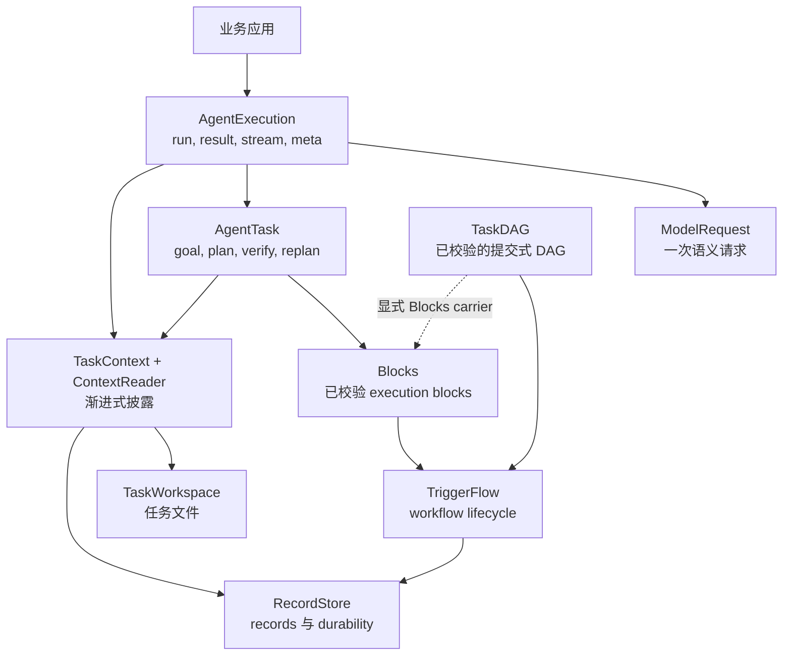

# 执行层选择

一次 Agent run 默认从 `AgentExecution` 开始；只有业务问题需要某个更底层 owner
的 contract 时，才下沉到该层。

## 所有者

| 所有者 | 用于 | 不用于 |
|---|---|---|
| `ModelRequest` | 精确 prompt、结构化输出、settings、一次 response | workflow state 或长任务 lifecycle |
| `AgentExecution` | 一次公开 Agent run、candidate binding、result/stream/meta | custom DAG validation 或持久 workflow topology |
| `AgentTask` | 一个 goal-driven task 的 plan、bounded execution、evidence、verification、repair/replan | developer-owned 稳定 workflow topology |
| `TaskDAG` | 模型/应用提交的 acyclic plan data、validation、resolver、dependency results | 面向人的 acceptance 或 pause/resume policy |
| `Blocks` | 已校验 block lowering、signals、result/evidence mapping | Skill 安装、capability grant、storage |
| `TriggerFlow` | branch、concurrency、wait、resume、runtime stream、save/load | prompt 或 DAG task semantics |
| `TaskContext` / `ContextReader` | source binding 与 consumer/phase 信息交付 | source persistence 或副作用 |
| `TaskWorkspace` | 任务文件边界、mutation/readback、file refs | records、memory、snapshots |
| `RecordStore` | records、检索索引、links、checkpoints、snapshots/events | 任务文件或语义决策 |

## 按问题形态选择

| 业务形态 | 起点 |
|---|---|
| 一次抽取、分类、改写或回答 | `ModelRequest` |
| 一次使用 Actions 或 Skills 的 Agent 请求 | `AgentExecution` |
| 必须验证完成情况的单个业务目标 | `agent.create_task(...)` / AgentTask strategy |
| 应用或模型提交的 DAG data | `TaskDAG` / DynamicTask facade |
| 源码中由开发者拥有的稳定 workflow topology | `TriggerFlow` |
| 从多个已知 source 获取有界相关信息 | `TaskContext` + consumer-bound `ContextReader` |
| 读取或修改已有项目文件 | `TaskWorkspace` |
| 持久 memory、evidence records 或 recovery | `RecordStore` |

Skills 不增加新执行层。`SkillLibrary` 拥有安装 revision；AgentExecution 把它们
绑定到 TaskContext；实际工作由所选执行 owner 完成。

TaskDAG 是 data，执行前必须 validate/resolve。开发者拥有的稳定 topology 可以
直接使用 TriggerFlow。TaskDAG 默认 executor 使用 TriggerFlow；只有需要 block
lifecycle evidence 时才显式 `compile_blocks(...)`。

`context_read` 只接收调用方绑定的 ContextReader。文件操作使用 TaskWorkspace
Actions，持久化使用 RecordStore ports。一个 owner 的 readback 不能被当作另一个
owner 的 required capability 已执行的证据。
