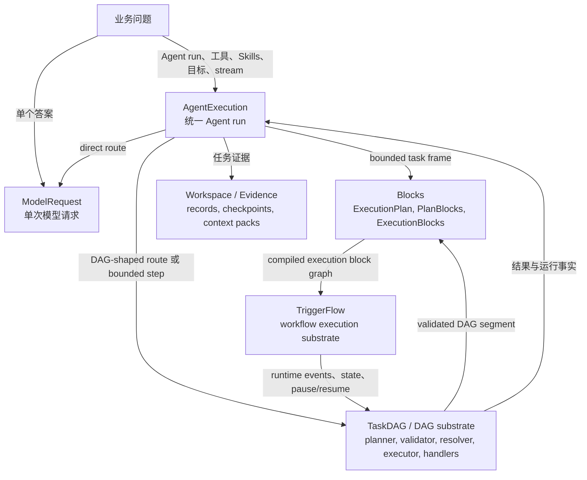
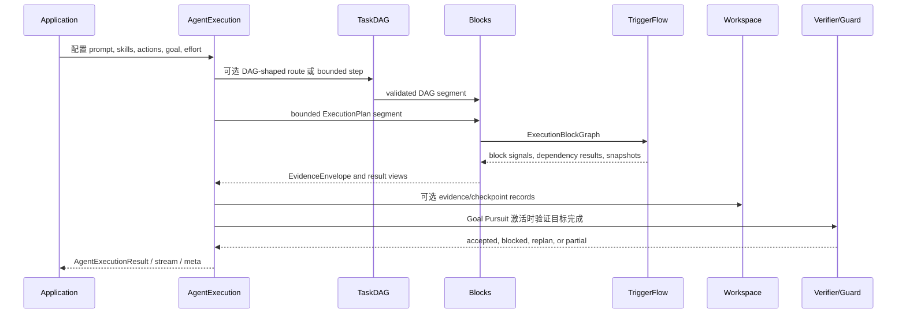

# 执行层选择

Agently 提供多层执行能力，是因为业务问题需要的 planning、state、evidence 和
定制自由度并不一样。

默认用户侧主线是 `AgentExecution`：当产品需要一次带 prompt、Actions、Skills、
goals、effort、result、stream 和 metadata 的 Agent run 时，从这里开始。只有当
问题需要更低层的合同，才向下拆。

## 层次图



边的合同含义：

- `ModelRequest` 负责一次标准化模型调用和结构化输出。
- `AgentExecution` 负责用户侧 Agent run，以及 result/stream/meta facade。
- `TaskDAG` 负责图形任务逻辑：Planner、Validator、Resolver、Executor、handlers、
  dependency results、semantic outputs 和 runtime placeholders。
- `Blocks` 负责把有边界的 ExecutionPlan / PlanBlock instances 或已校验的
  TaskDAG nodes 降低为 TriggerFlow-backed ExecutionBlocks，并做 evidence/result
  mapping。
- `TriggerFlow` 负责更底层的 workflow substrate：execution state、signals、
  concurrency、stream、pause/resume、persistence 和 lifecycle。
- `Workspace` 保存 evidence 和 context；它不负责判断任务是否完成。

`DynamicTask` 是当前覆盖 DAG substrate 的兼容与便利 facade。它仍可使用，但架构
owner 是 `TaskDAG`。

## 按问题形态选择

| 业务形态 | 从哪里开始 | 获得的框架能力 |
|---|---|---|
| 一个答案、抽取、分类或改写 | `ModelRequest` 或 `agent.input(...).output(...).start()` | Prompt 渲染、provider 抽象、结构化输出、streaming |
| 一次可能用 Actions 或 Skills 的 Agent run | `AgentExecution` / `agent.start()` | 路由选择、Action/Skill evidence、result/stream/meta facade |
| 一个必须验证完成情况的复杂业务任务 | `agent.goal(...).effort(...).start()` 或 `agent.create_task(...)` | Goal planning、bounded steps、Workspace evidence、model verifier、host guards、replan |
| 一个提交式或模型生成的依赖图 | `TaskDAG` 模块，或 DynamicTask facade | DAG planning、validation、handler 解析、dependency result collection、semantic outputs |
| 一个由应用代码拥有的稳定 workflow topology | `TriggerFlow` | 分支、并发、信号、pause/resume、持久化、runtime stream |
| 产品团队需要最大 DAG 定制自由度，同时仍想要 Agent result surface | 定制 `TaskDAG` 模块，再挂回 `AgentExecution` | 自定义 Planner/Validator/Resolver/Executor，同时保留 AgentExecution result、stream、meta 和 evidence path |

## 介入点

| 层 | 适合控制 | 不适合承担 |
|---|---|---|
| `ModelRequest` | 精确 prompt、output schema、模型设置和一次响应 | 工具路由、长任务完成、workflow state |
| `AgentExecution` | 用户侧 Agent run、路线诊断、stream/meta/result、execution-local candidates | 自定义图校验细节或 workflow 持久化细节 |
| `TaskDAG` | 图 schema、planner contract、validator rules、handlers、dependency data、semantic outputs | 面向人的任务验收或完整 workflow lifecycle |
| `Blocks` | ExecutionPlan lowering、PlanBlock/ExecutionBlock contracts、标准 block signals、result/evidence mapping | 任务生命周期 owner、capability grant 或原始 TriggerFlow dispatch |
| `TriggerFlow` | Runtime state、signals、joins、concurrency、pause/resume、save/load | 模型 prompt/output 行为或 DAG task 语义 |
| `Workspace` | Evidence records、checkpoints、context packs、后续步骤 recall | Planning、verification 或自动记忆决策 |

## 定制 DAG 再回写 AgentExecution

当团队需要高自由度时，可以把 DAG 路径拆成独立模块，逐层定制，独立运行后再把
snapshot 作为 evidence 传给后续 `AgentExecution`。

```python
from agently.builtins.plugins import AgentlyTaskDAGPlanner
from agently.core import TaskDAGExecutor, TaskDAGResolver, TaskDAGValidator

handlers = {
    "fetch_handler": fetch_handler,
    "analyze_handler": analyze_handler,
    "render_handler": render_handler,
}

resolver = TaskDAGResolver(handlers)
validator = TaskDAGValidator(resolver)
planner = AgentlyTaskDAGPlanner(validator=validator)

graph = await planner.async_plan(planner_agent, {"target": goal})
validator.validate(graph, strict_schema_version=True)

snapshot = await TaskDAGExecutor(resolver, validator=validator).async_run(
    graph,
    graph_input={"goal": goal},
)

execution = agent.create_execution()
execution.input({"goal": goal, "dag_snapshot": snapshot})
result = await execution.async_start()
```

应用已经直接持有 executor 时，同样把 snapshot 当作下一次 Agent step 的 evidence：

```python
snapshot = await TaskDAGExecutor(resolver, validator=validator).async_run(
    graph,
    graph_input={"goal": goal},
)

execution = agent.create_execution()
execution.input({"goal": goal, "dag_snapshot": snapshot})
data = await execution.async_start()
await execution.async_record_workspace(
    collection="observations",
    kind="dag_execution_evidence",
    content={"dag_snapshot": snapshot, "agent_result": data},
    checkpoint=True,
)
```

两种写法里，DAG 结果都只是 evidence。它本身不等于业务目标完成。启用 Goal
Pursuit 时，最终完成仍由 AgentTaskLoop 的 model verifier 加 host guard 决定。

## 运行流



## 实用规则

- 除非问题明显需要更低层 owner，否则从 `AgentExecution` 开始。
- 只有一次模型调用时，用 `ModelRequest`。
- 当计划本身是数据，需要校验、依赖执行、handler 和结果收集时，用 `TaskDAG`。
- 需要理解 bounded AgentTask step、Skill activation 或 TaskDAG segment 如何降低到
  TriggerFlow 并映射回 evidence 时，看 [Blocks 生命周期](blocks-lifecycle.md)。
- 当应用拥有稳定 workflow topology、等待、join、并发或 durable execution 时，用
  `TriggerFlow`。
- 用 `Workspace` 持久化 evidence 和 context，不要让它决定下一步做什么。
- `DynamicTask` 保持 facade / compatibility entrypoint；不要把它写成产品侧第二套
  task lifecycle。
- Goal Pursuit 激活时，DAG 完成只代表 evidence 可用。最终验收仍需要 model
  verifier 加 host guard。
