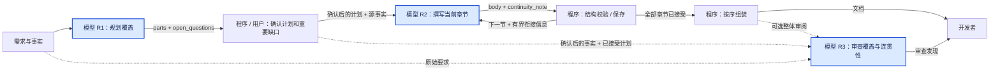

# 流程优先的 Prompt 协同设计样例

> 语言：[English](../../en/requests/prompt-collaboration.md) · **中文**

> 呈现参考 · 合成设计内容 · 非实际调用记录或已批准生产方案

这里把流程图与两个紧密关联的节点契约放在一起，以便检查上下游衔接。分组应服务于问题，
不是限制每次只能看一个，也不是规定最多三个；不要求复制相同章节、请求数量或字段。

## 1. 确认模型请求清单

**业务场景：** 将“会议行动项跟进”的产品需求整理成供产品与研发评审的设计文档。

先看完整范围内流程。蓝色且标为“模型”的节点承担语义工作，其余节点标明程序或人工职责。
这里使用可维护的 Mermaid 示意图，不要求固定工具。

| 请求 | 核心职责 | 产出交给谁 | 审阅状态 |
|---|---|---|---|
| **R1 · 章节规划** | 确定章节覆盖、顺序和待确认问题。 | 章节写作请求、业务用户。 | **下方展开作为示例。** |
| R2 · 章节写作 | 展开当前章节，保持必要的前文衔接。 | 程序组装、后续写作请求。 | 下方与 R1 一起审阅。 |
| R3 · 整体审阅 | 检查覆盖、矛盾和重复。 | 开发者的修订决策。 | 可选，尚未确定。 |

R2 是同一种请求设计，可能执行多次。程序负责内部标识、顺序、存储、结构校验和正文拼接。

邀请开发者校正清单和职责。范围明确时，可像下面这样在同一回复继续展示关联表格；
存在重要职责争议时，先解决再设计依赖部分。

## 2. 关联 Prompt 明细

R1 与 R2 合看，因为写作输入直接依赖章节计划。R3 在本样例中是尚未选入细审的可选节点；
需要完整三节点审查时，也可以把它放在同一回复。

### R1 · 章节规划｜待确认

| 项目 | 本次设计 |
|---|---|
| **要解决什么** | 怎样组织章节，才能覆盖需求并支持后续分段写作？ |
| **做到什么程度** | 给出有序章节计划、各节范围和待确认问题。 |
| **本次不做什么** | 不生成章节正文，不虚构系统能力，不创建真实任务。 |
| **谁消费结果** | 写作请求读取章节计划；用户确认信息缺口。 |

### Prompt 主表

下表是准备提供给模型的内容；审阅标题与确认状态不会自动加入模型请求。

| Slot | 主题 | 准备发送给模型的内容 |
|---|---|---|
| **`system`** | 角色与边界 | 你是产品设计分析助手。依据当前提供的需求和事实工作，区分已知事实、设计建议与待确认事项。 |
| **`input`** | 业务背景 | 团队主要通过企业 IM 协作。会议组织者关注行动落实，参会者关注负责人和截止时间，管理者关注推进情况。 |
| `input` | 当前问题 | 会议结论分散在纪要、群消息和个人记录中，行动项在复制、确认和跟进过程中容易丢失。 |
| `input` | 预期目标 | 把“会议结论—任务确认—持续跟进”连成清晰闭环，减少人工反复追问。 |
| **`info`** | `document_use` | 文档用于产品与研发评审，需要说明业务行为及其实现边界。 |
| `info` | `unknowns` | 当前没有指定 IM 厂商、任务系统、接口能力、权限制度和提醒政策；不得视为已确认事实。 |
| **`instruct`** | 本轮目标 | 依据 [input] 规划 [output.parts]，使用 [info.document_use] 与 [info.unknowns]。 |
| `instruct` | 信息不足 | 通过 [output.open_questions] 表达重要信息缺口，继续规划不依赖该信息的内容。 |
| **`output`** | 结构约束 | 返回 `parts` 和 `open_questions`，字段定义见下方输出表。 |

### 模型可见示例

**实际归属：** `info.examples`。**性质：** 合成示例。**作用：** 解释既有规则，不新增规则。
这不是新增 Agently slot 或 `.examples()` API。

| 解释哪条规则 | 示例输入 | 合理行为 | 不合理行为 |
|---|---|---|---|
| 信息不足时提出问题，不编造事实。 | 需求要求同步行动项，但未确定任务系统。 | 保留相关章节；必要时询问“计划对接哪种任务系统？” | 声称该系统已经支持自动创建任务。 |

仅供审阅者看的备注或输出说明样例，应另标为 **不发送给模型**。
没有需要时不强行补示例；实际示例内容不能压过规范性正文。

### 输出契约

**返回格式：JSON。**

| 字段 | 类型 | 必填 / 空值 | 含义 |
|---|---|---|---|
| **`parts`** | 数组 | 必填、非空。 | 按写作顺序覆盖业务问题与跟进闭环的互补章节，避免不必要重复，不预设固定章节数。 |
| `parts[].title` | 字符串 | 必填、非空。 | 章节标题。 |
| `parts[].brief` | 字符串 | 必填、非空。 | 能指导写作的具体内容方向和范围，不是正文或标题复述。 |
| **`open_questions`** | 字符串数组 | 必填、可为空数组。 | 缺失事实影响重要设计决定时，向用户提出的具体问题。 |

### R2 · 章节写作｜与 R1 一起审阅

上面的源事实和文档用途在展示中共享，不代表运行时省略输入。下面声明后续实际的数据映射，
不伪造 R1 的运行结果。

| Slot | 主题 | 值来源或实际固定 Prompt 文本 |
|---|---|---|
| `input` | `current_section` | 程序按顺序选取的一项已接受 R1 `parts`。 |
| `info` | `document_plan` | 已接受的 R1 `parts` 列表，不再请求模型重新摘要。 |
| `info` | `source_facts` | 原始需求、事实及用户明确确认的回答。 |
| `info` | `document_use` / `unknowns` | 上述共享契约；仅用已确认事实更新。 |
| `info` | `predecessor_continuity` | 程序限长的已接受前文章节衔接信息；首节为空。 |
| `instruct` | 写作 | 根据 [info.source_facts] 与 [info.document_plan] 展开 [input.current_section]，仅将 [info.predecessor_continuity] 用于衔接。应用 [info.document_use] 与 [info.unknowns]，返回 [output]。 |

返回以下 JSON 字段；该节点不额外增加模型可见示例：

| 字段 | 类型 / 必填性 | 含义与消费者 |
|---|---|---|
| `body` | 必填、非空白字符串 | 当前章节正文，不带文档标题和本节标题；程序补标题并组装正文。 |
| `continuity_note` | 必填字符串；本样例上限 800 字符，可为空 | 只保留后续 writer 需要的术语、事实或过渡信息；没有后续用途时为空。 |

800 字符只是本样例的衔接策略，不是通用默认值。源事实保持权威，有损衔接笔记不能替代它。

### 本轮确认

| 请确认 | 检查重点 |
|---|---|
| **职责是否合适** | 有没有把后续写作或系统操作混进本次请求？ |
| **规则是否清晰** | 是否存在信息缺口、冲突或被泛化的业务特例？ |
| **示例是否必要** | 是否仅解释正文规则，而没有偷偷改变行为？ |
| **输出是否够用** | R1 能否提供 R2 所需覆盖信息，而不丢失源事实范围或复制无用数据？ |

**重要变更实施前，确认或修订 R1/R2 这一组。** 清单确认不等于这些 Prompt 文本已获批准。
修订应回到真实 Prompt/config 并检查受影响的流程衔接，未变化的确认结果继续保留。

本例只展示审阅形式，不是强制业务流程、schema、章节数量或固定业务政策。
