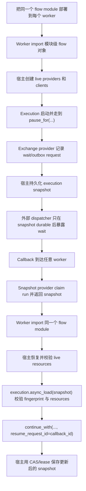

# 分布式 Pause 与 Resume 边界

> 语言：[English](../../en/triggerflow/distributed-pause-resume.md) · **中文**

TriggerFlow 提供支持宿主管理分布式 pause/resume 的基础能力。它不提供完整的生产级
分布式 workflow engine。

核心规则是：

```text
TriggerFlow core 在 save/load 之间保持进程无状态。
Execution state 存在可序列化 snapshot 里。
Live object 由宿主系统重新创建、恢复和校验。
```

## 边界摘要

| 关注点 | TriggerFlow 负责 | 外部系统负责 |
|---|---|---|
| Flow code | 用当前 import 的 flow definition 校验 fingerprint | 把同一个模块/config 部署到每个 worker |
| Execution progress | 可序列化 execution snapshot、state、interrupt、resume ledger、join progress | durable storage、retention、atomic claim、compare-and-set write |
| Pause/resume | `pause_for(...)`、`continue_with(...)`、稳定 `resume_request_id`、重复 resume 投影 | callback transport、queue/webhook 投递、outbox transaction、跨 provider 顺序 |
| Live object availability | resource requirements、resolver descriptor、load diagnostics、缺失 resource fail-fast | 创建 client、恢复 session、校验 lease/fence token 和 health |
| Stateful resources | 持久化再次请求 resource 所需的 ref/requirement | browser/session/process/task/cache state、state version、replayability、restore failure policy |
| Side effects | idempotency key 和 execution facts，帮助宿主安全决策 | exactly-once write、业务事务边界、外部系统去重 |
| Observability | RuntimeEvent facts 和 recovery diagnostics | operator policy、alert、生产修复流程 |

`runtime_resources` 只是把当前进程已经存在的 live object 挂到 execution 的入口。
它不是恢复协议。

## Resource 生命周期

| Resource 形态 | 例子 | Load 期望 |
|---|---|---|
| 无状态或等价可重建 | HTTP client、DB client、logger | 从配置重建，并在 load 前挂载，或通过 resolver 重建。 |
| 外部 durable state 的 adapter | Snapshot store、exchange provider、Workspace | 重建 adapter，但通过 provider 校验外部 state ref、version 和 lease。 |
| 有状态 execution session | Browser page、sandbox process、tool session、remote task handle | Snapshot 必须携带 durable session/ref requirement；provider 必须在 load ready 前恢复并校验。 |
| 不可恢复 transient state | 本地 lock、内存 queue item、打开的 transaction、coroutine frame | 不要带着这种状态跨 durable pause boundary；先完成、abort，或让 load fail。 |

如果后续 chunk 只能依赖某个有状态 live object 继续执行，snapshot 里必须有足够的
可序列化信息，让外部系统重新找到同一个逻辑 resource。如果外部系统无法恢复或校验
这个 resource，`async_load(...)` 应该在图继续前失败。

## 建议流程



关键顺序在 TriggerFlow core 之外：不要暴露外部 approval、webhook、queue message
或 UI task，除非对应的 execution snapshot 已经可恢复。生产宿主通常用 outbox table、
queue transaction、snapshot-store claim、lease 或 compare-and-set write 实现这点。

## 服务封装形态

把 workflow 封装成可 import 的模块。不要让业务 resource 依赖进程本地 closure。

```python
# my_app/discount_flow.py
from agently import TriggerFlow, TriggerFlowRuntimeData


discount_flow = TriggerFlow(name="discount-approval")
discount_flow.declare_resource_requirement(
    "approval_router",
    resolver="my_app.resources:create_approval_router",
    provider_kind="execution_exchange_provider",
    config_ref="settings://approval-router",
    fail_policy="fail_closed",
)


@discount_flow.chunk
async def request_approval(data: TriggerFlowRuntimeData):
    request = dict(data.value or {})
    await data.async_set_state("request", request, emit=False)
    return await data.async_pause_for(
        type="exchange",
        exchange_kind="approval",
        interrupt_id="discount-approval",
        resume_to="next",
        payload={"customer": request["customer"], "discount": request["discount"]},
        audit_metadata={"run_id": data.execution.run_context.run_id},
    )


@discount_flow.chunk
async def finalize(data: TriggerFlowRuntimeData):
    request = dict(data.get_state("request") or {})
    decision = dict(data.value or {})
    final = {
        "customer": request["customer"],
        "status": "approved" if decision["approved"] else "denied",
    }
    await data.async_set_state("final", final, emit=False)
    await data.async_emit("DISCOUNT_DECIDED", final)


@discount_flow.chunk
async def audit_decision(data: TriggerFlowRuntimeData):
    await data.async_set_state(
        "audit",
        {"event": data.event, "status": data.value["status"]},
        emit=False,
    )


discount_flow.to(request_approval).to(finalize)
discount_flow.when("DISCOUNT_DECIDED").to(audit_decision)
```

在宿主代码里创建 resources。这个 helper 可以返回 `runtime_resources`，但那只是最后
挂载到 execution 的入口。

```python
# my_app/resources.py
def build_runtime_resources(settings, *, snapshot=None):
    return {
        "snapshot_store": settings.snapshot_store(),
        "execution_exchange_provider": settings.exchange_outbox_provider(),
    }


async def create_approval_router(context):
    settings = load_settings(context["requirement"]["config_ref"])
    router = settings.exchange_outbox_provider()
    return {"resource": router, "health": await router.health()}
```

在 worker 中启动并暂停：

```python
from my_app.discount_flow import discount_flow


resources = build_runtime_resources(settings)
snapshot_store = resources["snapshot_store"]

execution = discount_flow.create_execution(auto_close=False, runtime_resources=resources)
await execution.async_start({"customer": "Acme", "discount": 18})

snapshot_ref = await execution.async_save(snapshot_store, step_id="waiting-approval")

# Host/provider API: 只暴露 execution snapshot 已 durable 的 wait request。
await resources["execution_exchange_provider"].flush_ready_requests(
    run_id=execution.run_context.run_id,
    after_snapshot_ref=snapshot_ref,
)
```

任意 worker 恢复：

```python
worker_id = "worker-b"
claim = await snapshot_store.claim(run_id, owner_id=worker_id)
# claim(...) 是 host/provider API。它应返回已 claim 的 snapshot、
# state version 和 lease/fence metadata。

from my_app.discount_flow import discount_flow


resources = build_runtime_resources(settings, snapshot=claim["snapshot"])
execution = discount_flow.create_execution(auto_close=False, runtime_resources=resources)

load = await execution.async_load(claim["snapshot"])
if not load["ready"]:
    raise RuntimeError(load["diagnostics"])

await execution.async_continue_with(
    "discount-approval",
    {"approved": True},
    resume_request_id=callback_id,
    actor="approval-service",
)

await execution.async_save(
    snapshot_store,
    run_id=run_id,
    expected_state_version=claim["state_version"],
    step_id="after-approval",
)
await snapshot_store.release_lease(run_id, owner_id=worker_id, lease_token=claim["lease_token"])
```

`claim(...)`、`flush_ready_requests(...)` 和 `release_lease(...)` 不是
TriggerFlow core API。它们代表生产级分布式恢复所需的宿主/provider 工作。

## Stateful Resource 示例

如果 resource 自己带状态，要把 durable ref 写进 execution state，并声明能恢复它的
resource requirement。

```python
flow.declare_resource_requirement(
    "browser_session",
    resolver="my_app.browser:restore_browser_session",
    provider_kind="browser",
    config_ref="settings://browser-pool",
    fail_policy="fail_closed",
)


async def collect_quote(data: TriggerFlowRuntimeData):
    browser = data.require_resource("browser_session")
    session_ref = await browser.persist_session()
    await data.async_set_state("browser_session_ref", session_ref, emit=False)
    return await data.async_pause_for(
        type="exchange",
        exchange_kind="approval",
        interrupt_id="quote-approval",
        resume_to="next",
    )
```

resolver 必须校验外部 session 仍然存在，且和 snapshot 匹配，然后才能返回 live
browser/session object：

```python
async def restore_browser_session(context):
    snapshot_state = context["snapshot"]["runtime_data"]
    session_ref = snapshot_state.get("browser_session_ref")
    browser = await browser_pool.restore(session_ref)
    if browser is None:
        return {"resource": None, "health": "missing"}
    if not await browser.matches(session_ref):
        return {"resource": None, "health": "unhealthy"}
    return {"resource": browser, "health": "healthy"}
```

## 不要过度承诺

- 不要说 TriggerFlow 自己提供完整分布式恢复。
- 不要说 `runtime_resources` 会被序列化或恢复。
- worker handoff 路径如果还需要 async resource restore，不要用 `load(...)` 继续。
- 不要在宿主可恢复对应 snapshot 前暴露外部 wait。
- required stateful resource 无法恢复时，不要继续执行。

## 参见

- [持久化与 Blueprint](persistence-and-blueprint.md)
- [Pause 与 Resume](pause-and-resume.md)
- [State 与 Resources](state-and-resources.md)
- [Lifecycle](lifecycle.md)
