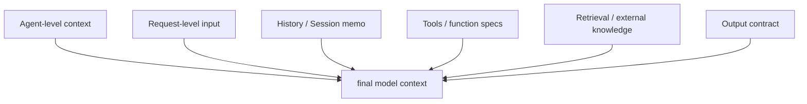

# Context Engineering

“Context Engineering” is not about writing one clever prompt. It is about designing and governing the **entire context** sent into the model.

Common consensus in English-language materials includes:

- context is the full set of tokens entering model reasoning, not only the system prompt
- Context Engineering is the process of selecting, organizing, updating, and iterating those tokens
- typical ingredients include system instructions, user input, tool descriptions, external knowledge, history, structured IO contracts, and runtime state

## 1. Layered context assembly



### How to read this diagram

- Context Engineering is about how these layers compose into the final context window.
- Agently's value is that these layers are explicit APIs instead of one long natural-language blob.

> References: Anthropic “Effective context engineering for AI agents”; Prompting Guide “Context Engineering Guide”.

Below is how Agently supports these ideas in practice, with runnable examples.

## 2) Layered context: Agent level vs Request level

Separating long-lived background from request-scoped input reduces noise and improves reuse.

```python
from agently import Agently

agent = Agently.create_agent()

# Agent-level stable context
agent.set_agent_prompt("system", "You are an enterprise knowledge assistant")
agent.set_agent_prompt("instruct", ["Answers must be brief and actionable"])

# Request-level input
result = (
  agent
  .set_request_prompt("input", "Give me one deployment suggestion")
  .output({"advice": ("str", "one-line advice")})
  .start()
)

print(result)
```

## 3) Dynamic variables and templated context

Dynamic information should be injected in a structured way.

```python
from agently import Agently

agent = Agently.create_agent()

user = {"name": "Moxin", "role": "PM"}
agent.set_request_prompt(
  "input",
  "Summarize this meeting decision for {name} ({role})",
  mappings=user,
)
agent.set_request_prompt("output", {"summary": ("str", "one-line summary")})

print(agent.start())
```

## 4) Configured prompts for maintainability

Moving context out of code makes it easier to version and collaborate on.

```yaml
# prompt.yaml
.agent:
  system: "You are an enterprise knowledge assistant"
  instruct:
    - "Start with the conclusion, then provide reasons"
.request:
  input: "{question}"
  output:
    summary:
      $type: str
      $desc: "One-line conclusion"
```

```python
from agently import Agently

agent = Agently.create_agent()
agent.load_yaml_prompt("prompt.yaml", mappings={"question": "What are Agently's strengths?"})

print(agent.start())
```

## 5) Structured IO to reduce ambiguity

Structured output is a major part of Context Engineering because it constrains the result shape and reduces downstream ambiguity.

```python
from agently import Agently

agent = Agently.create_agent()

response = (
  agent
  .set_request_prompt("input", "Write a release plan with a goal and milestones")
  .output({
    "goal": ("str", "goal"),
    "milestones": [
      {"title": ("str", "milestone"), "date": ("str", "date")}
    ]
  })
  .get_response()
)

print(response.result.get_data(ensure_keys=["goal", "milestones"]))
```

## 6) External knowledge injection (RAG entrypoint)

A core part of Context Engineering is bringing the right knowledge into context.

```python
from agently import Agently

agent = Agently.create_agent()

kb = [
  {"title": "Agently v4", "content": "Supports Output Format and TriggerFlow"},
  {"title": "Agently Prompt", "content": "Supports YAML/JSON configured prompts"},
]

def retrieve(query: str):
  return [item for item in kb if "Agently" in item["title"]]

question = "What are Agently's core capabilities?"
knowledge = retrieve(question)

result = (
  agent
  .set_request_prompt("input", question)
  .set_request_prompt("info", {"knowledge": knowledge})
  .output({"answer": ("str", "answer"), "sources": ["str"]})
  .start()
)

print(result)
```

## 7) Memory and history: controlling context length

In multi-turn settings, context grows continuously. In `v4.0.8.1+`, the recommended pattern is the newer Session model with `context_window` plus memo strategies.

```python
from agently import Agently

agent = Agently.create_agent()
agent.activate_session(session_id="context_demo")
session = agent.activated_session
assert session is not None

agent.add_chat_history({"role": "user", "content": "I only want concise answers"})
agent.add_chat_history({"role": "assistant", "content": "Understood"})

agent.set_settings("session.max_length", 800)

session.resize()
agent.set_chat_history(session.context_window)

print(agent.input("Repeat my preference").start())
```

## 8) Tools as context components

Tool specs are also part of context. Agently can inject normalized tool descriptions and orchestrate tool use on demand.

```python
from agently import Agently

agent = Agently.create_agent()

def fetch_order(order_id: str) -> dict:
  return {"order_id": order_id, "status": "paid"}

agent.register_tool(
  name="fetch_order",
  desc="Query order status",
  kwargs={"order_id": (str, "order id")},
  func=fetch_order,
  returns=dict,
)
agent.use_tools("fetch_order")

print(
  agent
  .input("Check the status of order A-100")
  .output({"status": ("str", "status")})
  .start()
)
```

## 9) Evaluation and iteration

Context Engineering usually requires iterative validation. Agently does not include a built-in eval platform, but response objects are easy to connect to custom evaluation logic.

```python
from agently import Agently

agent = Agently.create_agent()
response = agent.input("Explain observability in one sentence").get_response()

text = response.result.get_text()
score = 1 if len(text) <= 30 else 0

print(text)
print("score=", score)
```

## References

- https://www.anthropic.com/engineering/effective-context-engineering-for-ai-agents
- https://www.promptingguide.ai/guides/context-engineering-guide
