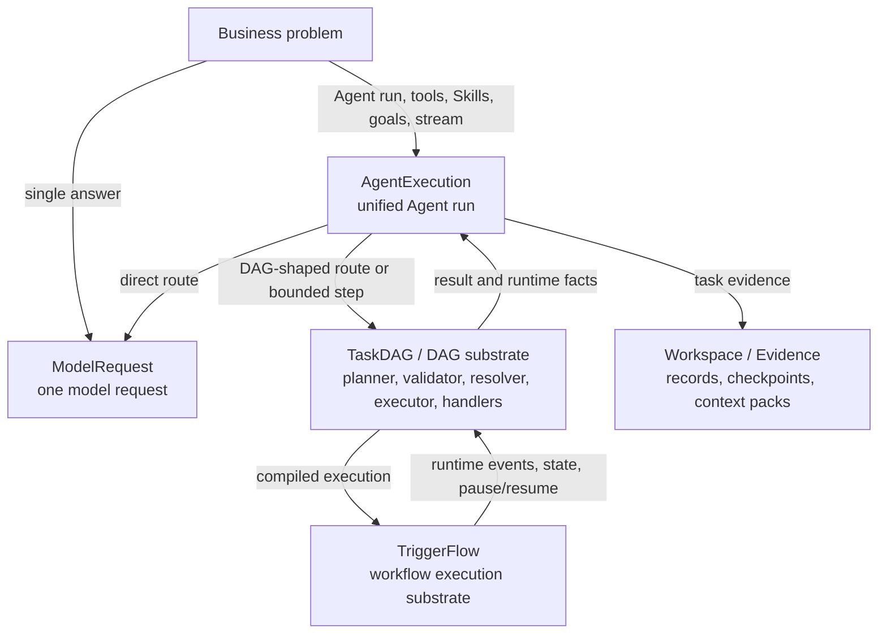
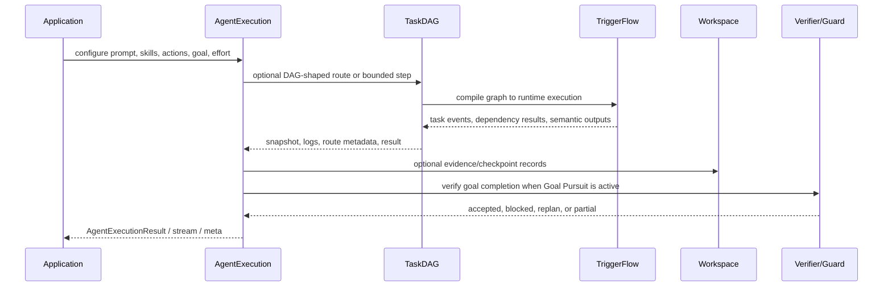

# Execution Layer Selection

Agently exposes several execution layers because business problems do not all
need the same amount of planning, state, evidence, or customization.

The default user-facing layer is `AgentExecution`: start there when the product
needs an Agent run with prompt, Actions, Skills, goals, effort, result, stream,
and metadata. Drop down only when the problem needs a lower-level contract.

## Layer Map



Contract behind the edges:

- `ModelRequest` owns one normalized model call and its structured output.
- `AgentExecution` owns the user-facing Agent run and result/stream/meta
  facade.
- `TaskDAG` owns graph-shaped planning and execution logic: Planner,
  Validator, Resolver, Executor, handlers, dependency results, semantic
  outputs, and runtime placeholders.
- `TriggerFlow` owns the lower-level workflow substrate: execution state,
  signals, concurrency, stream, pause/resume, persistence, and lifecycle.
- `Workspace` stores evidence and context; it does not decide completion.

`DynamicTask` is the current compatibility and convenience facade over the DAG
substrate. It can still be used, but the architectural owner is `TaskDAG`.

## Choose By Problem Shape

| Business shape | Start from | Framework capability you get |
|---|---|---|
| One answer, extraction, classification, or rewrite | `ModelRequest` or `agent.input(...).output(...).start()` | Prompt rendering, provider abstraction, structured output, streaming |
| One Agent run that may use Actions or Skills | `AgentExecution` / `agent.start()` | Route selection, Action/Skill evidence, result/stream/meta facade |
| One complex business task that must verify completion | `agent.goal(...).effort(...).start()` or `agent.create_task(...)` | Goal planning, bounded steps, Workspace evidence, model verifier, host guards, replan |
| A submitted or model-generated dependency graph | `TaskDAG` modules, or the DynamicTask facade | DAG planning, validation, handler resolution, dependency result collection, semantic outputs |
| A stable workflow topology owned by application code | `TriggerFlow` | Branching, concurrency, signals, pause/resume, persistence, runtime stream |
| A product team wants maximum DAG customization and still an Agent result surface | Build/customize `TaskDAG` modules, then attach the DAG to `AgentExecution` | Custom Planner/Validator/Resolver/Executor plus AgentExecution result, stream, meta, and evidence paths |

## Intervention Points

| Layer | Use when you want to control | Avoid using it for |
|---|---|---|
| `ModelRequest` | Exact prompt, output schema, model settings, and one response | Tool routing, long task completion, workflow state |
| `AgentExecution` | User-facing Agent run, route diagnostics, stream/meta/result, execution-local candidates | Custom graph validation internals or workflow persistence details |
| `TaskDAG` | Graph schema, planner contract, validator rules, handlers, dependency data, semantic outputs | Human-facing task acceptance or full workflow lifecycle |
| `TriggerFlow` | Runtime state, signals, joins, concurrency, pause/resume, save/load | Model prompt/output behavior or DAG task semantics |
| `Workspace` | Evidence records, checkpoints, context packs, recall into later steps | Planning, verification, or automatic memory decisions |

## Custom DAG Back Into AgentExecution

When a team wants high freedom, it can decompose the DAG path, customize each
module, and still write the result back through `AgentExecution`.

```python
from agently.builtins.plugins import AgentlyTaskDAGPlanner
from agently.core import TaskDAGExecutor, TaskDAGResolver, TaskDAGValidator

handlers = {
    "fetch_handler": fetch_handler,
    "analyze_handler": analyze_handler,
    "render_handler": render_handler,
}

resolver = TaskDAGResolver(handlers)
validator = TaskDAGValidator(resolver)
planner = AgentlyTaskDAGPlanner(validator=validator)

graph = await planner.async_plan(planner_agent, {"target": goal})
validator.validate(graph, strict_schema_version=True)

execution = agent.create_execution()
execution.input({"goal": goal})
execution.use_dynamic_task(mode="submitted", plan=graph, handlers=handlers)
result = await execution.async_start()
```

If the application runs the DAG directly through `TaskDAGExecutor`, treat the
snapshot as evidence for the next Agent step:

```python
snapshot = await TaskDAGExecutor(resolver, validator=validator).async_run(
    graph,
    graph_input={"goal": goal},
)

execution = agent.create_execution()
execution.input({"goal": goal, "dag_snapshot": snapshot})
data = await execution.async_start()
await execution.async_record_workspace(
    collection="observations",
    kind="dag_execution_evidence",
    content={"dag_snapshot": snapshot, "agent_result": data},
    checkpoint=True,
)
```

In both shapes, the DAG result is evidence. It does not by itself mean a
business goal is complete. Goal completion still belongs to AgentTaskLoop model
verification plus host guards when goal pursuit is active.

## Runtime Flow



## Practical Rules

- Start at `AgentExecution` unless the problem clearly needs lower-level
  ownership.
- Use `ModelRequest` when the task is only one model call.
- Use `TaskDAG` when the plan is data and needs validation, dependency
  execution, handlers, and result collection.
- Use `TriggerFlow` when the application owns stable workflow topology,
  waits, joins, concurrency, or durable execution.
- Use `Workspace` to persist evidence and context, not to decide what to do.
- Keep `DynamicTask` as a facade/compatibility entrypoint; do not introduce it
  as a second task lifecycle in product-facing guidance.
- When goal pursuit is active, DAG completion is evidence only. Final
  acceptance still requires model verifier plus host guard.

