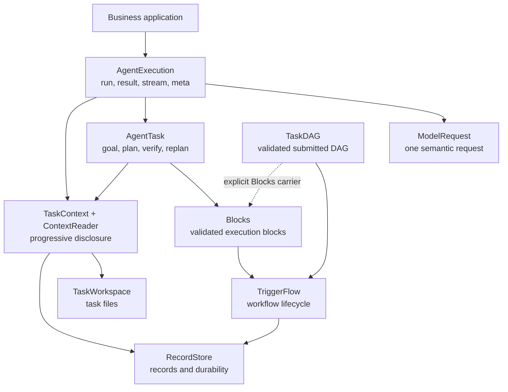

# Execution layer selection

Start at `AgentExecution` for an Agent run. Move to a lower owner only when the
business problem needs that owner's contract.

## Owners

| Owner | Use it for | Do not use it for |
|---|---|---|
| `ModelRequest` | Exact prompt, structured output, settings, one response | Workflow state or long-task lifecycle |
| `AgentExecution` | One public Agent run, candidate binding, result/stream/meta | Custom DAG validation or durable workflow topology |
| `AgentTask` | One goal-driven task with plan, bounded execution, evidence, verification, repair/replan | Developer-owned stable workflow topology |
| `TaskDAG` | Model/app-submitted acyclic plan data, validation, resolver, dependency results | Human-facing acceptance or pause/resume policy |
| `Blocks` | Validated block lowering, block signals, result/evidence mapping | Skill installation, capability grants, storage |
| `TriggerFlow` | Branches, concurrency, waits, resume, runtime stream, save/load | Prompt or DAG task semantics |
| `TaskContext` / `ContextReader` | Source binding and consumer/phase-bound information delivery | Source persistence or side effects |
| `TaskWorkspace` | Task file boundary, mutation/readback, file refs | Records, memory, snapshots |
| `RecordStore` | Records, retrieval indexes, links, checkpoints, snapshots/events | Task files or semantic decisions |

## Choose by problem shape

| Business shape | Start from |
|---|---|
| One extraction, classification, rewrite, or answer | `ModelRequest` |
| One Agent request using Actions or Skills | `AgentExecution` |
| One business goal that must verify completion | `agent.create_task(...)` / AgentTask strategy |
| Submitted or model-generated DAG data | `TaskDAG` / DynamicTask facade |
| Stable workflow topology owned in source code | `TriggerFlow` |
| Bounded information from several known sources | `TaskContext` + a consumer-bound `ContextReader` |
| Existing project files must be read or changed | `TaskWorkspace` |
| Durable memory, evidence records, or recovery | `RecordStore` |

Skills do not add another execution layer. `SkillLibrary` owns installed
revisions; AgentExecution binds them to TaskContext; the selected execution
owner performs the work.

TaskDAG is data; validate and resolve it before execution. Developer-owned
stable topology can use TriggerFlow directly. The default TaskDAG executor uses
TriggerFlow; `compile_blocks(...)` is opt-in when block lifecycle evidence is
needed.

Use `context_read` only with a caller-bound ContextReader. Use TaskWorkspace
Actions for file operations and RecordStore ports for persistence. Never use a
readback from one owner as proof that a required capability owned by another
owner executed.
