# Flow-First Prompt Collaboration Example

> Languages: **English** · [中文](../../cn/requests/prompt-collaboration.md)

Presentation specimen only: synthetic design content, not an observed model
run or a production-approved business plan. The flow and two tightly related
node contracts are shown together to inspect their handoff. Adapt the group to
the question; neither one node nor three nodes is a mandatory presentation limit.

## Multi-Round Progress and Changes

When Prompt collaboration, Flow design or experiment evaluation takes several
rounds, begin each substantive round's response with a current-item table and
a change-log table, before the detailed design or findings.

Put **Status on the left and Item on the right**. Keep item numbers stable.
Show additions, modifications, removals and abandonment explicitly: *new text*,
~~old text~~ → *replacement*, and ❌ ~~abandoned item~~, accompanied by text
status labels. Keep confirmed decisions distinct from applied or verified work.
Explain whether removal eliminates duplicate work or abandons a goal.

Record **time with timezone, discussion version, affected item, change/reason,
and implementation status**. D01/D02 can simply mean discussion revisions.
Use actual known times; label unavailable historical times instead of inventing
them. Append later decisions and outcomes, including implementation, removal
and reopening, so earlier history remains available. Mark proposed changes
as pending until decided under the existing collaboration agreement.

The following is a synthetic presentation example; timestamps and states are
illustrative, not evidence of actual work. These tables are for developer
collaboration, not fields to add to the application's model prompt.

**Current items · D03**

| Status | Item |
|---|---|
| ✅ Confirmed | 1. Business goal and scope |
| 🔄 In progress · modified | 2. ~~Review every request separately~~ → *Review coupled requests together* |
| ⏳ Pending | 3. Evaluate representative scenarios |
| ❌ Abandoned | 4. ~~Add an unused summary request~~ |
| ➖ Removed | 5. ~~Store a duplicate input snapshot~~ |
| 🆕 Pending · added | 6. *Check early retrieval deduplication and concurrency limits* |

**Change log · example times in UTC+08:00**

| Time | Discussion version | Item | Change and reason | Implementation status |
|---|---|---|---|---|
| 2026-09-07 14:10 | D01 | 1–5 | Establish initial scope. | ✅ Recorded |
| 2026-09-07 14:25 | D03 | 2 | Joint review makes dependencies easier to inspect. | ✅ Applied to review plan |
| 2026-09-07 14:25 | D03 | 4 | No consumer for the summary. | ❌ Abandoned; removed from design |
| 2026-09-07 14:25 | D03 | 5 | Existing records already preserve the input. | ✅ Duplicate removed; tracing retained |
| 2026-09-07 14:25 | D03 | 6 | Early retrieval requires controlled execution. | ⏳ Confirmed; not implemented |
| 2026-09-07 14:40 | D03 | 6 | Propose payload-based deduplication. | 💬 Awaiting confirmation |

Highlight only this round's differences in the current-item table; retain older
wording in the change history. While the same work item continues, every
status/history presentation includes its complete item list and complete change
history, including unchanged, completed, pending, removed and abandoned items.
Highlight this round within that full view; delta-only tables or links to prior
records do not replace it. Continuing, resuming or focusing on a subtopic does
not reset the work item. Start a separate list only for genuinely different
work and state that scope change. Recover missing history or label the gap;
never invent it. When nothing changed, retain the full view and say so.
Reopen completed items explicitly
when new evidence invalidates them.

Reuse an existing plan, review note or experiment record. Short work can keep
the tables in the conversation; longer work may use an existing project file
for handoff and recovery. Group large lists by phase and keep rows concise
without omitting items or history entries. Do not require another tracker, rigid data schema or
approval gate. Routine tool updates do not each create a discussion version.

## 1. Confirm the Request Inventory

**Scenario:** turn meeting-action follow-up product requirements into a design
document for product and engineering review.

Show the whole in-scope flow before the detail tables. Blue `MODEL` nodes do
semantic work; labeled Host/user nodes own confirmation and deterministic work.
This editable Mermaid diagram is one presentation option, not a required tool.

```mermaid
flowchart LR
  U["Requirements and facts"] --> R1["MODEL R1: plan coverage"]
  R1 -->|"parts + open_questions"| C["HOST / USER: confirm plan and material gaps"]
  C -->|"accepted plan + source facts"| R2["MODEL R2: write current section"]
  R2 -->|"body + continuity_note"| V["HOST: structure check / store"]
  V -->|"next section + bounded continuity"| R2
  V -->|"all sections accepted"| A["HOST: ordered assembly"]
  A -->|"document"| T["Developer"]
  A -.->|"optional document review"| R3["MODEL R3: inspect coverage and coherence"]
  U -.->|"original requirements"| R3
  C -.->|"confirmed facts + accepted plan"| R3
  R3 -->|"findings"| T
  classDef model fill:#dbeafe,stroke:#1d4ed8,stroke-width:2px,color:#172554;
  class R1,R2,R3 model;
```

| Request | Core responsibility | Consumer | Review state |
|---|---|---|---|
| **R1: Section plan** | Define coverage, order, and unresolved questions. | Writers and business user. | **Expanded below as an example.** |
| R2: Section writer | Develop the current section with relevant continuity. | Host assembly and the next writer. | Reviewed with R1 below. |
| R3: Document review | Find gaps, contradictions, and repetition. | Developer's revision decision. | Optional; not yet selected. |

R2 is one request family invoked for multiple sections. Host code owns identity,
ordering, storage, structure checks, and exact body assembly.

Invite corrections to this inventory and allocation of responsibilities. When
scope is clear, continue with the related tables in the same reply, as below.
If important responsibilities are disputed, resolve those before dependent design.

## 2. Review Related Requests

R1 and R2 are grouped because the writer's input depends directly on the plan.
R3 is optional and not selected for detail in this specimen; a three-node
end-to-end review could include it in the same reply.

### R1: Section Plan — Awaiting Confirmation

| Item | Proposed design |
|---|---|
| **Question to solve** | How should the document cover the requirements and support section-by-section writing? |
| **Stage result** | An ordered section plan, section scopes, and questions for the user. |
| **Out of scope** | Writing section bodies, inventing system capabilities, or creating real tasks. |
| **Consumers** | Writers use the plan; the user resolves information gaps. |

### Prompt Main Table

These are proposed model-visible contents. Review headings and approval state
are not automatically added to the model request.

| Slot | Topic | Actual proposed prompt content |
|---|---|---|
| **`system`** | Role and boundary | You are a product-design analyst. Use the supplied requirements and facts; distinguish known facts, proposals, and unresolved questions. |
| **`input`** | Background | The team mainly collaborates through enterprise IM. Organizers need follow-through, attendees need owners and due dates, and managers need progress visibility. |
| `input` | Current problem | Conclusions are scattered across minutes, chat messages, and personal notes. Actions are lost during copying, confirmation, and follow-up. |
| `input` | Desired outcome | Connect meeting conclusions, task confirmation, and continued follow-up into a clear business loop with less repeated manual chasing. |
| **`info`** | `document_use` | The document supports product and engineering review and explains business behavior and implementation boundaries. |
| `info` | `unknowns` | The IM vendor, task system, API capabilities, permission policy, and reminder policy are not specified. Do not treat them as confirmed facts. |
| **`instruct`** | Current task | Plan [output.parts] from [input], using [info.document_use] and [info.unknowns]. |
| `instruct` | Missing information | Use [output.open_questions] for material gaps; continue planning independent content. |
| **`output`** | Structure | Return `parts` and `open_questions` using the field constraints below. |

### Model-Visible Example

**Actual placement:** `info.examples`. **Source:** synthetic.
**Purpose:** explain the existing missing-information rule, not create a rule.
This is not a new Agently slot or `.examples()` API.

| Rule illustrated | Example input | Appropriate behavior | Inappropriate behavior |
|---|---|---|---|
| Ask about relevant missing facts instead of inventing them. | Action synchronization is required, but the task system is unspecified. | Keep the relevant section and, when needed, ask which task system will be used. | Claim that the system already supports automatic task creation. |

Reviewer-only notes or display-only output illustrations are separately marked
**not sent to the model**. Do not fill an example section when examples are not
needed; keep actual model examples subordinate to normative prompt content.

### Output Contract

**Return format: JSON.**

| Field | Type | Required / empty behavior | Meaning |
|---|---|---|---|
| **`parts`** | Array | Required, non-empty. | Complementary sections in writing order covering the business problems and follow-up loop without unnecessary repetition; no fixed section count. |
| `parts[].title` | String | Required, non-empty. | Section title. |
| `parts[].brief` | String | Required, non-empty. | Concrete writing directions and scope, not section prose or a repetition of the title. |
| **`open_questions`** | Array of strings | Required, may be empty. | Concrete questions for missing facts that affect important design decisions. |

### R2: Section Writer — Reviewed With R1

The source facts and document use above are shared display content, not omitted
runtime inputs. These bindings specify the actual future producer-to-consumer
mapping; no fabricated R1 output is presented as an observed result.

| Slot | Topic | Value source or actual fixed Prompt text |
|---|---|---|
| `input` | `current_section` | One accepted R1 `parts` item, chosen by Host order. |
| `info` | `document_plan` | The accepted R1 `parts` list, not a second model summary. |
| `info` | `source_facts` | The original requirements/facts and any explicitly confirmed answers. |
| `info` | `document_use` / `unknowns` | The shared contract above, updated only by confirmed facts. |
| `info` | `predecessor_continuity` | Host-bounded notes from accepted earlier sections; empty for the first. |
| `instruct` | Writing | Develop [input.current_section] using [info.source_facts] and [info.document_plan]; use [info.predecessor_continuity] only for continuity. Apply [info.document_use] and [info.unknowns]; return [output]. |

Return JSON with these fields; this node adds no model-visible example:

| Field | Type / requiredness | Meaning and consumer |
|---|---|---|
| `body` | Required nonblank string | Current section prose without the document title or section heading; Host adds headings and assembles bodies. |
| `continuity_note` | Required string, at most 800 characters in this specimen; may be empty | Only next-use terminology, facts or transitions consumed by a later writer; empty when no later writer needs it. |

The 800-character bound is a sample continuity policy, not a universal default.
Source facts remain authoritative; a lossy note does not replace them.

### Confirmation Point

| Confirm | Review focus |
|---|---|
| **Responsibility** | Did writing or real system operations leak into the planner? |
| **Rules and facts** | Are facts sufficient? Any conflicts or single-instance rules? |
| **Examples** | Are they necessary and explanatory, without changing the rules? |
| **Output and handoff** | Does R1 supply the coverage R2 needs, without losing source scope or copying unused data? |

**Confirm or revise the R1/R2 group before implementing consequential changes.**
Inventory approval alone does not approve these Prompt texts. Apply revisions to
the actual prompt/config and check affected handoffs; keep unchanged confirmations.

This example demonstrates a review format, not a required workflow, schema,
section count, or fixed business policy.
