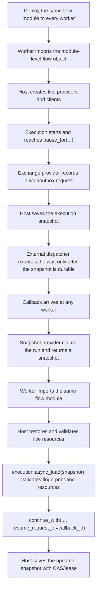

# Distributed Pause and Resume Boundaries

> Languages: **English** · [中文](../../cn/triggerflow/distributed-pause-resume.md)

TriggerFlow provides foundations for host-managed distributed pause/resume. It
does not provide a full production distributed workflow engine.

The core rule is:

```text
TriggerFlow core is process-stateless between save/load.
Execution state lives in a serialized snapshot.
Live objects are recreated, restored, and validated by the host.
```

## Boundary Summary

| Concern | TriggerFlow owns | External systems own |
|---|---|---|
| Flow code | Flow fingerprint validation against the currently imported definition | Packaging and deploying the same module/config to every worker |
| Execution progress | Serializable execution snapshot, state, interrupts, resume ledger, join progress | Durable storage, retention, atomic claim, compare-and-set writes |
| Pause/resume | `pause_for(...)`, `continue_with(...)`, stable `resume_request_id`, duplicate resume projection | Callback transport, queue/webhook delivery, outbox transaction, cross-provider ordering |
| Live object availability | Resource requirements, resolver descriptors, load diagnostics, fail-fast missing-resource behavior | Creating clients, restoring sessions, validating leases/fence tokens and health |
| Stateful resources | Persisting refs/requirements needed to ask for the resource again | Browser/session/process/task/cache state, state version, replayability, restore failure policy |
| Side effects | Idempotency keys and execution facts that let a host make safe decisions | Exactly-once writes, business transaction boundaries, deduplication in external systems |
| Observability | RuntimeEvent facts and recovery diagnostics | Operator policy, alerting, production remediation workflows |

`runtime_resources` is only the mount point for live objects that already exist
in the current process. It is not a recovery protocol.

## Resource Lifecycle

| Resource shape | Examples | Load expectation |
|---|---|---|
| Stateless or equivalently rebuildable | HTTP client, DB client, logger | Recreate from config and mount before load or through a resolver. |
| Adapter over external durable state | Snapshot store, exchange provider, Workspace | Recreate the adapter, then validate external state refs, versions, and leases through the provider. |
| Stateful execution session | Browser page, sandbox process, tool session, remote task handle | The snapshot must carry a durable session/ref requirement; the provider must restore and validate it before load is ready. |
| Non-recoverable transient state | Local lock, in-memory queue item, open transaction, coroutine frame | Do not cross a durable pause boundary with this state. Finish, abort, or fail load. |

If a chunk can continue only with a stateful live object, the snapshot must
contain enough serializable information to ask the external system for the same
logical resource again. If the external system cannot restore or validate that
resource, `async_load(...)` should fail before graph continuation.

## Recommended Flow



The important ordering is outside TriggerFlow core: do not expose an external
approval, webhook, queue message, or UI task unless the corresponding execution
snapshot can be recovered. A production host usually implements this with an
outbox table, queue transaction, snapshot-store claim, lease, or compare-and-set
write.

## Service Shape

Package the workflow as an importable module. Do not rely on process-local
closures for business resources.

```python
# my_app/discount_flow.py
from agently import TriggerFlow, TriggerFlowRuntimeData


discount_flow = TriggerFlow(name="discount-approval")
discount_flow.declare_resource_requirement(
    "approval_router",
    resolver="my_app.resources:create_approval_router",
    provider_kind="execution_exchange_provider",
    config_ref="settings://approval-router",
    fail_policy="fail_closed",
)


@discount_flow.chunk
async def request_approval(data: TriggerFlowRuntimeData):
    request = dict(data.value or {})
    await data.async_set_state("request", request, emit=False)
    return await data.async_pause_for(
        type="exchange",
        exchange_kind="approval",
        interrupt_id="discount-approval",
        resume_to="next",
        payload={"customer": request["customer"], "discount": request["discount"]},
        audit_metadata={"run_id": data.execution.run_context.run_id},
    )


@discount_flow.chunk
async def finalize(data: TriggerFlowRuntimeData):
    request = dict(data.get_state("request") or {})
    decision = dict(data.value or {})
    final = {
        "customer": request["customer"],
        "status": "approved" if decision["approved"] else "denied",
    }
    await data.async_set_state("final", final, emit=False)
    await data.async_emit("DISCOUNT_DECIDED", final)


@discount_flow.chunk
async def audit_decision(data: TriggerFlowRuntimeData):
    await data.async_set_state(
        "audit",
        {"event": data.event, "status": data.value["status"]},
        emit=False,
    )


discount_flow.to(request_approval).to(finalize)
discount_flow.when("DISCOUNT_DECIDED").to(audit_decision)
```

Build resources in host code. This helper may return `runtime_resources`, but
that is only the final mount into the execution.

```python
# my_app/resources.py
def build_runtime_resources(settings, *, snapshot=None):
    return {
        "snapshot_store": settings.snapshot_store(),
        "execution_exchange_provider": settings.exchange_outbox_provider(),
    }


async def create_approval_router(context):
    settings = load_settings(context["requirement"]["config_ref"])
    router = settings.exchange_outbox_provider()
    return {"resource": router, "health": await router.health()}
```

Start and pause in a worker:

```python
from my_app.discount_flow import discount_flow


resources = build_runtime_resources(settings)
snapshot_store = resources["snapshot_store"]

execution = discount_flow.create_execution(auto_close=False, runtime_resources=resources)
await execution.async_start({"customer": "Acme", "discount": 18})

snapshot_ref = await execution.async_save(snapshot_store, step_id="waiting-approval")

# Host/provider API: expose only wait requests whose execution snapshot is durable.
await resources["execution_exchange_provider"].flush_ready_requests(
    run_id=execution.run_context.run_id,
    after_snapshot_ref=snapshot_ref,
)
```

Resume from any worker:

```python
worker_id = "worker-b"
claim = await snapshot_store.claim(run_id, owner_id=worker_id)
# claim(...) is host/provider API. It should return the claimed snapshot,
# state version, and lease/fence metadata.

from my_app.discount_flow import discount_flow


resources = build_runtime_resources(settings, snapshot=claim["snapshot"])
execution = discount_flow.create_execution(auto_close=False, runtime_resources=resources)

load = await execution.async_load(claim["snapshot"])
if not load["ready"]:
    raise RuntimeError(load["diagnostics"])

await execution.async_continue_with(
    "discount-approval",
    {"approved": True},
    resume_request_id=callback_id,
    actor="approval-service",
)

await execution.async_save(
    snapshot_store,
    run_id=run_id,
    expected_state_version=claim["state_version"],
    step_id="after-approval",
)
await snapshot_store.release_lease(run_id, owner_id=worker_id, lease_token=claim["lease_token"])
```

`claim(...)`, `flush_ready_requests(...)`, and `release_lease(...)` are not
TriggerFlow core APIs. They are examples of the host/provider work required for
production distributed recovery.

## Stateful Resource Example

If a resource carries state, store a durable ref in execution state and declare
a resource requirement that can restore it.

```python
flow.declare_resource_requirement(
    "browser_session",
    resolver="my_app.browser:restore_browser_session",
    provider_kind="browser",
    config_ref="settings://browser-pool",
    fail_policy="fail_closed",
)


async def collect_quote(data: TriggerFlowRuntimeData):
    browser = data.require_resource("browser_session")
    session_ref = await browser.persist_session()
    await data.async_set_state("browser_session_ref", session_ref, emit=False)
    return await data.async_pause_for(
        type="exchange",
        exchange_kind="approval",
        interrupt_id="quote-approval",
        resume_to="next",
    )
```

The resolver must validate that the external session still exists and matches
the snapshot before returning the live browser/session object:

```python
async def restore_browser_session(context):
    snapshot_state = context["snapshot"]["runtime_data"]
    session_ref = snapshot_state.get("browser_session_ref")
    browser = await browser_pool.restore(session_ref)
    if browser is None:
        return {"resource": None, "health": "missing"}
    if not await browser.matches(session_ref):
        return {"resource": None, "health": "unhealthy"}
    return {"resource": browser, "health": "healthy"}
```

## Do Not Claim More Than This

- Do not say TriggerFlow provides complete distributed recovery by itself.
- Do not say `runtime_resources` are serialized or recovered.
- Do not use `load(...)` to continue a worker-handoff path that still needs
  async resource restore.
- Do not expose external waits before the host can recover the corresponding
  snapshot.
- Do not continue when a required stateful resource cannot restore its state.

## See Also

- [Persistence and Blueprint](persistence-and-blueprint.md)
- [Pause and Resume](pause-and-resume.md)
- [State and Resources](state-and-resources.md)
- [Lifecycle](lifecycle.md)
