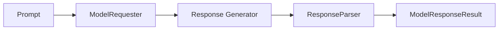

# Model Response Overview

Output control makes results **structured and reliable**. This chapter explains how to **read and consume** those results. Agently wraps model returns into a unified response object so you can access text, structured data, metadata, and streaming events consistently.

## Response pipeline



## Key objects

- **ModelResponse**: a response snapshot with `response.id`, plus prompt and settings snapshots. Use `cancel_logs()` to stop logs.
- **ModelResponseResult**: result access via `get_text()` / `get_data()` / `get_data_object()` / `get_meta()` / `get_generator()`.
- **ResponseParser**: normalizes the event stream and parses structured output. Default: `AgentlyResponseParser`.

## Recommended usage: keep one response

In chained calls, `agent.start()` / `agent.get_text()` / `agent.get_data()` / `agent.get_data_object()` / `agent.get_meta()` / `agent.get_generator()` (and the same methods on a request) **implicitly create a new response and trigger a new request**. To keep a single request fixed, call `get_response()` first, then read text, structured data, metadata, or streaming events from the response as many times as needed.

```python
from agently import Agently

agent = Agently.create_agent()

response = (
  agent
  .input("Introduce Agently in one sentence")
  .output({
    "intro": ("str", "One-line intro"),
  })
  .get_response()
)

text = response.result.get_text()
data = response.result.get_data()
meta = response.result.get_meta()

print(text)
print(data)
print(meta)
```
