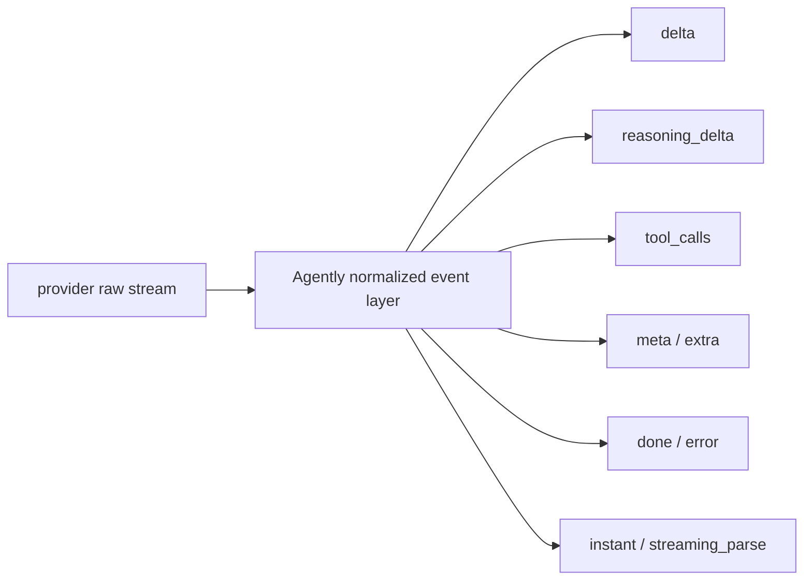

# Streaming Responses and Event Types

Agently normalizes model output into one event stream so you do not have to bind your application to each provider's raw streaming shape.

## When to read this

- You already understand `get_response()`
- You want to connect streaming events to UI, logs, or downstream logic
- You want to distinguish `delta`, `meta`, `tool_calls`, and `instant`

## What you will learn

- Why Agently normalizes provider streams first
- What the common event types mean
- When to use text streaming and when to use structured streaming
- Why async generators should be the default in production

## Event flow



`instant` is not a separate system. It is a structured view built on top of the same normalized event layer.

## Common event types

- `delta`: text delta
- `reasoning_delta`: reasoning delta
- `tool_calls`: tool-call fragments
- `meta`: usage, finish_reason, and similar metadata
- `done`: final result
- `extra`: extended fields
- `error`: request or parsing error
- `instant` / `streaming_parse`: structured streaming events

## Async First recommendation

If you are inside a service runtime, SSE endpoint, WebSocket handler, TriggerFlow chunk, or any overlapping-request workload, prefer async generators:

```python
async for item in response.get_async_generator(type="instant"):
    print(item.path, item.value)
```

Why:

- avoids blocking sync bridges inside an event loop
- fits async service integration better
- makes it easier to forward structured stream events into TriggerFlow or runtime stream

## Text-only streaming

```python
for chunk in response.result.get_generator(type="delta"):
    print(chunk, end="", flush=True)
```

Good fit:

- typewriter-style UI
- simple logs

## Filter only the events you care about

```python
for event, value in response.result.get_generator(
    type="specific",
    specific=["reasoning_delta", "tool_calls", "done"],
):
    print(event, value)
```

## Structured streaming

```python
for item in response.result.get_generator(type="instant"):
    print(item.path, item.delta, item.is_complete)
```

Good fit:

- the output schema is already explicit
- you want to update one field or list item while generation continues

In production, the more recommended form is:

```python
async for item in response.get_async_generator(type="instant"):
    if item.is_complete:
        print(item.path, item.value)
```

## Common mistakes

- Using only `delta` when the real need is structured field updates
- Exposing raw event noise to the frontend instead of turning it into business semantics first
- Starting several consumers before you have fixed one reusable `response`

## Next

- Back to response reading: [Model Response Overview](/en/model-response/overview)
- Structured field streaming: [Instant Structured Streaming](/en/output-control/instant-streaming)

## Related Skills

- `agently-model-response`
- `agently-output-control`
