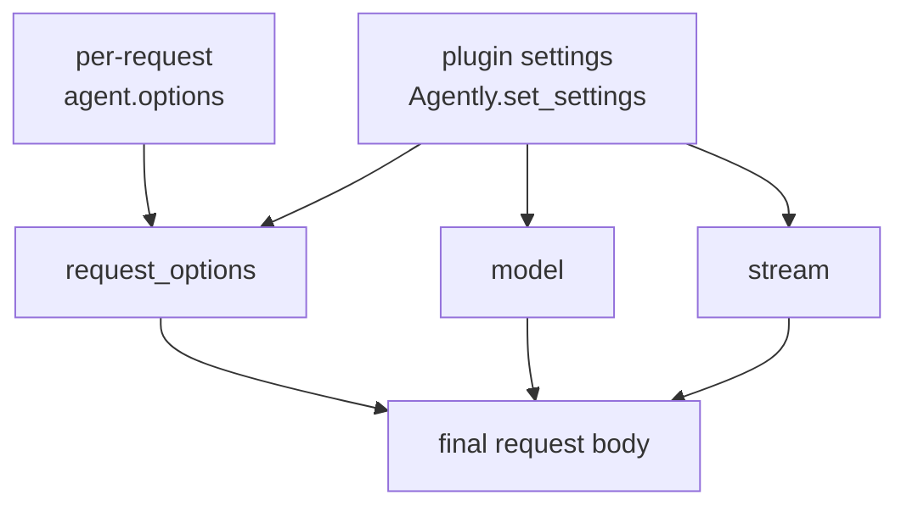
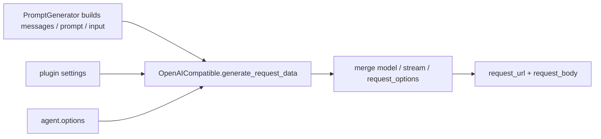

# OAIClient (OpenAICompatible) Parameter Guide (v4)

This page explains how parameter settings actually work in Agently v4, based on source behavior in the OpenAI-compatible requester.

> `OpenAICompatible`, `OpenAI`, and `OAIClient` are aliases of the same model requester plugin in v4.

## 1. Request-parameter precedence map



### How to read this diagram

- `request_options` and `agent.options()` both flow into the request body.
- `model` and `stream` are special: the plugin layer writes their final values.

### Design rationale

Keeping `model` and `stream` owned by the plugin layer gives the requester stable control over endpoint paths, model-type defaults, and streaming capability boundaries, instead of letting every per-request override break transport assumptions.

## 2. Where to set parameters

| Layer | API | Typical keys | Scope |
| --- | --- | --- | --- |
| Global / agent settings | `Agently.set_settings("OpenAICompatible", {...})` | `base_url` `model` `request_options` `stream` | Default for following requests |
| Per-request override | `agent.options({...})` | `temperature` `top_p` `max_tokens` `tools` | Current request prompt |

Both sources eventually become request body fields.

## 3. Request assembly pipeline



### How to read this diagram

- Prompt generation builds the model-type-specific primary fields.
- The requester then merges model name, stream mode, auth, URL, and extra options into the final request.

## 4. Effective precedence in source logic

In `OpenAICompatible.generate_request_data()`:

1. `model` is force-written from plugin settings  
`plugins.ModelRequester.OpenAICompatible.model` > `default_model[model_type]`  
(`agent.options({"model": ...})` is overwritten)
2. `stream` is force-written from plugin settings  
explicit `plugins...stream`, or defaults: `chat/completions=true`, `embeddings=false`  
(`agent.options({"stream": ...})` is overwritten)
3. Other request options  
`agent.options({...})` overrides `request_options`

## 5. Recommended setup for temperature/top_p

### 5.1 Global defaults

```python
from agently import Agently

Agently.set_settings("OpenAICompatible", {
  "base_url": "https://api.openai.com/v1",
  "api_key": "YOUR_API_KEY",
  "model": "gpt-4o-mini",
  "request_options": {
    "temperature": 0.2,
    "top_p": 0.9,
    "max_tokens": 800
  }
})
```

### 5.2 Per-request overrides

```python
agent = Agently.create_agent()

result = (
  agent
  .input("Explain RAG in one paragraph")
  .options({
    "temperature": 0.7,
    "max_tokens": 300
  })
  .start()
)
```

## 6. Two different `tools` mechanisms

### 6.1 Agently tooling flow (`@agent.tool_func` + `agent.use_tools`)

This is Agently orchestration: tool judging + tool execution + result injection into `action_results`.

```python
from agently import Agently

agent = Agently.create_agent()

@agent.tool_func
def add(a: int, b: int) -> int:
  return a + b

agent.use_tools(add)
print(agent.input("Use tool to calculate 12+34").start())
```

### 6.2 Provider-native OpenAI tools (pass-through)

Put raw `tools`/`tool_choice` in `request_options` or `agent.options()`:

```python
agent.options({
  "tools": [
    {
      "type": "function",
      "function": {
        "name": "get_weather",
        "description": "Get current weather",
        "parameters": {
          "type": "object",
          "properties": {
            "city": { "type": "string" }
          },
          "required": ["city"]
        }
      }
    }
  ],
  "tool_choice": "auto"
})
```

These two approaches can coexist, but they are not the same mechanism.

## 7. URL, model type, and message shaping

- `full_url` overrides `base_url + path_mapping[model_type]`
- `model_type=chat` sends `messages`
- `model_type=completions` sends `prompt`
- `model_type=embeddings` sends `input` and defaults to non-streaming
- `strict_role_orders` affects role normalization
- attachment prompts auto-enable `rich_content`

## 8. Auth choices

Supported ways:

- `api_key`
- `auth` (`api_key` / `headers` / `body`)

```python
Agently.set_settings("OpenAICompatible", {
  "base_url": "https://api.example.com/v1",
  "auth": {
    "headers": {
      "Authorization": "Bearer xxx",
      "X-Project": "demo"
    }
  }
})
```

## 9. Fast troubleshooting

1. `temperature` not working: use `request_options` or `agent.options()` instead of root-level `options`.
2. `stream` not working: plugin-level `stream` overrides request-level value.
3. `model` not working: `model` is force-written at plugin level.
4. `tools` not working: confirm whether you want Agently tool orchestration or provider-native tools.
5. endpoint errors: try `full_url` first.

## 10. Debugging

```python
from agently import Agently

Agently.set_settings("debug", True)
# or:
# Agently.set_settings("runtime.show_model_logs", True)
```

You will see request-stage fields like `request_url`, `request_options`, and `stream`.

## 11. Source references

- `agently/builtins/plugins/ModelRequester/OpenAICompatible.py`
- `agently/builtins/plugins/PromptGenerator/AgentlyPromptGenerator.py`
- `agently/builtins/agent_extensions/ToolExtension.py`
- `agently/core/Agent.py`

## Related docs

- OpenAI model setup: [/en/models/openai](/en/models/openai)
- Model settings overview: [/en/model-settings](/en/model-settings)
- Full settings reference: [/en/settings](/en/settings)
