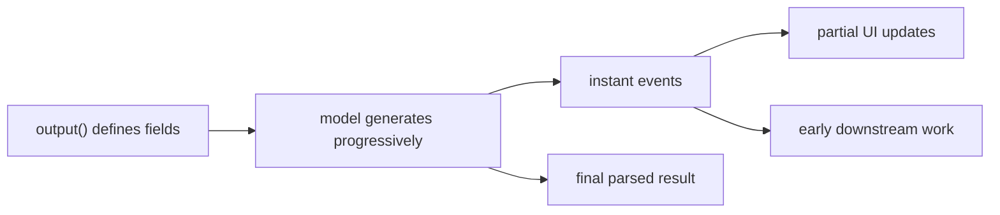

# Instant Structured Streaming

Instant solves this problem: you want early feedback, but you do not want to fall back to a noisy stream of raw text tokens.

## When to read this

- You already define output with `output()`
- You want realtime UI, progressive summaries, or early downstream triggers
- You do not want to wait for the full JSON-like result before starting to work

## What you will learn

- Why structured streaming requires `output()` first
- What `path`, `wildcard_path`, and `delta` mean
- When to fix one `response` and consume both stream and final data from it
- Why `get_async_generator(type="instant")` should be the default in services and TriggerFlow

## Instant data flow



## Minimal example

```python
from agently import Agently

agent = Agently.create_agent()

response = (
    agent
    .input("Explain recursion, give one definition and two tips")
    .output(
        {
            "definition": (str, "One-line definition"),
            "tips": [(str, "Short tip")],
        }
    )
    .get_response()
)

for item in response.result.get_generator(type="instant"):
    if item.path == "definition" and item.delta:
        print(item.delta, end="", flush=True)
    if item.wildcard_path == "tips[*]" and item.delta:
        print(item.delta, end="", flush=True)

print()
print(response.result.get_data())
```

## Async First version

If this runs inside a service, async worker, SSE endpoint, or TriggerFlow chunk, prefer:

```python
async for item in response.get_async_generator(type="instant"):
    if item.is_complete and item.wildcard_path == "tips[*]":
        print(item.path, item.value)

final_data = await response.async_get_data()
```

This is especially useful when:

- one response updates UI and also feeds later logic
- completed fields should be forwarded into TriggerFlow
- several async consumers reuse the same response

## Reading `path` and `wildcard_path`

- `path`: the concrete field path, such as `tips[0]`
- `wildcard_path`: the pattern form, such as `tips[*]`
- `delta`: the incremental text chunk for that field

For list-like UIs, `wildcard_path` is often the better matching surface.

## Why `get_response()` matters here

If you want both streaming updates and final structured data, fix one response first:

- streaming stage: `response.get_async_generator(type="instant")`
- final stage: `await response.async_get_data()`

That keeps one model request and several result views.

## Common mistakes

- Trying structured streaming before defining `output()`
- Reconstructing fields manually from `delta` text
- Re-requesting the same result just to get the final data after streaming

## Next

- Output schema design: [Agently Output Format](/en/output-control/format)
- Response objects and final reads: [Result Data](/en/model-response/result-data)
- Turning early fields into events: [From Token Output to Live Signals](/en/triggerflow/token-to-signal)

## Related Skills

- `agently-output-control`
- `agently-model-response`
