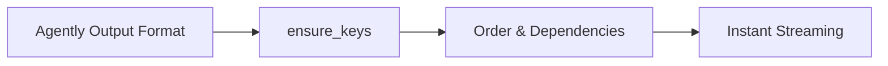

# Output Control Overview

When structured results must feed downstream systems, you usually want stable fields and predictable structure even across model changes. Agently v4 uses Agently Output Format, `ensure_keys`, and Instant structured streaming to keep outputs consistent. In practice, even small models like qwen2.5:7b can achieve over 99% success for controlled outputs, and combining `ensure_keys` makes failure extremely unlikely.

Common scenarios include business outputs with stable fields (forms, tickets, reviews, summaries), multi-step flows with dependencies, low-latency UIs that need structured streaming, and reducing output drift across models.

## Map

- [Agently Output Format](/en/output-control/format)
- [`ensure_keys` for critical fields](/en/output-control/ensure-keys)
- [Order and dependency control](/en/output-control/order-and-deps)
- [Instant structured streaming](/en/output-control/instant-streaming)



## Shortest path

```python
from agently import Agently

agent = Agently.create_agent()

result = (
  agent
  .input("Write one-line positioning for Agently")
  .output({ "Positioning": ("str", "One-line positioning") })
  .start()
)

print(result["Positioning"])
```
