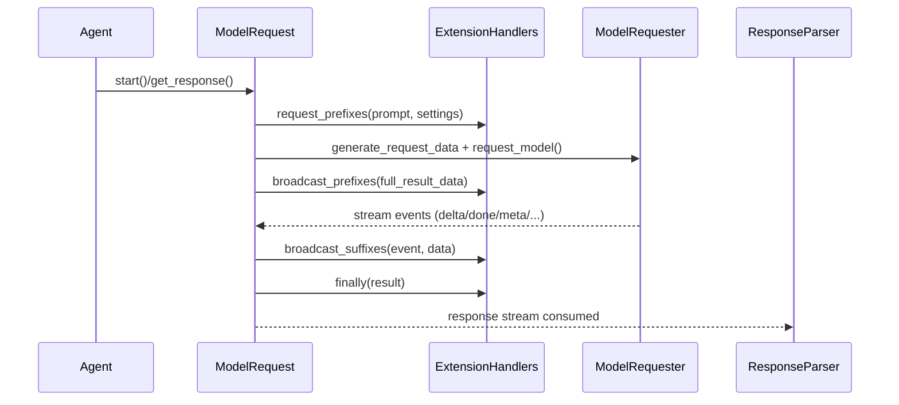

# Agently Builtins 与扩展实现手册（中文草案）

> 目标：让 builtins 目录下的每一种类型（plugins / agent_extensions / hookers / tools）
> 都有清晰的“作用、作用层、接入方式、开发方式”。
>
> 本文聚焦框架内建结构与扩展规则，不替代具体功能使用教程。

## 0. 阅读路径
- **只做插件**：直接看第 4 节「插件（plugins）」。
- **只做 Agent 扩展**：看第 5 节，配合 `docs/agent-extensions/*`。
- **只做 Hooker / 运行时日志**：看第 6 节。
- **只做工具（Tool）**：看第 7 节。
- **需要整体结构**：先看第 1~3 节 + 第 8 节。

## 1. builtins 目录结构与框架关联

```
agently/builtins/
  plugins/                # PluginManager 接入，核心可替换实现
    PromptGenerator/AgentlyPromptGenerator.py
    ModelRequester/OpenAICompatible.py
    ResponseParser/AgentlyResponseParser.py
    ToolManager/AgentlyToolManager.py
    Session/AgentlyMemoSession.py

  agent_extensions/        # BaseAgent 的 mixin 扩展（能力/生命周期挂钩）
    ToolExtension.py
    KeyWaiterExtension.py
    AutoFuncExtension.py
    ConfigurePromptExtension.py
    ChatSessionExtension.py

  hookers/                 # EventCenter hooker 插件（运行时事件）
    SystemMessageHooker.py
    PureLoggerHooker.py
    ConsoleHooker.py

  tools/                   # 内置工具包（非 PluginManager 插件）
    Search.py
    Browse.py
    Cmd.py
```

### 1.1 关联关系速查表

| 类型 | 核心入口 | 生效层 | 默认加载位置 | 典型内建项 |
|---|---|---|---|---|
| plugins | `PluginManager` / `Prompt` / `ModelRequest` / `Tool` / `Session` | 核心调用链（Prompt -> Request -> Parse） | `agently/_default_init.py` | PromptGenerator / ModelRequester / ResponseParser / ToolManager / Session |
| agent_extensions | `BaseAgent` + `ExtensionHandlers` | Agent API + 请求生命周期 | `agently/base.py`（Agent 组合） | ToolExtension / KeyWaiter / AutoFunc / ConfigurePrompt |
| hookers | `EventCenter` | 运行时事件与日志 | `agently/_default_init.py` | SystemMessageHooker / PureLoggerHooker (+ ConsoleHooker 可选) |
| tools | `ToolManager` + `ToolExtension` | 工具调用层 | 手动注册 | Search / Browse / Cmd |

> 注意：**EventHooker / BuiltInTool 不是 PluginManager 管辖的 plugin type**，它们有各自的注册通道。

## 2. Agently 运行层次架构

### 2.1 总体运行流（抽象）

```mermaid
flowchart TD
  User[Developer/User] --> Agent[Agent (BaseAgent + Extensions)]

  Agent --> Prompt[Prompt]
  Prompt -->|PromptGenerator plugin| PromptGen

  Agent --> Request[ModelRequest]
  Request -->|ModelRequester plugin| ModelRequester
  Request -->|ResponseParser plugin| ResponseParser

  Agent --> Tool[Tool]
  Tool -->|ToolManager plugin| ToolManager

  Request --> EventCenter
  EventCenter --> Hookers[Event Hookers]

  ModelRequester --> LLM[(LLM / API)]

  Session[Session] -->|Session plugin| SessionImpl
```

### 2.2 ExtensionHandlers 生命周期（请求链条）



> 说明：`ExtensionHandlers` 用于扩展“请求前 / 响应中 / 响应后”的行为，
> 工具调用、自动回写、会话记录等均通过它实现。

## 3. Builtins 类型速查（作用 / 生效层 / 如何接入）

- **plugins**：核心可替换实现（Prompt / ModelRequest / Tool / Session）。
- **agent_extensions**：混入 BaseAgent，扩展 API 与请求生命周期。
- **hookers**：监听 EventCenter 事件，影响日志/控制台/监控。
- **tools**：工具函数集合，需通过 ToolManager 注册并由 ToolExtension 触发。

下面分类型说明。

---

## 4. 插件（plugins）开发与注册

### 4.1 插件类型（AgentlyPluginType）
`agently/types/plugins/base.py` 定义：
- PromptGenerator
- ModelRequester
- ResponseParser
- ToolManager
- Session

### 4.2 插件协议（Protocol）
协议位于 `agently/types/plugins/`，用于约束构造参数与核心方法。

**开发约束**：
- 必须提供 `name`（注册 key）。
- 构造参数需匹配协议（IDE / 类型检查依赖）。
- 核心方法签名需一致（否则 core 无法调用）。
- `DEFAULT_SETTINGS` 推荐提供，可自动注入 settings。

### 4.3 插件注册与激活
- 注册：`PluginManager.register(plugin_type, plugin_class, activate=True|False)`
- 激活：`settings.set("plugins.<Type>.activate", "PluginName")`
- 默认注册位置：`agently/_default_init.py`

注册示例：
```python
from agently.base import plugin_manager
from agently_ext.plugins.MySession import MySession

plugin_manager.register("Session", MySession, activate=True)
```

`DEFAULT_SETTINGS` 行为：
- `plugins.<Type>.<Name>` 写入默认配置
- `$global` 会合并到全局 settings
- `$mappings` 会合并到 settings 的 mappings

### 4.4 各插件类型的作用 / 生效层 / 开发要点

#### 4.4.1 PromptGenerator
- **作用**：Prompt -> text/messages/prompt-object/output model
- **生效层**：Prompt 渲染层
- **接入点**：`agently/core/Prompt.py`
- **核心接口**：`to_text` / `to_messages` / `to_prompt_object` / `to_output_model`
- **建议**：
  - 保持 Prompt 标准槽位一致
  - 兼容 `rich_content` 与角色顺序

#### 4.4.2 ModelRequester
- **作用**：构造请求、调用模型、广播流式响应
- **生效层**：Request 网络调用层
- **接入点**：`agently/core/ModelRequest.py`
- **核心接口**：`generate_request_data` / `request_model` / `broadcast_response`
- **建议**：
  - 广播事件保持统一（delta/done/meta/error 等）
  - 严格处理流式与非流式差异

#### 4.4.3 ResponseParser
- **作用**：解析响应流，生成 text / parsed / meta
- **生效层**：Response 解析层
- **接入点**：`agently/core/ModelRequest.ModelResponseResult`
- **核心接口**：`get_text` / `get_data` / `get_meta` / streaming generator
- **建议**：
  - 支持 streaming 与 non-streaming
  - 保留 full_result_data 以便扩展

#### 4.4.4 ToolManager
- **作用**：工具注册、查询、调用、MCP 接入
- **生效层**：工具管理层
- **接入点**：`agently/core/Tool.py`
- **核心接口**：`register` / `get_tool_list` / `call_tool` / `async_call_tool`
- **建议**：
  - 统一参数/返回 schema
  - 对同步/异步提供一致调用体验

#### 4.4.5 Session
- **作用**：会话历史、memo、压缩策略、序列化
- **生效层**：会话记忆层
- **接入点**：`agently/core/Session.py`
- **核心接口**：`append_message` / `judge_resize` / `resize` / `to_json` / `load_json`
- **减负入口（推荐）**：
  - `session.mode` + `session.limit` + `session.resize.every_n_turns`
  - 大多数场景无需直接配置 `session.resize.*`
- **建议**：
  - Session 属于核心能力，但实现放插件
  - 将“策略差异”留在 handler/config 层，而非分裂多个 session plugin

示例（减负配置）：
```python
session.configure(mode="lite", limit={"chars": 12000})
# 或
agent.enable_session_lite(chars=12000, every_n_turns=8)
```

### 4.5 扩展新的插件类型（框架级）
1) 在 `agently/types/plugins/base.py` 的 `AgentlyPluginType` 中新增 Literal
2) 新建对应 Protocol 文件
3) 在 core 中接入该插件（调用位置）
4) 在 `_default_init.py` 注册默认实现（如需）
5) 更新文档与示例

---

## 5. Agent 扩展（agent_extensions）开发与接入

### 5.1 作用与生效层
- **作用**：扩展 Agent API、注入请求生命周期逻辑（Tool/KeyWaiter 等）
- **生效层**：Agent API + ExtensionHandlers
- **接入点**：`agently/base.py` 中的 `class Agent(...)`

### 5.2 默认内建扩展
默认 `Agent` 的 MRO：
```
ToolExtension
KeyWaiterExtension
AutoFuncExtension
ConfigurePromptExtension
BaseAgent
```

这些扩展通过：
- 新增方法（如 `tool_func` / `auto_func` / `load_yaml_prompt`）
- 往 `extension_handlers` 挂载 `request_prefixes` / `broadcast_prefixes` / `finally`
来改变请求行为。

### 5.3 可选扩展：ChatSessionExtension
`ChatSessionExtension` 不在默认 Agent 中，需要自定义 Agent 组合使用：
```python
from agently.base import Agent as DefaultAgent
from agently.builtins.agent_extensions import ChatSessionExtension

class MyAgent(ChatSessionExtension, DefaultAgent):
    pass

agently = Agently(AgentType=MyAgent)
```

### 5.4 自定义扩展开发要点
- 继承 `BaseAgent` 或 mixin 进 Agent
- 必须 `super().__init__()` 保持基类初始化
- 使用 `ExtensionHandlers.append` 接入生命周期
- 注意 sync/async 的兼容（`FunctionShifter`）
- 尽量保持扩展“可拆卸”，不侵入 core 逻辑

> 详细用法参考：`docs/agent-extensions/*`

---

## 6. 事件 Hooker（hookers）与 EventCenter

### 6.1 作用与生效层
- **作用**：订阅事件，输出日志/控制台/监控
- **生效层**：运行时事件层（EventCenter）
- **接入点**：`agently/core/EventCenter.py`

### 6.2 默认内建 Hooker
- `SystemMessageHooker`（AGENTLY_SYS：模型请求、工具、TriggerFlow）
- `PureLoggerHooker`（message/log -> logger）
- `ConsoleHooker`（可选，`Agently.set_debug_console("ON")`）

### 6.3 Hooker 开发要点
- 实现 `EventHooker` Protocol
- 指定 `events`（如 message / log / console / AGENTLY_SYS）
- 实现 `handler(message)`
- 用 `event_center.register_hooker_plugin(Hooker)` 注册

最小示例：
```python
from agently.types.plugins import EventHooker

class MyHooker(EventHooker):
    name = "MyHooker"
    events = ["log"]

    @staticmethod
    async def handler(message):
        print("[LOG]", message.content)
```

---

## 7. 内置工具（tools）与 ToolManager

### 7.1 作用与生效层
- **作用**：提供可直接注册的工具函数集合（Search/Browse/Cmd）
- **生效层**：工具调用层（ToolManager + ToolExtension）
- **接入点**：通过 `agent.use_tools` 或 `tool.register`

### 7.2 内建工具包
- `Search`：ddgs 搜索（含新闻/百科/arXiv）
- `Browse`：HTTP 抓取 + 简易解析
- `Cmd`：命令行执行（带 allowlist）

### 7.3 工具注册方式
**方式 1：直接 use_tools（推荐）**
```python
search = Search()
browse = Browse()
agent.use_tools([search.search, search.search_news, browse.browse])
```

**方式 2：手动注册**
```python
tool = Search()
for info in tool.tool_info_list:
    agent.tool.register(
        name=info["name"],
        desc=info["desc"],
        kwargs=info["kwargs"],
        func=info["func"],
    )
```

### 7.4 自定义 BuiltInTool 开发要点
- 提供 `tool_info_list`（name/desc/kwargs/func）
- 函数签名与 docstring 越清晰，模型调用越稳定
- 注意安全边界（如 Cmd 的 allowlist）

---

## 8. 默认注册 / 激活位置一览

- `agently/_default_init.py`
  - `_load_default_plugins`：注册内建 plugins
  - `_hook_default_event_handlers`：注册 SystemMessageHooker / PureLoggerHooker
- `agently/base.py`
  - 组合默认 Agent 扩展（Tool/KeyWaiter/AutoFunc/ConfigurePrompt）
  - `set_debug_console` 控制 ConsoleHooker

---

## 9. 常见问题与排查
- 插件未生效：检查 `plugins.<Type>.activate` 是否指向正确插件名
- DEFAULT_SETTINGS 未加载：确认 register 是否执行
- 工具调用没触发：确认 `agent.use_tools(...)` 是否被调用
- Hooker 不工作：确认注册到 EventCenter，events 名称正确
- ChatSession 不生效：确认 mixin 到 Agent 的 MRO

---

## 10. 建议与最佳实践
- **插件负责算法/实现，核心负责调度/接口**
- **Session 属于核心能力，实现放插件**
- **Agent 扩展尽量可插拔，避免侵入 core**
- **EventHooker 只做观察与副作用，不改变核心结果**
- **工具调用输出尽量结构化，便于 ResponseParser 解析**

---

# 设计建议（结合当前 Session 目标）
1) **核心 Session + 策略扩展** 是最稳妥的架构：避免多插件重复状态
2) **Agent 集成建议放 core**：在 `Agent` 中 attach/detach Session，并拦截 chat_history API
3) **轻量模式入口要极简**：只需设置长度阈值即可启用
4) **Memo 模式策略与序列化能力保留**：memo 结构化导出/读入由 Session 提供，不做持久化
5) **ChatSessionExtension 与 Session 功能重叠**：建议统一到 Session 体系，逐步收敛
