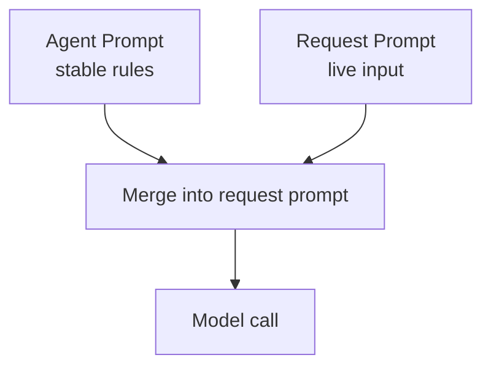

# Layered Prompts: Agent and Request

Agently prompt values can be almost any structured data: strings, dicts, lists, or nested objects. Layering keeps stable rules and dynamic input cleanly separated while still composing them into one request.

In production you usually want to set stable rules once and only pass request‑level input at call time. A common pattern is to initialize Agent Prompt at creation, then provide Request Prompt when dispatching work.

```python
from agently import Agently

agent = Agently.create_agent()

# One-time initialization
agent.set_agent_prompt("system", "You are a rigorous technical writer.")
agent.set_agent_prompt("developer", "Follow Markdown formatting rules.")

def explain(topic: str):
  return (
    agent
    .input(f"Explain { topic } and give 2 exercises")
    .instruct("Definition first, then example")
    .output({
      "Definition": (str, "One-line definition"),
      "Exercises": [{"Question": (str, ""), "Answer": (str, "")}]
    })
    .start()
  )
```

## Understand the two layers

- Agent Prompt: stable rules and long-term constraints
- Request Prompt: per-request input and dynamic directives



## Use structured prompt values

```python
from agently import Agently

agent = Agently.create_agent()

agent.set_agent_prompt("system", {
  "Role": "Technical writer",
  "Goals": ["accurate", "concise", "reusable"]
})
```

## Set Request Prompt

```python
agent.set_request_prompt("input", {
  "Topic": "Recursion",
  "Requirements": ["one-line definition", "one example", "two exercises"]
})

agent.set_request_prompt("instruct", "Give a definition first, then an example.")
```

## Common standard slots

Agently provides standard slots (usable in Agent or Request):

- `system` / `developer`
- `chat_history`
- `info`
- `tools`
- `action_results`
- `instruct`
- `examples`
- `input`
- `attachment`
- `output`
- `output_format`
- `options`

Put stable rules in `system`/`developer`, and task input in `input`.

Put long-lived rules into the Agent layer when possible.
