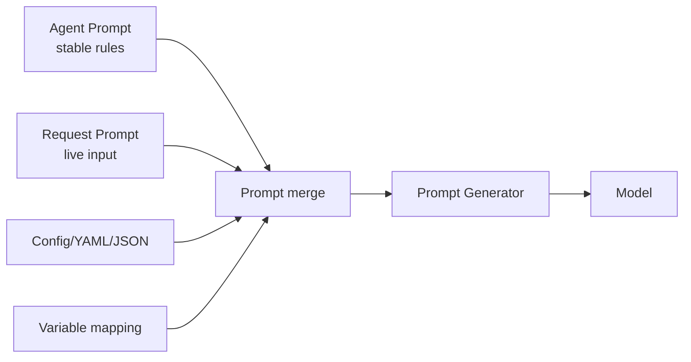

# Prompt Management Overview

In production, you usually want prompts to stay maintainable under change. Agently treats prompts as structured, composable data and manages them with a layered model plus configuration and export workflows.

## Core ideas

- Prompts are structured data plus variables, not just plain text
- Stable rules live in the Agent layer; dynamic input lives in the Request layer
- Config-driven prompts decouple content from code

Common scenarios include team prompt collaboration, frequent prompt updates without code releases, multi-template reuse, and traceable prompt snapshots for debugging.

## Navigation

- [Layered prompts: Agent and Request](/en/prompt-management/layers)
- [Quick syntax and always](/en/prompt-management/quick-syntax)
- [Config prompts: YAML/JSON](/en/prompt-management/config-files)
- [Variables and templating](/en/prompt-management/variables)
- [Export and versioning](/en/prompt-management/export)
