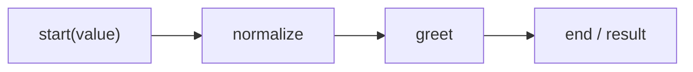

# Basic Flow and Recommended Patterns

> Applies to: `v4.0.8.2`

> Visualization boundary: Mermaid can show anonymous links, but JSON/YAML flow config export still requires named handlers and conditions.

## 1. Minimal linear flow



### How to read this diagram

- This is the minimal `to().to().end()` chain.
- `end()` is not just a visual terminator. It is an explicit runtime instruction for where results converge.

## 2. Recommended starter template

```python
from agently import TriggerFlow, TriggerFlowRuntimeData

flow = TriggerFlow(name="hello-flow")

@flow.chunk("normalize")
async def normalize(data: TriggerFlowRuntimeData):
    return str(data.value).strip()

@flow.chunk("greet")
async def greet(data: TriggerFlowRuntimeData):
    return f"Hello, {data.value}"

flow.to(normalize).to(greet).end()
print(flow.start(" Agently "))
```

## 3. Current recommended style

- prefer named chunks
- terminate linear chains explicitly with `.end()`
- use `TriggerFlowRuntimeData` in new code
- use `runtime_resources` for runtime dependencies

## 4. What `side_branch()` is for

`side_branch()` is suitable for:

- logging
- debug printing
- instrumentation

It does not change the main trigger chain.

```python
flow.to(main_task).side_branch(side_log).end()
```

## 5. Inject runtime dependencies

```python
flow.update_runtime_resources(logger=my_logger)

result = flow.start(
    "topic",
    runtime_resources={"search_tool": custom_search_tool},
)
```

Override order:

1. flow-level `update_runtime_resources(...)`
2. execution/start-level `runtime_resources={...}`
3. `data.set_resource(...)` inside a chunk

## 6. Anti-patterns

- writing long-term logic as anonymous `lambda`
- omitting `.end()` while still expecting `start()` to produce a result
- capturing tools or loggers in closures around handlers
