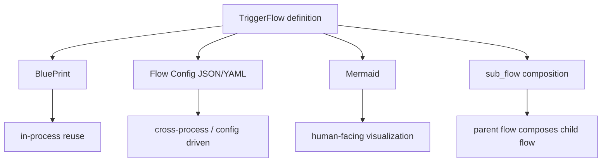

# Blueprint, Config Export/Import, and Mermaid

> Visualization boundary: Mermaid can display anonymous links for understanding, but JSON/YAML export still cannot serialize anonymous handlers or conditions.

In `v4.0.8.3`, there are four different ways to reuse or express a flow:

## 1. Capability boundaries



### How to read this diagram

- These forms are not interchangeable.
- `BluePrint` is about runtime reuse, `Flow Config` is about portable configuration, `Mermaid` is about human-readable structure, and `sub_flow` is about workflow composition.

## 2. `save_blue_print()` / `load_blue_print()`

Suitable for:

- copying flow definitions inside the same Python process

Characteristics:

- no JSON/YAML involved
- no explicit handler registration required

## 3. Flow Config

Public APIs:

- `get_flow_config()`
- `get_json_flow()`
- `get_yaml_flow()`
- `load_flow_config()`
- `load_json_flow()`
- `load_yaml_flow()`

Suitable for:

- cross-process or cross-environment reuse
- config-driven workflows
- review and versioning

### Export prerequisite

You need stable handler and condition references.

Recommended:

```python
flow.register_chunk_handler(named_chunk)
flow.register_condition_handler(named_condition)
```

Anonymous `lambda` handlers can run, but they cannot be exported to JSON/YAML flow config.

## 4. `sub_flow` is also exportable

Starting in `v4.0.8.3`, `to_sub_flow(child_flow)` is a first-class operator in flow config rather than a runtime-only closure trick.

That means:

- child-flow structure is preserved in exported parent config
- `capture` / `write_back` declarations stay in config
- reloaded flow config preserves the same child-flow boundaries

## 5. Mermaid

APIs:

- `to_mermaid()`
- `to_mermaid(mode="simplified")`
- `to_mermaid(mode="detailed")`

Rules:

- Mermaid can render anonymous `lambda`
- Mermaid is for humans to understand structure
- Mermaid is not an execution-state persistence format

Mermaid improvements in `v4.0.8.3`:

- simplified mode now expands internal nodes inside `if_condition`, `match`, and `for_each`
- downstream nodes after a branch or loop are no longer accidentally kept inside the previous group
- `sub_flow` renders as a dashed tinted box with the full child flow inlined

## 6. `declare_emits()`

If a chunk actively emits business events, declare them:

```python
chunk.declare_emits("Alert")
```

This affects:

- `emit_signals` in flow config
- how Mermaid renders external signal edges

## 7. `replace=True`

`load_flow_config()` / `load_json_flow()` / `load_yaml_flow()` default to:

- `replace=True`

which means the loaded config replaces the current blueprint.

## 8. Recommended mental order

1. treat `BluePrint` as in-process definition reuse
2. treat `Flow Config` as an exchange format
3. treat `Mermaid` as a human-readable diagram
4. treat `sub_flow` as composing an isolated child flow into a parent flow
