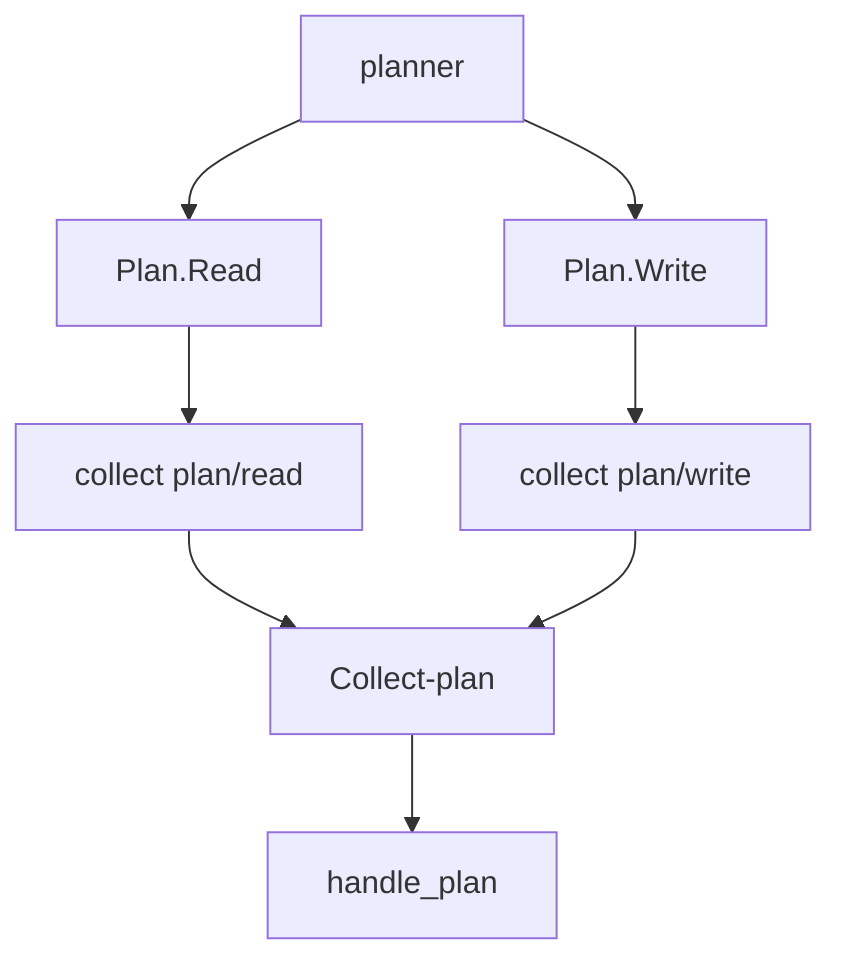

# collect Aggregation

> Visualization boundary: aggregation diagrams explain runtime behavior only; JSON/YAML export still requires named handlers and conditions.

`collect()` converges values from multiple branches into one collection.

## 1. fan-out / fan-in structure



### How to read this diagram

- `collect()` is not a separate node family. It is the convergence mechanism between branch outputs.
- Downstream logic is triggered by the internal `Collect-<name>` event.

## 2. Basic API

```python
process.collect(
    collection_name: str,
    branch_id: str | None = None,
    mode: "filled_and_update" | "filled_then_empty" = "filled_and_update",
)
```

After aggregation, the internal event emitted is:

- `Collect-<collection_name>`

## 3. Typical example

```python
flow.when("Plan.Read").to(reader).collect("plan", "read")
flow.when("Plan.Write").to(writer).collect("plan", "write")
flow.when({"collect": "plan"}).to(handle_plan).end()
```

Aggregated value shape:

```python
{
    "read": "...",
    "write": "...",
}
```

## 4. Two modes

```text
filled_and_update:
  - aggregated state stays alive
  - later writes from the same branch update the value

filled_then_empty:
  - internal aggregation state is cleared after one completed round
  - the next round starts fresh
```

### Design rationale

- `filled_and_update` is better for long-lived dashboards or continuously refreshed aggregated views
- `filled_then_empty` is better for round-based workflows, loops, and batch-style independent convergence

## 5. Usage guidance

- keep `branch_id` stable and readable
- prefer `filled_then_empty` inside multi-round loops
- if other chains should react to aggregation, subscribe with `when({"collect": name})`
