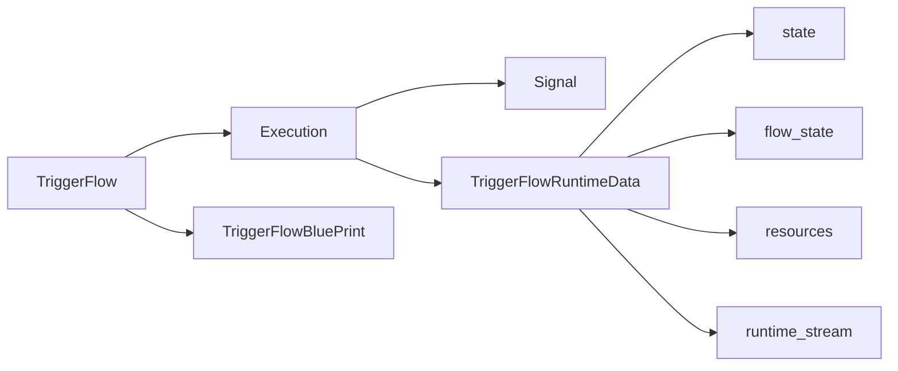

# TriggerFlow Concepts

> Visualization boundary: Mermaid may illustrate anonymous links, but JSON/YAML export still requires named handlers and conditions.

## 1. Core object relationships



### How to read this diagram

- `TriggerFlow` is the definition, `Execution` is one run.
- `TriggerFlowRuntimeData` is not just an event object. It is the runtime context slice visible to a handler.

## 2. Flow, BluePrint, and Execution

- `TriggerFlow`
  the flow definition and the entrypoint for creating executions
- `TriggerFlowBluePrint`
  a reusable in-process flow template
- `Execution`
  one isolated runtime instance with state, result, interrupts, and runtime resources

Engineering-wise:

- think of `TriggerFlow` as definition
- think of `Execution` as request-scoped runtime

## 3. Signals are the real kernel

At runtime, TriggerFlow revolves around `Signal`. A signal includes:

- `id`
- `trigger_event`
- `trigger_type`
- `value`
- `source`
- `meta`
- `layer_marks`

Public `trigger_type` values currently include:

- `event`
- `runtime_data`
- `flow_data`

## 4. Chunk = handler + continuation signal

Each chunk has:

- a handler
- a name
- a continuation signal emitted after completion

If a chunk emits business events on its own, declare them explicitly:

```python
chunk.declare_emits("ApprovalRequest")
```

## 5. `TriggerFlowRuntimeData` is runtime context

The handler parameter should now be understood as a runtime context object.

It exposes:

- current trigger: `trigger_event`, `trigger_type`, `value`
- current signal snapshot: `signal`, `signal_id`, `signal_source`, `signal_meta`, `signal_info`
- current execution: `execution`, `execution_id`
- data namespaces: `state`, `flow_state`
- resource view: `resources`

Compatibility note:

- `TriggerFlowRuntimeData` is the primary name
- `TriggerFlowEventData` is only a compatibility alias

## 6. Data and resource boundaries

- `data.state`
  execution-scoped recoverable state
- `data.flow_state`
  flow-scoped shared state
- `data.resources`
  runtime resources visible to the current execution

Public resource APIs:

- `get_resource()`
- `require_resource()`
- `set_resource()`
- `del_resource()`

## 7. Pause and resume

`pause_for()`:

- creates an interrupt
- moves execution into `waiting`
- writes an interrupt event into `runtime_stream`

`continue_with()`:

- updates interrupt state and response
- moves execution back to `running`
- injects the resume event again
