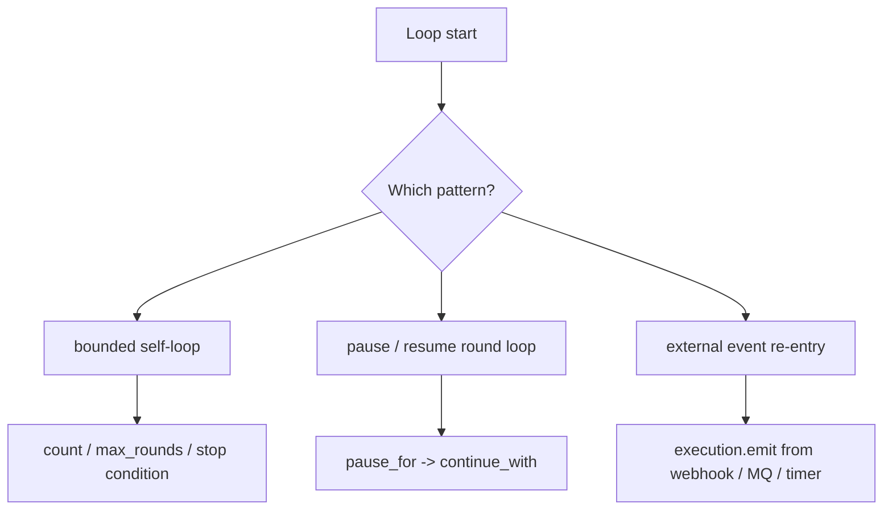

# Cycles and Re-entry Safety

> Visualization boundary: the diagrams show loop semantics only; JSON/YAML export still depends on named handlers and conditions.

TriggerFlow can implement loops, but the recommended form is always a loop with a **provable stop condition**.

## 1. Three safe loop patterns



### How to read this diagram

- Safety does not come from “being able to loop”; it comes from clear stop conditions and clear control ownership.
- These three modes correspond to internal control, approval-driven control, and externally driven control.

## 2. Bounded self-loop

The simplest safe pattern is to encode an explicit termination rule:

```python
async def loop_step(data):
    count = int(data.state.get("count", 0) or 0)
    if count >= 3:
        data.set_result({"done": True, "count": count})
        return
    data.state.set("count", count + 1, emit=False)
    await data.async_emit("Loop", count + 1)
```

## 3. Pause/resume round loop

A more stable pattern is to pause after each round and let an external system decide whether to continue:

- `step -> pause_for()`
- external `continue_with()`
- `ResumeLoop -> emit("Loop")`

Suitable for:

- human-in-the-loop workflows
- approval flows
- long-running transactions

## 4. External event re-entry

Often the safest “loop” is no self-loop at all. The execution simply waits for repeated outside re-entry:

```python
execution.emit("Tick", 1)
execution.emit("Tick", 1)
execution.emit("Tick", 1)
```

Suitable for:

- webhooks
- MQ consumers
- scheduled triggers

## 5. Key principles

- every round must have an explicit exit condition
- if the loop owns the final result, call `set_result()` or end the chain explicitly
- never treat infinite spinning as the default control flow
