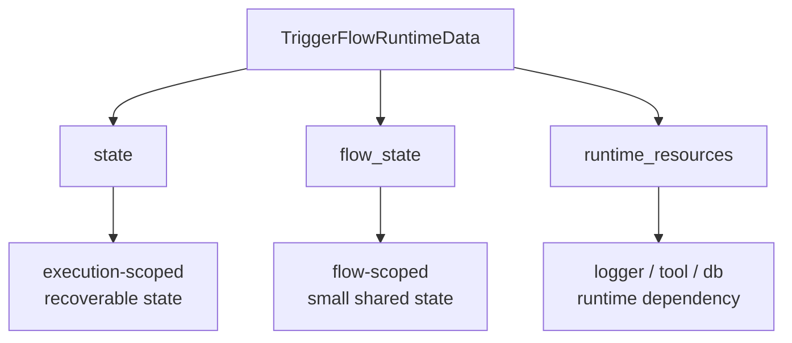
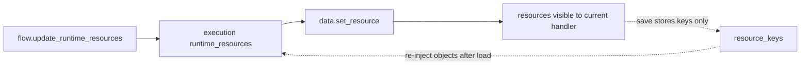

# Runtime Data, Shared State, and Runtime Resources

> Visualization boundary: diagrams simplify the mental model; exported config still depends on named handlers and conditions.

One of the most important `v4.0.8.3` ideas is to split runtime data into three layers:

- `state`
- `flow_state`
- `runtime_resources`

## 1. Three-layer data model



### How to read this diagram

- use `state` for request-scoped, recoverable business data
- use `flow_state` only for a small amount of cross-execution shared state
- use `runtime_resources` for injected runtime dependencies, not persistence

## 2. `data.state`

`state` is execution-scoped recoverable state, suitable for:

- request input
- intermediate results
- progress flags
- drafts

```python
data.state.set("request", {"topic": data.value})
```

Legacy APIs still work:

- `get_runtime_data()`
- `set_runtime_data()`
- `append_runtime_data()`

But new docs recommend `data.state`.

## 3. `data.flow_state`

`flow_state` is flow-scoped shared state, suitable only for small genuinely shared values such as:

- global flags
- shared counters
- small shared config

Do not put request-level payloads there.

## 4. `runtime_resources`

Runtime dependencies are not persisted, for example:

- logger
- search_tool
- browse_tool
- db session
- browser client

Injection patterns:

```python
flow.update_runtime_resources(logger=my_logger)

execution = flow.create_execution(
    runtime_resources={"search_tool": custom_search_tool},
)
```

## 5. Override and recovery rules



### Design rationale

- flow-level resources hold defaults
- execution-level overrides specialize a specific run
- `set_resource()` inside a handler is for temporary runtime adjustment

During `save()`, only:

- `resource_keys`

are persisted, never the resource objects themselves. After `load()`, you must inject those objects again.

## 6. How `sub_flow` capture / write_back relate to these layers

Starting in `v4.0.8.3`, child-flow data exchange is explicitly built on top of these layers:


### `capture` boundary

- `input` comes from parent `value`
- `runtime_data` comes from parent `state`
- `flow_data` comes from parent `flow_state`
- `resources` comes from parent `runtime_resources`

You should understand it as:

- snapshot once when the parent node executes
- initialize the isolated child execution
- no live binding afterwards

### `write_back` boundary

- reads only from child `result`
- can write only into parent `value`, `state`, or `flow_state`
- cannot write resource objects back into the parent

## 7. Isolation in child flows

`sub_flow` does not share the parent's runtime containers:

- child `state` is its own execution state
- child `flow_state` belongs to its own isolated flow instance
- child mutations do not implicitly change the parent

Any data exchange between parent and child should be declared through:

- `capture={...}`
- `write_back={...}`

rather than guessed by the framework.

## 8. Public resource APIs

- `get_resource(key, default=None)`
- `require_resource(key)`
- `set_resource(key, value)`
- `del_resource(key)`

Recommendation:

- use `require_resource()` for required dependencies
- use `get_resource()` for optional ones
